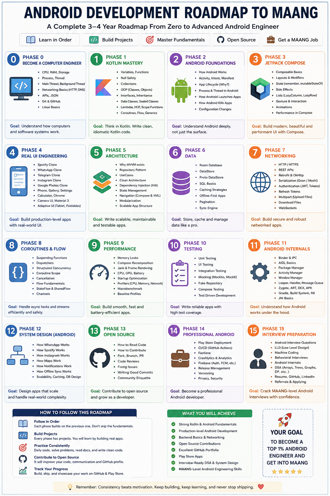

# 🚀 Ultimate MAANG-Grade Android Development Course

<div align="center">


<p align="center">
  <b>A real, deep-dive roadmap to master modern Android engineering from absolute first principles — built to take you from computer fundamentals to cracking MAANG & top tech companies.</b>
</p>

</div>

---

## 📌 Project Overview

Most tutorials teach you *what* code to type, but they rarely explain *why* things work the way they do. This repository is built differently. 

It is an open, structured learning journey designed to take you under the hood of Android development — starting from how CPUs, RAM, OS processes, and threads interact, all the way up to advanced Kotlin Coroutines, Jetpack Compose internals, production architecture, and mobile system design.

Whether you are starting from scratch or aiming for top-tier product companies (MAANG), this course focuses on core fundamentals, real-world patterns, and clean engineering logic — no shortcuts, no surface-level copy-pasting.

---

## 💬 A Personal Note from the Author

> [!NOTE]
> **To every student from a Tier-3 college or non-IIT/NIT background:**
> 
> I know the exact feeling and pain of not getting into an **IIT** or **NIT**. When you are not from a premier institute, society often doubts your potential, and it's easy to feel left behind.
> 
> I am currently pursuing my **BCA from a Tier-3 government college**. But I realized early on that sticking strictly to the college syllabus will never be enough to achieve world-class engineering skills or crack top companies like **MAANG**. That is why I push myself to do **exceptionally extra things** beyond the college curriculum every single day—diving deep into computer science fundamentals, low-level architecture, production-grade Android engineering, and system design.
> 
> 🔥 **I am putting my EVERYTHING into making this repository the BEST Android Development resource on the entire internet.** 
> 
> * 🛑 **Zero Extra Resources Needed:** If you complete this curriculum with 100% honesty, consistency, and dedication, **you will not need any other roadmaps, books, or paid courses**. You will be fully prepared to crack almost **every Android Developer interview** (including MAANG & top product companies).
> * ⏳ **Realistic Timeframe:** This is a comprehensive, deep-dive mastery journey that will take approximately **1 to 1.5 years** of active dedicated study.
> * 📅 **Daily Dedication:** I am committed to pushing **daily updates and code commits** to this repository to continuously expand and refine this curriculum!
> 
> This course is proof that **relentless effort, deep curiosity, and high-quality skills matter far more than your college tag**. If you are ready to break out of the ordinary and put in the work, this roadmap is for you! 🚀

---

## 🎯 Why This Course? (The MAANG Benchmark)

Top tech companies don't just test whether you can drag-and-drop buttons or make an API call. They evaluate:

- 🧠 **Low-Level Fundamentals:** CPU cache locality, RAM allocations, memory leaks, and thread safety.
- ⚡ **Asynchronous Concurrency:** Kotlin Coroutines, Channels, StateFlow/SharedFlow, backpressure, and thread pool management.
- 🏗️ **Clean System Architecture:** MVVM, MVI, Layered Clean Architecture, SOLID principles, and Dependency Injection (Hilt/Koin).
- 🎨 **Modern Declarative UI:** Deep understanding of Jetpack Compose recomposition, layout phases, state hoisting, and custom modifiers.
- 📱 **Mobile System Design:** Offline-first caching, real-time sync engines, media streaming, image caching algorithms, and SDK design.

---

## 🗺️ Complete Series Roadmap (Phase 0 to Phase 15)

This course follows a 16-phase roadmap matching [`Roadmap.png`](./Roadmap.png) designed to take you from absolute zero to a MAANG-level Android Engineer:

### 0️⃣ Phase 0: Become a Computer Engineer *(Current Phase)*
* **Topics:** CPU, RAM, Storage | Process, Thread | Main Thread, Background Thread | Networking Basics (HTTP, DNS) | APIs, JSON | Git & GitHub | Linux Basics
* **Goal:** Understand how computers and software systems work.

### 1️⃣ Phase 1: Kotlin Mastery
* **Topics:** Variables, Functions | Null Safety | Collections | OOP (Classes, Objects) | Interfaces, Inheritance | Data Classes, Sealed Classes | Lambdas, HOF, Scope Functions | Coroutines, Flow, Generics
* **Goal:** Think in Kotlin. Write clean, idiomatic Kotlin code.

### 2️⃣ Phase 2: Android Foundations
* **Topics:** How Android Works | Activity, Intent, Manifest | App Lifecycle (Why?) | Process & Thread in Android | How Android Launches Apps | How Android Kills Apps | Configuration Changes
* **Goal:** Understand Android deeply, not just the surface.

### 3️⃣ Phase 3: Jetpack Compose
* **Topics:** Composable Basics | Layouts & Modifiers | State (`remember`, `mutableStateOf`) | Side Effects | Lists (`LazyColumn`, `LazyRow`) | Gesture & Interaction | Animations | Performance in Compose
* **Goal:** Build modern, beautiful and performant UI with Compose.

### 4️⃣ Phase 4: Real UI Engineering
* **Topics:** Spotify Clone | WhatsApp Clone | Telegram Clone | Instagram Clone | Google Photos Clone | Phone, Gallery, Settings | Calculator, Chrome | Camera UI, Material 3 | Adaptive UI (Tablet, Foldables)
* **Goal:** Build production-level apps with real-world UI.

### 5️⃣ Phase 5: Architecture
* **Topics:** Why MVVM exists | Repository Pattern | UseCases | Clean Architecture | Dependency Injection (Hilt) | State Management | Navigation (Compose & XML) | Modularization | Scalable App Structure
* **Goal:** Write scalable, maintainable and testable apps.

### 6️⃣ Phase 6: Data
* **Topics:** Room Database | DataStore | Proto DataStore | SQL Basics | Caching Strategies | Offline-First Apps | Pagination | Sync Engine
* **Goal:** Store, cache and manage data like a pro.

### 7️⃣ Phase 7: Networking
* **Topics:** HTTP / HTTPS | REST APIs | Retrofit & OkHttp | Serialization (Gson / Moshi) | Authentication (JWT, Tokens) | Refresh Tokens | Multipart (Upload Files) | Download Files | WebSockets
* **Goal:** Build secure and robust networked apps.

### 8️⃣ Phase 8: Coroutines & Flow
* **Topics:** Suspending Functions | Dispatchers | Structured Concurrency | Coroutine Scope | Cancellation | Flow Fundamentals | StateFlow & SharedFlow | Channels
* **Goal:** Handle async tasks and streams efficiently and safely.

### 9️⃣ Phase 9: Performance
* **Topics:** Memory Leaks | Compose Recomposition | Jank & Frame Rendering | CPU, GPU, Battery | Startup Optimization | Profilers (CPU, Memory, Network) | Macrobenchmark | Baseline Profiles
* **Goal:** Build smooth, fast and battery-efficient apps.

### 🔟 Phase 10: Testing
* **Topics:** Unit Testing | UI Testing | Integration Testing | Mocking (Mockito, MockK) | Fake Repository | Compose Testing | Test Driven Development (TDD)
* **Goal:** Write reliable apps with high test coverage.

### 1️⃣1️⃣ Phase 11: Android Internals
* **Topics:** Binder & IPC | AIDL Basics | Package Manager | Activity Manager | Window Manager | Looper, Handler, Message Queue | Zygote, ART, DEX, APK | Gradle, Build System, R8 | JNI Basics
* **Goal:** Understand how Android works under the hood.

### 1️⃣2️⃣ Phase 12: System Design (Android)
* **Topics:** How WhatsApp Works | How Spotify Works | How Instagram Works | How Maps Work | How Notifications Work | How Offline Sync Works | Scalability, Caching, DB Design
* **Goal:** Design apps that scale and handle real-world complexity.

### 1️⃣3️⃣ Phase 13: Open Source
* **Topics:** How to Read Code | How to Contribute | Fork, Branch, PR | Code Reviews | Fixing Issues | Writing Good Commits | Community Etiquette
* **Goal:** Contribute to open source and grow as a developer.

### 1️⃣4️⃣ Phase 14: Professional Android
* **Topics:** Play Store Deployment | CI/CD (GitHub Actions) | Fastlane | Crashlytics & Analytics | Firebase (Auth, FCM, etc.) | Release Management | Versioning | Privacy, Security
* **Goal:** Become a professional Android developer.

### 1️⃣5️⃣ Phase 15: Interview Preparation
* **Topics:** Android Interview Questions | LLD (Low Level Design) | Machine Coding | Behavioral Interviews | Android Internals | DSA (Arrays, Trees, Graphs, DP, etc.) | Resume, GitHub, LinkedIn | Referrals & Applying
* **Goal:** Crack MAANG-level Android interviews with confidence.

---

## 📁 Repository Structure

```text
Android-Development-Course/
├── README.md
├── Roadmap.png
├── phase-0-computer-engineer/
│   ├── 01-cpu-ram-storage/
│   │   ├── notes.md
│   │   └── Computer Fundamentals.png
│   ├── 02-process-thread/
│   │   ├── notes.md
│   │   └── process and threads.png
│   ├── 03-main-background-thread/
│   │   ├── notes.md
│   │   └── main thread and background thread.png
│   └── 04-networking/
│       ├── notes.md
│       └── networking.png
└── ... (Upcoming Phases 1 to 15)
```

---

## 🖼️ Complete Course Roadmap Diagram

Below is the visual roadmap mapping out the complete learning path from fundamentals to MAANG readiness:

<div align="center">



</div>

---

<div align="center">

**Made with ❤️ for aspiring Android Engineers. Star ⭐ this repository to follow along the journey!**

<br>

<sub>🎨 *Note: The visual guide diagrams & infographic images in this repository were created with ChatGPT.*</sub>

</div>