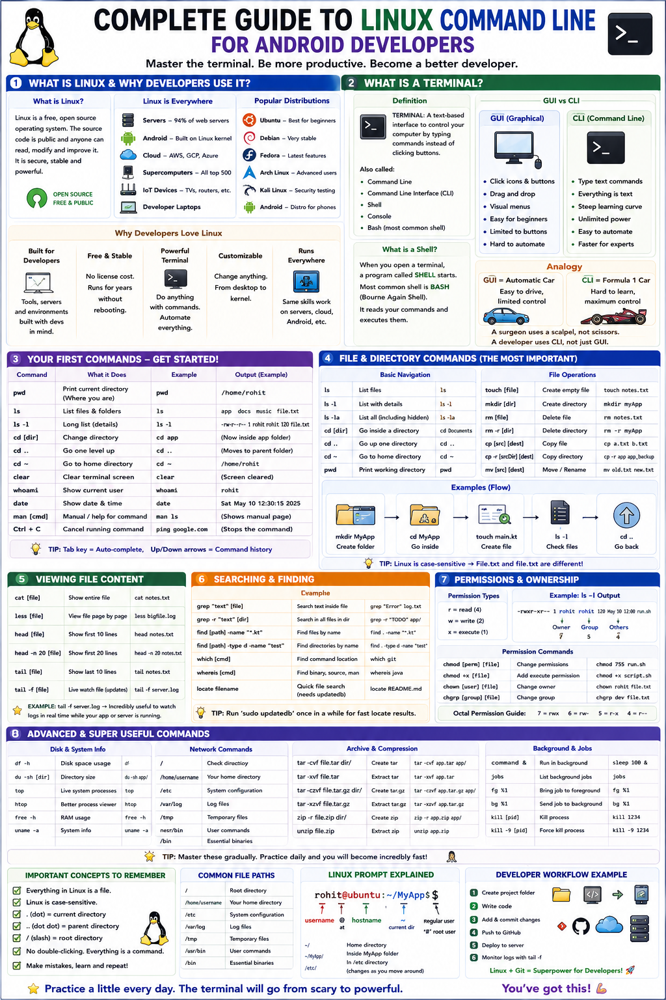

# 🐧 Complete Guide to Linux Command Line for Android Developers



---

## 🐧 Part 1: What is Linux and Why Developers Use It

### 💡 What is Linux?
Most people have used Windows or macOS. Linux is the third major operating system, but with one enormous difference — it is **free and open source**.

```
WHAT "OPEN SOURCE" MEANS:

Closed Source (Windows, macOS):
  The source code is SECRET.
  Only Microsoft/Apple engineers can see and modify it.
  You pay to use it.
  You trust the company to make it work correctly.

Open Source (Linux):
  The source code is PUBLIC.
  ANYONE in the world can read it, study it, modify it.
  It is FREE.
  Thousands of developers worldwide improve it together.
  You can verify exactly what it does.
```

---

### 🌐 The Family Tree — Linux is Everywhere

```
LINUX RUNS ON:

🖥️  Servers
    94% of the world's web servers run Linux
    Google, Facebook, Amazon, Netflix — all Linux servers
    The server your Android app talks to? Almost certainly Linux.

📱  Android Phones
    Android IS built on top of the Linux kernel.
    Every Android phone runs Linux underneath.
    When you build Android apps, you are building on Linux.

☁️  Cloud Computing
    AWS, Google Cloud, Microsoft Azure — mostly Linux
    When you deploy your app's backend, it runs on Linux

🤖  Supercomputers
    ALL of the world's top 500 supercomputers run Linux

🏠  Smart Devices
    Smart TVs, routers, Raspberry Pi, IoT devices

💻  Developer Laptops
    Many developers use Ubuntu or other Linux distributions

IN SHORT:
  The internet runs on Linux.
  Android runs on Linux.
  As a developer, Linux is unavoidable.
```

---

### 📦 What is a Linux Distribution?
Linux itself is just the kernel (the core). Different organizations take this kernel and build a complete operating system around it. These are called **distributions** or **distros**.

```
POPULAR LINUX DISTRIBUTIONS:

Ubuntu      → Most beginner-friendly. Great for developers.
             The one most tutorials use. RECOMMENDED FOR YOU.

Debian      → Very stable. Ubuntu is based on Debian.

Fedora      → Cutting-edge features. Sponsored by Red Hat.

Arch Linux  → For advanced users. Maximum control.

Kali Linux  → Specialized for security/hacking/penetration testing.

Android     → Yes! Android is a Linux distribution for phones.

THINK OF IT LIKE:
  Linux Kernel = The engine of a car
  Distribution = The complete car (engine + body + interior)
  
  The engine is the same (or similar).
  But Toyota, Honda, BMW all build different cars with it.
  Ubuntu, Fedora, Android all build different OS's with Linux.
```

---

### 🔥 Why Developers Specifically Love Linux

1. **BUILT FOR DEVELOPERS:** Package managers install any tool in one command. The terminal is incredibly powerful. Most development tools work natively. Servers run Linux, so you develop in the exact same environment.
2. **FREE AND STABLE:** No license costs. Servers can run for YEARS without rebooting. Less prone to crashes than Windows.
3. **POWERFUL TERMINAL:** Automate repetitive tasks with scripts. Control every aspect of the system. Do things in seconds that take minutes in GUI.
4. **CUSTOMIZABLE:** Change anything and everything — from the desktop environment to the kernel itself.
5. **RUNS EVERYWHERE:** Skills learned on Linux apply directly to servers, cloud, and Android. A universal skill for any developer career.

---

## 💻 Part 2: What is a Terminal?

### 📖 The Definition

> 💻 **TERMINAL:** A text-based interface to control your computer by typing commands instead of clicking buttons.

```
Also called:
  - Command Line
  - Command Line Interface (CLI)
  - Shell
  - Console
  - Bash (the most common shell program)

WHAT IS A SHELL?
  When you open a terminal, a program called a SHELL starts.
  The most common shell is BASH (Bourne Again Shell).
  The shell reads your commands and executes them.
  It is the interpreter between you and the OS.
```

---

### ⚖️ GUI vs CLI — The Core Difference

```
GUI (Graphical User Interface) — What most people use:
  - Click icons and buttons
  - Drag and drop files
  - Visual menus
  - Intuitive for beginners
  - Limited to what buttons exist
  - Cannot easily automate tasks

CLI (Command Line Interface) — What developers use:
  - Type text commands
  - Everything is text-based
  - Steep initial learning curve
  - Unlimited power and flexibility
  - Can automate ANY repetitive task
  - Faster for experienced users

ANALOGY:
  GUI = Automatic car (easy to drive, limited control)
  CLI = Formula 1 race car (complex to learn, maximum control)
  
  A surgeon does not use kitchen scissors.
  A developer does not just use file explorer.
  The right tool for the job matters.
```

---

### ⚡ Why the Terminal is So Powerful

#### 📁 Example 1: Rename 1,000 Files
- **GUI approach:** Click file 1 → press F2 → type new name → press Enter... repeat 999 more times. *(Time: 2-3 hours of repetitive clicking)*
- **Terminal approach:** `for f in *.jpg; do mv "$f" "photo_$f"; done` *(Time: 0.5 seconds)*

#### 🔍 Example 2: Find all Kotlin files containing the word "TODO"
- **GUI approach:** Open each file one by one in text editor, use Ctrl+F to search each file. *(Time: Could take hours)*
- **Terminal approach:** `grep -r "TODO" --include="*.kt" .` *(Time: Less than 1 second)*

#### 📦 Example 3: Install Software
- **GUI approach:** Open browser → search name → find site → download installer → run → click 10 screens. *(Time: 5-15 minutes)*
- **Terminal approach:** `sudo apt install vlc` *(Time: 30 seconds automatically)*

---

### 🖥️ How to Open the Terminal

- **Linux (Ubuntu):** Press `Ctrl + Alt + T` OR Right-click desktop → "Open Terminal".
- **Mac:** Press `Cmd + Space` → type "Terminal" → Enter.
- **Windows:** Install **WSL** (Windows Subsystem for Linux — recommended), OR use **Git Bash** installed with Git.
- **Android Studio:** View → Tool Windows → Terminal (built-in terminal tab at the bottom).

---

### 🔬 Anatomy of a Terminal Prompt

```
rohit@ubuntu:~/Projects/MyApp$

Breaking it down:
rohit           → Your username (who you are logged in as)
@               → Separator (means "at")
ubuntu          → Computer name (hostname)
:               → Separator
~/Projects/MyApp→ Current directory you are in
$               → Prompt (means you are a regular user; # means root/admin)
```

```
EXAMPLE INTERACTION:
rohit@ubuntu:~$ pwd
/home/rohit
rohit@ubuntu:~$ 

You typed: pwd
Computer showed: /home/rohit
Then showed the prompt again (ready for next command)
```

---

## 🧭 Part 3: Navigation Commands

### 🗺️ Understanding the File System Structure

```
LINUX FILE SYSTEM HIERARCHY:

/                          ← ROOT (the very top, like C:\ on Windows)
├── home/                  ← All user home folders
│   ├── rohit/             ← YOUR home folder (~)
│   │   ├── Documents/
│   │   ├── Downloads/
│   │   ├── Projects/
│   │   │   └── MyApp/
│   │   └── Desktop/
│   └── priya/             ← Another user's home folder
├── etc/                   ← System configuration files
├── usr/                   ← User programs and utilities
├── bin/                   ← Essential system binaries (commands)
├── var/                   ← Variable data (logs, databases)
├── tmp/                   ← Temporary files (cleared on restart)
└── opt/                   ← Optional/third-party software

KEY CONCEPTS:
  / (root)    → The top of everything. Like the trunk of a tree.
  ~           → Shortcut for YOUR home directory (/home/rohit)
  .           → Current directory (where you are right now)
  ..          → Parent directory (one level up)
  /home/rohit → ABSOLUTE path (starts from root, always works)
  Documents   → RELATIVE path (relative to where you currently are)
```

---

### 1️⃣ Command 1: `pwd` (Print Working Directory)
Shows you exactly **WHERE** you are in the file system.

```bash
rohit@ubuntu:~$ pwd
/home/rohit

rohit@ubuntu:~$ pwd
/home/rohit/Projects/WeatherApp/app/src/main
```

> 💡 **Analogy:** `pwd` is like looking at the room label on your current wall: *"Where in the building am I right now?"*

---

### 2️⃣ Command 2: `ls` (List)
Lists files and folders in the current directory.

```bash
# Basic listing
$ ls

# Long format (-l): permissions, links, owner, group, size, date
$ ls -l

# Show hidden files (-a): files starting with .
$ ls -a

# Combine long format + hidden files (-la): MOST USEFUL COMBINATION
$ ls -la

# Human-readable sizes (-lh): shows KB, MB instead of raw bytes
$ ls -lh

# List a specific directory without navigating there
$ ls /home/rohit/Documents
```

```
BREAKDOWN OF ls -l OUTPUT:
drwxr-xr-x  2  rohit  rohit  4096  Jan 15 10:30  Desktop
│           │   │      │      │     │              │
permissions links owner group size  date           name
```

---

### 3️⃣ Command 3: `cd` (Change Directory)
Moves you from one directory to another.

```bash
# Move into a folder:
$ cd Documents

# Move into a nested folder:
$ cd Projects/WeatherApp

# Using ABSOLUTE path (works from anywhere):
$ cd /home/rohit/Projects/WeatherApp

# Go up ONE level (to parent directory):
$ cd ..

# Go up TWO levels:
$ cd ../..

# Go to your home directory (from anywhere):
$ cd ~
# OR simply:
$ cd

# Go to the previous directory (where you were before):
$ cd -
```

```
COMPLETE NAVIGATION EXAMPLE:
rohit@ubuntu:~$ pwd
/home/rohit

rohit@ubuntu:~$ cd Projects
rohit@ubuntu:~/Projects$ cd WeatherApp
rohit@ubuntu:~/Projects/WeatherApp$ cd app/src/main
rohit@ubuntu:~/Projects/WeatherApp/app/src/main$ cd ..
rohit@ubuntu:~/Projects/WeatherApp/app/src$ cd ~
rohit@ubuntu:~$ pwd
/home/rohit
```

> [!WARNING]
> **Common Mistakes with `cd`:**
> - Linux is case-sensitive! `cd documents` will fail if the folder is `Documents`.
> - If a directory name has spaces, wrap it in quotes: `cd "my folder"` or escape the space: `cd my\ folder`.

---

### 📊 Navigation Commands Summary

| Command | What It Does |
| :--- | :--- |
| **`pwd`** | Show current location |
| **`ls`** | List contents of current directory |
| **`ls -la`** | List all (including hidden) with details |
| **`cd folder`** | Move into a folder |
| **`cd ..`** | Go up one level |
| **`cd ~`** | Go to home directory |
| **`cd -`** | Go back to previous directory |
| **`cd /full/path`** | Go directly to absolute path |

---

## 📁 Part 4: File and Folder Commands

### 4️⃣ Command 4: `mkdir` (Make Directory)
Creates new folders (directories).

```bash
# Create a single folder:
$ mkdir Projects

# Create MULTIPLE folders at once:
$ mkdir Documents Downloads Pictures

# Create NESTED folders all at once (-p flag):
$ mkdir -p Projects/WeatherApp/app/src/main/java
```

> 💡 Without `-p`, `mkdir` fails if parent folders do not exist. With `-p`, it creates all required nested levels automatically!

---

### 5️⃣ Command 5: `touch` (Create Empty File)
Creates a new, empty file, or updates existing file timestamps.

```bash
# Create one file:
$ touch MainActivity.kt

# Create multiple files at once:
$ touch MainActivity.kt HomeFragment.kt LoginActivity.kt

# Create a file in a specific location:
$ touch Projects/WeatherApp/README.md
```

---

### 6️⃣ Command 6: `rm` (Remove / Delete)
Deletes files and folders.

> [!CAUTION]
> **PERMANENT DELETION:** `rm` deletes files permanently! There is **NO Recycle Bin / Trash** on the terminal. Once deleted, files are gone forever.

```bash
# Delete a single file:
$ rm notes.txt

# Delete multiple files:
$ rm file1.txt file2.txt file3.txt

# Delete with CONFIRMATION prompt (-i):
$ rm -i notes.txt

# Delete an EMPTY folder:
$ rmdir EmptyFolder

# Delete a folder AND everything inside it recursively (-r):
$ rm -r MyFolder

# Force delete a folder recursively without confirmation (-rf):
$ rm -rf MyFolder
```

---

### 7️⃣ Command 7: `cp` (Copy)
Copies files or folders from one location to another.

```bash
# Copy a file in the same folder (with new name):
$ cp notes.txt notes_backup.txt

# Copy a file to a different folder:
$ cp notes.txt Documents/

# Copy an entire folder recursively (-r):
$ cp -r OldProject/ NewProject/

# Copy with verbose output (-v):
$ cp -v notes.txt backup/
```

---

### 8️⃣ Command 8: `mv` (Move / Rename)
Moves files/folders to a new location, OR renames them in place.

```bash
# RENAME a file:
$ mv old_name.txt new_name.txt

# MOVE a file to a different folder:
$ mv notes.txt Documents/

# MOVE and RENAME in one step:
$ mv notes.txt Documents/my_notes.txt

# Move an entire folder:
$ mv Projects/OldExperiment/ Archive/
```

---

### 📊 File and Folder Commands Summary

| Command | What It Does |
| :--- | :--- |
| **`mkdir folder`** | Create a new folder |
| **`mkdir -p a/b/c`** | Create nested folders all at once |
| **`touch file.txt`** | Create a new empty file |
| **`rm file.txt`** | Delete a file (**PERMANENT!**) |
| **`rm -r folder/`** | Delete folder and everything inside |
| **`rm -i file.txt`** | Delete with confirmation prompt |
| **`cp file dest`** | Copy file to destination |
| **`cp -r folder dest`** | Copy entire folder to destination |
| **`mv old new`** | Move or rename file/folder |

---

## 📄 Part 5: Viewing File Content

### 9️⃣ Command 9: `cat` (Concatenate)
Displays the **ENTIRE** content of a file in the terminal. Best for small files.

```bash
# Display file content:
$ cat README.md

# Display with line numbers (-n):
$ cat -n MainActivity.kt

# Display multiple files sequentially:
$ cat file1.txt file2.txt
```

---

### 🔟 Command 10: `less` (Page-by-Page Viewing)
Opens a file for reading page by page. Allows scrolling up and down. Better than `cat` for large files.

```bash
$ less largeFile.txt
```

```
NAVIGATION INSIDE LESS:
  Space bar  → Go to NEXT page (scroll down)
  b          → Go to PREVIOUS page (scroll up)
  ↑ / ↓      → Scroll up/down one line
  /keyword   → SEARCH for a word (type /word and press Enter)
  n          → Go to NEXT search result
  N          → Go to PREVIOUS search result
  g          → Go to BEGINNING of file
  G          → Go to END of file
  q          → QUIT less (return to terminal)
```

---

### 1️⃣1️⃣ Command 11: `head` and `tail`

```bash
# HEAD — SHOWS THE FIRST lines of a file
$ head README.md         # First 10 lines (default)
$ head -n 5 README.md    # First 5 lines
$ head -n 20 MainActivity.kt

# TAIL — SHOWS THE LAST lines of a file
$ tail README.md         # Last 10 lines (default)
$ tail -n 5 README.md    # Last 5 lines
$ tail -n 20 error.log

# MOST USEFUL: Watch a file in real-time (live log monitoring):
$ tail -f logfile.log
# (-f means "follow" — streams new lines as they are written!)
# Press Ctrl+C to stop
```

---

### 📊 Viewing Commands Summary

| Command | What It Does |
| :--- | :--- |
| **`cat file.txt`** | Show entire file content |
| **`cat -n file.txt`** | Show content with line numbers |
| **`less file.txt`** | Open file for page-by-page reading |
| **`head file.txt`** | Show first 10 lines |
| **`head -n 20 file.txt`** | Show first 20 lines |
| **`tail file.txt`** | Show last 10 lines |
| **`tail -n 20 file.txt`** | Show last 20 lines |
| **`tail -f logfile.log`** | Watch file in real-time (**live feed**) |

---

## 🔐 Part 6: File Permissions

### ❓ Why Permissions Exist
Linux is a multi-user system. File permissions control exactly **WHO** can do **WHAT** with each file and directory.

---

### 🔑 Understanding `rwx`

```
EVERY FILE AND FOLDER HAS THREE TYPES OF PERMISSIONS:

r = READ    (Files: view content | Folders: list items with ls)
w = WRITE   (Files: edit/delete content | Folders: add/delete/rename files inside)
x = EXECUTE (Files: run as script/program | Folders: enter folder with cd)

DEFINED FOR THREE GROUPS:
  Owner   → The user who owns the file
  Group   → A group of users
  Others  → Everyone else on the system
```

```
READING THE PERMISSION STRING (from ls -la):

- r w x r - x r - -
│ └─┬─┘ └─┬─┘ └─┬─┘
│ Owner Group Others
│  rwx   r-x   r--
File type (- = file, d = directory)

POSITIONS:
1     : File type (- = regular file, d = directory, l = symlink)
2-4   : OWNER permissions (rwx)
5-7   : GROUP permissions (r-x)
8-10  : OTHERS permissions (r--)
```

---

### 🛠️ Command 12: `chmod` (Change Mode / Permissions)

#### Method 1: Symbolic Mode

```bash
# Give owner execute permission:
$ chmod u+x script.sh

# Remove write permission from others:
$ chmod o-w sensitive.txt

# Give everyone read permission:
$ chmod a+r README.md

# Remove all permissions from others:
$ chmod o-rwx private.key
```

#### Method 2: Numeric / Octal Mode

```
r = 4,  w = 2,  x = 1

ADD THEM UP for each group (Owner, Group, Others):
  rwx = 4+2+1 = 7  (full access)
  rw- = 4+2+0 = 6  (read and write)
  r-x = 4+0+1 = 5  (read and execute)
  r-- = 4+0+0 = 4  (read only)
  --- = 0+0+0 = 0  (no access)
```

| Number | Permissions (`rwx`) | Common Use Case |
| :--- | :--- | :--- |
| **`755`** | `rwxr-xr-x` | Executable scripts, directories |
| **`644`** | `rw-r--r--` | Regular files (source code, documents) |
| **`600`** | `rw-------` | Private files (SSH private keys) |
| **`777`** | `rwxrwxrwx` | Everyone full access (dangerous!) |

```bash
# Examples:
$ chmod 755 script.sh
$ chmod 644 README.md
$ chmod 600 private_key.pem
$ chmod -R 755 MyProject/   # -R = recursive (applies to all files inside)
```

---

### 🔑 Command 13: `sudo` (Superuser Do)
Runs a command with administrator (`root`) privileges.

```bash
$ sudo apt update
```

> [!WARNING]
> `sudo` gives complete power over your system. A wrong command with `sudo` can break your OS. Never run `sudo rm -rf /`. Only use `sudo` when actually required.

---

## 📦 Part 7: Package Manager (`apt`)

### ❓ What is a Package Manager?
A tool that installs, updates, and removes software automatically. Think of it as the App Store for your operating system.

```
Without package manager: Search website → Download installer → Run → Handle dependencies manually (Slow!).
With package manager: Run $ sudo apt install nodejs (Takes 30 seconds!).
```

---

### 📦 Essential `apt` Commands

```bash
# 1. UPDATE PACKAGE LIST (Refresh catalog):
$ sudo apt update

# 2. UPGRADE INSTALLED PACKAGES (Update all installed software):
$ sudo apt upgrade

# 3. INSTALL A PACKAGE:
$ sudo apt install git
$ sudo apt install git nodejs python3 curl unzip   # Install multiple at once

# 4. REMOVE A PACKAGE:
$ sudo apt remove nodejs
$ sudo apt purge nodejs      # Remove package AND configuration files

# 5. SEARCH FOR A PACKAGE:
$ apt search "text editor"

# 6. SHOW PACKAGE DETAILS:
$ apt show git

# 7. CLEAN UP UNUSED DEPENDENCIES:
$ sudo apt autoremove
```

---

## ⚡ Part 8: Useful Shortcuts and Tips

### ⌨️ Terminal Shortcuts & Navigation

```
Tab        → AUTOCOMPLETE (Press Tab to autocomplete files/commands — USE ALWAYS!)
Ctrl+C     → Kill / stop currently running command
Ctrl+Z     → Pause / suspend currently running command
Ctrl+L     → Clear terminal screen (same as typing clear)
Ctrl+A     → Move cursor to BEGINNING of line
Ctrl+E     → Move cursor to END of line
Ctrl+U     → Delete everything BEFORE cursor
Ctrl+K     → Delete everything AFTER cursor
Ctrl+W     → Delete previous WORD
Ctrl+R     → Reverse SEARCH command history
↑ / ↓      → Navigate up/down through command history
```

---

### 🛠️ Useful Extra Commands

```bash
# echo — Print text or write to file
$ echo "Hello World"
$ echo "# My Project" > README.md      # Overwrite file
$ echo "More content" >> README.md     # Append to file

# grep — Search for text inside files
$ grep "TODO" MainActivity.kt
$ grep -r "TODO" --include="*.kt" .   # Search recursively in all Kotlin files

# find — Search for files by name
$ find . -name "*.kt"

# which — Show executable location
$ which git

# System diagnostics
$ df -h      # Check disk space usage
$ free -h    # Check RAM usage
$ top        # Live process monitor (or install htop)
```

---

## 📱 Part 9: Why Android Developers Need Linux Basics

1. **Android Studio Terminal:** Built-in terminal executes shell scripts and `./gradlew` commands.
2. **ADB (Android Debug Bridge):** Command-line tool communicating directly with connected Android devices:
   ```bash
   $ adb devices
   $ adb install app-debug.apk
   $ adb uninstall com.rohit.weatherapp
   $ adb logcat -s WeatherViewModel
   $ adb shell      # Opens a live Linux terminal INSIDE your Android phone!
   ```
3. **Gradle Build Commands:**
   ```bash
   $ ./gradlew assembleDebug
   $ ./gradlew assembleRelease
   $ ./gradlew test
   $ ./gradlew clean
   ```
4. **Backend Server Management:** Remote servers run Linux; developers manage them via `ssh user@server_ip`.
5. **Automation:** Create bash scripts (`deploy.sh`) to automate builds and deployments.

---

## 📊 Complete Command Reference

| Category | Command | Purpose |
| :--- | :--- | :--- |
| **Navigation** | `pwd` | Show current directory |
| | `ls -la` | List all files with full details |
| | `cd folder` | Move into folder |
| | `cd ..` | Go up one level |
| | `cd ~` | Go to home directory |
| | `cd -` | Go back to previous directory |
| **Files & Folders** | `mkdir -p` | Create nested folders all at once |
| | `touch file.txt` | Create empty file |
| | `rm file.txt` | Delete file permanently |
| | `rm -rf folder/` | Delete folder and contents recursively |
| | `cp -r src dest` | Copy files/folders recursively |
| | `mv old new` | Move or rename files/folders |
| **Viewing Content** | `cat file.txt` | Display full file content |
| | `less file.txt` | Page-by-page interactive file viewer |
| | `head -n 20` | Show first 20 lines |
| | `tail -n 20` | Show last 20 lines |
| | `tail -f log` | Stream log updates live in real-time |
| **Permissions** | `chmod 755` | Set read/write/execute permissions |
| | `chmod +x` | Make script executable |
| | `sudo command` | Execute command as administrator (root) |
| **Package Manager** | `sudo apt update` | Refresh package catalog |
| | `sudo apt upgrade` | Upgrade all installed packages |
| | `sudo apt install` | Install new package |
| **Utilities** | `grep -r` | Search text inside files |
| | `find . -name` | Find files by name pattern |
| | `Tab` | Autocomplete command or file path |
| | `Ctrl+C` | Terminate running command |

---

## ❓ 5 Questions to Test Your Understanding

### 🎯 Question 1: Navigation Challenge
You open a fresh terminal. Your username is `arjun` and home directory is `/home/arjun`.
- **a)** What command shows your current location? What is the output?
- **b)** What single command displays all files (including hidden ones) with full permission details?
- **c)** Write two commands to navigate to `/home/arjun/Projects/FoodApp/app/src/main` (one using absolute path, one using relative `~` path).
- **d)** If you are in `/home/arjun/Projects/FoodApp/app/src/main/java`, what command takes you back to `Projects` using `..` notation?
- **e)** What is the fastest command to jump back to your home directory from anywhere?

---

### 🍕 Question 2: File Operations Practice
Starting from your home directory, write the exact commands for each step in order:
1. Create a folder named `AndroidLearning`.
2. Inside `AndroidLearning`, create `Projects/Calculator/src/` with a single command.
3. Navigate into `Calculator`.
4. Create three files: `MainActivity.kt`, `activity_main.xml`, `README.md`.
5. Rename `activity_main.xml` to `activity_calculator.xml`.
6. Copy `MainActivity.kt` to `MainActivity_backup.kt`.
7. View content of `README.md`.
8. Delete `MainActivity_backup.kt` with a confirmation prompt (`-i`).
9. Return to home directory in one command.
10. Delete `AndroidLearning` and all contents. What command do you use and what warning applies?

---

### 🔐 Question 3: Permissions Investigation
Inspect this `ls -la` output:
```text
-rw-r--r--  1  arjun  developers  1024  Jan 15  README.md
-rwxr-x---  1  arjun  developers  2048  Jan 15  deploy.sh
drwxr-xr-x  3  arjun  developers  4096  Jan 15  app/
-rw-------  1  arjun  arjun       2048  Jan 15  api_keys.txt
-rw-rw-r--  1  arjun  developers  512   Jan 15  config.txt
```
- **a)** Can a user who is NOT `arjun` and NOT in `developers` execute `deploy.sh`? Why?
- **b)** Can someone in `developers` read `api_keys.txt`? How do you know?
- **c)** Can someone in `developers` enter `app/` and create files inside?
- **d)** What does the first character of each line signify?
- **e)** Write the `chmod` command to make `api_keys.txt` readable by `arjun` only (both numeric and symbolic modes).
- **f)** Write the `chmod` command using numeric notation to make `deploy.sh` executable by everyone (`755`).

---

### 📦 Question 4: Package Manager and System Knowledge
You set up a fresh Ubuntu installation for Android development:
- **a)** What is the FIRST command you should always run before installing anything? Why?
- **b)** Write a single command to install `git`, `curl`, `unzip`, and `openjdk-17-jdk`.
- **c)** How do you verify `git` was installed correctly?
- **d)** How do you remove a package AND its configuration files (`remove` vs `purge`)?
- **e)** What command searches the package database for `python`?
- **f)** Why is running everything with `sudo` bad practice? What is the correct approach?
- **g)** What single command cleans up orphaned dependency packages?

---

### 📱 Question 5: Android Developer Real Scenarios
- **Scenario A (Log Investigation):** An app log has 5,000 lines. Write the command to view the last 50 lines of `~/logs/app_crash.log`. Write the command to watch log updates live in real-time.
- **Scenario B (Finding TODOs):** Write the `grep` command to search for `"TODO"` inside all Kotlin (`.kt`) files in `~/Projects/InheritedApp/`.
- **Scenario C (Script Creation):** Write commands to create `build_and_deploy.sh` and make it executable by owner only.
- **Scenario D (Disk Space):** Write the command to inspect available disk space in human-readable format (`df -h`).
- **Scenario E (Command History):** Describe two ways to re-run a long command executed earlier without retyping it.
- **Scenario F (Full Integration):** Explain step-by-step what happens when you run `sudo apt install git`.