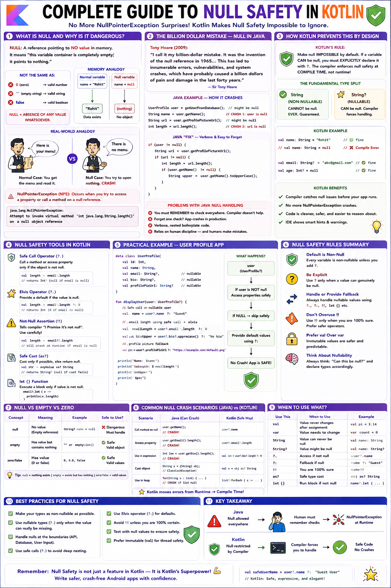

# 🛡️ Complete Guide to Null Safety in Kotlin



---

## 🚫 Part 1: What is Null and Why is it Dangerous?

### ❓ What Does "Null" Actually Mean?
Before understanding why null is dangerous, let's understand what it actually is.

> 🚫 **NULL:** A reference pointing to **NO value** in memory. It means "this variable container is completely empty; it points to nothing."

```
NULL IS NOT THE SAME AS:
  - 0 (zero IS a valid numeric value)
  - "" (an empty string IS a valid String object)
  - false (false IS a valid Boolean value)

NULL IS THE ABSENCE OF ANY VALUE WHATSOEVER.
```

```
MEMORY ANALOGY:

Regular variable:
┌─────────────────────┐
│   name = "Rohit"    │  → Points to a String object in memory
└─────────────────────┘         ↓
                          ┌──────────┐
                          │ "Rohit"  │  ← Actual data EXISTS
                          └──────────┘

Null variable:
┌─────────────────────┐
│   name = null       │  → Points to NOTHING
└─────────────────────┘         ↓
                              (void)   ← No object. Empty space.
```

---

### 🍽️ The Real-World Analogy
Imagine you ask a waiter: *"Can you give me the menu?"*

- **NORMAL Case:** Waiter hands you a physical menu object. You open it and read. Everything works.
- **NULL Case:** Waiter says *"There is no menu."* You try to open it anyway. You are holding **NOTHING** and trying to read it. **CRASH!**

In programming terms:
```kotlin
val name = getUserName()  // returns null
name.length               // trying to read from NOTHING → CRASH
```

---

### 💥 NullPointerException — The Most Famous Bug in Programming

> 💥 **NullPointerException (NPE):** Occurs when code attempts to invoke a method or access a property on an object reference that evaluates to `null`.

```
THE CRASH MESSAGE:
  java.lang.NullPointerException: 
  Attempt to invoke virtual method 'int java.lang.String.length()' on a null object reference

TRANSLATION: "You tried to call .length() on something that does not exist. I cannot do that!"
```

---

## 💸 Part 2: The Billion Dollar Mistake — Null in Java

### 📜 Tony Hoare's Confession
Null references were invented by Sir Tony Hoare in 1965 for the ALGOL W language. In 2009, he publicly apologized:

> 💬 *"I call it my billion-dollar mistake. It was the invention of the null reference in 1965... This has led to innumerable errors, vulnerabilities, and system crashes, which have probably caused a billion dollars of pain and damage in the last forty years."*
> — **Tony Hoare (2009)**

---

### ☕ How Java Crashes With Null — A Real Example

```java
// JAVA CODE — Pre-Kotlin Null Nightmare
public class UserProfile {
    private String name;
    private String email;
    private String profilePictureUrl;  // nullable if user hasn't uploaded

    public String getProfilePictureUrl() { return profilePictureUrl; }
    public String getName() { return name; }
}

// In an Android Activity:
UserProfile user = getUserFromDatabase();  // might return null!

// CRASH 1: User object is null
String name = user.getName();  // NullPointerException!

// CRASH 2: Specific field is null
String url = user.getProfilePictureUrl();
int length = url.length();      // NullPointerException if url is null!

// JAVA "FIX" — Verbose nested checks everywhere:
if (user != null) {
    String url = user.getProfilePictureUrl();
    if (url != null) {
        int length = url.length();
        if (user.getName() != null) {
            String upper = user.getName().toUpperCase();
        }
    }
}
```

```
PROBLEMS WITH JAVA NULL HANDLING:
  ❌ You must REMEMBER to check everywhere. Compiler does NOT help you.
  ❌ Forget one check? App crashes in production.
  ❌ Verbose, nested boilerplate code.
  ❌ It relies on human discipline — and humans make mistakes.
```

---

## 🛡️ Part 3: How Kotlin Prevents This By Design

### 🎯 Kotlin's Fundamental Approach

> 🛡️ **KOTLIN'S RULE:** Make `null` **IMPOSSIBLE** by default. If a variable CAN be null, you must EXPLICITLY declare it with `?`. The compiler enforces null safety at **COMPILE TIME**, not runtime!

---

### 🔀 The Fundamental Type Split

```
JAVA:    One type `String` → can be null or non-null (ambiguous)

KOTLIN:  TWO completely separate types in the type system:
         String   → CANNOT be null. EVER. Guaranteed.
         String?  → CAN be null. Compiler forces handling.
```

```kotlin
fun main() {
    // NON-NULLABLE (default in Kotlin):
    val name: String = "Rohit"      // ✅ fine
    // val name: String = null      // ❌ COMPILE ERROR: Null cannot be a value of a non-null type String

    // NULLABLE (explicitly marked with ?):
    val nickname: String? = "Rocky" // ✅ fine
    val email: String? = null       // ✅ fine — null allowed for String?

    // The compiler enforces safe usage:
    println(name.length)     // ✅ SAFE — name is String, guaranteed not null
    // println(email.length) // ❌ COMPILE ERROR — email might be null!
}
```

---

## ❓ Part 4: Nullable Types — The `?` Operator

### 📝 Declaring Nullable Types

```kotlin
fun main() {
    // NON-NULLABLE TYPES (cannot hold null):
    val name: String = "Rohit"
    val age: Int = 24
    val isLoggedIn: Boolean = true

    // NULLABLE TYPES (CAN hold null — must add ?):
    var profilePictureUrl: String? = null      // User hasn't uploaded photo
    var bio: String? = null                     // Optional biography
    var discountCode: String? = null           // Maybe no coupon applied

    // Reassigning values:
    profilePictureUrl = "https://cdn.app.com/photos/user_1042.jpg"
    discountCode = null                        // Reset back to null
}
```

```kotlin
// NULLABLE VERSIONS FOR ALL TYPES:
val a: Int = 42          ; var b: Int? = null
val c: Long = 100L       ; var d: Long? = null
val e: Double = 3.14     ; var f: Double? = null
val g: Float = 1.5f      ; var h: Float? = null
val i: String = "hello"  ; var j: String? = null
val k: Boolean = true    ; var l: Boolean? = null
val m: Char = 'A'        ; var n: Char? = null
```

```kotlin
// COMMON NULLABLE TYPES IN ANDROID DATA MODELS:
data class UserProfile(
    val id: Int,
    val name: String,
    val profilePictureUrl: String?, // optional
    val bio: String?,                // optional
    val referralCode: String?        // optional
)

data class ApiResponse(
    val data: List<Restaurant>?,     // null if request failed
    val error: String?               // null if request succeeded
)
```

---

## 🪂 Part 5: Safe Call Operator — `?.`

### ❓ The Problem It Solves
Instead of writing verbose `if (variable != null)` checks, Kotlin provides the **Safe Call Operator** (`?.`).

> 🪂 **SAFE CALL OPERATOR (`?.`):** Executes the method or property access ONLY if the receiver is NOT `null`. If the receiver is `null`, it skips execution and evaluates directly to `null`. **NO CRASH!**

```kotlin
fun main() {
    val url: String? = "https://cdn.app.com/photo.jpg"
    val noUrl: String? = null

    println(url?.length)    // 35 (url is not null, .length runs)
    println(noUrl?.length)  // null (noUrl is null, skips .length and returns null)

    // Chaining multiple safe calls:
    data class City(val name: String, val country: String?)
    data class Address(val city: City?, val zipCode: String?)
    data class User(val name: String, val address: Address?)

    val user1 = User("Rohit", Address(City("Bangalore", "India"), "560001"))
    val user2 = User("Priya", null)

    println(user1.address?.city?.country)  // India
    println(user2.address?.city?.country)  // null (safely evaluates to null)

    // Chaining function calls safely:
    val name: String? = "  rohit kumar  "
    println(name?.trim()?.uppercase())     // "ROHIT KUMAR"
}
```

```kotlin
// REAL ANDROID UI SAFE CALL EXAMPLE:
fun displayUserInfo(user: UserProfile?) {
    nameTextView.text = user?.name         // ✅ sets null if user is null
    emailTextView.text = user?.email       // ✅ safe
    bioTextView.text = user?.bio           // ✅ safe
}
```

---

## 🕺 Part 6: Elvis Operator — `?:`

### ❓ The Problem Safe Call Alone Does Not Solve
`url?.length` returns `Int?` (which can be `null`). But what if you need an actual non-null `Int` with a default value when `null`?

> 🕺 **ELVIS OPERATOR (`?:`):** Named because `?:` resembles Elvis Presley's hair lock when tilted sideways! Returns the left-hand expression if non-null; otherwise returns the right-hand fallback expression.

$$\text{value} = \text{nullableExpression} \quad \mathbf{?:} \quad \text{fallbackDefault}$$

```kotlin
fun main() {
    val url: String? = null
    val actualUrl: String? = "https://cdn.app.com/photo.jpg"

    // Elvis with fallback default:
    val length1 = url?.length ?: 0
    println(length1)   // 0 (url is null, fallback 0 used)

    val length2 = actualUrl?.length ?: 0
    println(length2)   // 35 (actualUrl is valid)

    val userName: String? = null
    val displayName = userName ?: "Anonymous User"
    println(displayName) // "Anonymous User"

    // ELVIS WITH EARLY RETURN FROM FUNCTION:
    fun processUser(userId: Int?): String {
        val id = userId ?: return "Invalid: No user ID provided"
        return "Processing user: $id"
    }

    // ELVIS WITH EXCEPTION THROWING:
    fun getUserName(name: String?): String {
        return name ?: throw IllegalArgumentException("Name cannot be null!")
    }
}
```

```kotlin
// REAL ANDROID USAGE OF ELVIS OPERATOR:

fun bindUserData(user: UserProfile?) {
    nameTextView.text = user?.name ?: "Unknown User"
    bioTextView.text = user?.bio ?: "No bio added yet"
    cityTextView.text = user?.city ?: "Location not set"
}

fun calculateOrderTotal(order: Order?): Double {
    val subtotal = order?.subtotal ?: 0.0
    val discount = order?.discount ?: 0.0
    val deliveryFee = order?.deliveryFee ?: 40.0
    return subtotal - discount + deliveryFee
}
```

---

## ⚠️ Part 7: Not-Null Assertion Operator — `!!`

> ⚠️ **NOT-NULL ASSERTION (`!!`):** Converts any nullable type to non-nullable (`T?` $\rightarrow$ `T`). Tells the compiler: *"I guarantee this is not null. Skip safety checks."* **If wrong, throws a `NullPointerException` at runtime!**

```kotlin
fun main() {
    val name: String? = "Rohit"
    val nullName: String? = null

    val actualName: String = name!!   // ✅ Fine — name is "Rohit"
    println(actualName.length)        // 5

    // val disaster: String = nullName!! // ❌ NullPointerException CRASH!
}
```

> [!CAUTION]
> **Avoid `!!` in production code!** It disables Kotlin's safety protections. Always prefer `?.` (Safe Call), `?:` (Elvis), or `let`.

---

### 📊 `?.` vs `?:` vs `!!` Comparison Matrix

| Operator | Syntax | Meaning | Crash Risk |
| :--- | :--- | :--- | :--- |
| **Safe Call** | `a?.b` | Call `.b` if `a` is not null, else return `null`. | 🟢 **Zero Risk** |
| **Elvis Operator** | `a ?: b` | Return `a` if non-null, else return fallback `b`. | 🟢 **Zero Risk** |
| **Not-Null Assertion** | `a!!` | Treat `a` as non-null. Throw NPE if `null`. | 🔴 **High Risk** |

---

## 🎯 Part 8: `let` Scope Function with Null Safety

> 🎯 **`let`:** Executes a block of code ONLY when the target object is **NOT `null`**. Inside the block, the non-null value is referenced as `it` (or a named parameter).

```kotlin
fun main() {
    val profilePicUrl: String? = "https://cdn.app.com/photo.jpg"
    val emptyUrl: String? = null

    // Run block ONLY if profilePicUrl is non-null:
    profilePicUrl?.let { url ->
        println("Loading image: $url")
        println("URL length: ${url.length}")
    }

    // Skipped silently when null:
    emptyUrl?.let {
        println("This will NEVER run")
    }

    // Combining let + Elvis:
    val discountCode: String? = null
    val discountMessage = discountCode?.let { code ->
        "Discount applied: $code (10% off)"
    } ?: "No discount code applied"

    println(discountMessage) // No discount code applied
}
```

```kotlin
// REAL ANDROID USAGE WITH let:
fun onUserLoaded(user: UserProfile?) {
    user?.let { profile ->
        displayName(profile.name)
        loadProfilePicture(profile.profilePictureUrl)
        updateBio(profile.bio)
    }
}
```

---

## 📱 Part 9: Complete Android Example — Profile Picture URL

Here is a full, real-world Android profile processing pipeline putting all null-safety operators together:

```kotlin
data class UserProfile(
    val id: Int,
    val name: String,
    val email: String,
    val profilePictureUrl: String?,    // optional
    val bio: String?,                   // optional
    val city: String?,                  // optional
    val phoneNumber: String?,           // optional
    val followersCount: Int?,           // optional
    val isPremium: Boolean = false
)

object DefaultValues {
    const val AVATAR_URL = "https://cdn.app.com/avatars/default_avatar.png"
    const val NO_BIO = "This user hasn't written a bio yet."
    const val UNKNOWN_CITY = "Location not shared"
    const val NO_PHONE = "Phone number not provided"
}

class UserProfileHandler {

    // 1. Safe Call (?.)
    fun getPhotoUrlLength(user: UserProfile?): Int? {
        return user?.profilePictureUrl?.length
    }

    // 2. Elvis Operator (?:)
    fun getDisplayPhotoUrl(user: UserProfile?): String {
        return user?.profilePictureUrl ?: DefaultValues.AVATAR_URL
    }

    // 3. let + safe call
    fun processProfilePicture(user: UserProfile?): ProfilePictureResult {
        val url = user?.profilePictureUrl

        return url?.let { photoUrl ->
            val isValidUrl = photoUrl.startsWith("https://") &&
                             (photoUrl.endsWith(".jpg") || photoUrl.endsWith(".png"))

            if (isValidUrl) {
                ProfilePictureResult.Success(photoUrl)
            } else {
                ProfilePictureResult.InvalidUrl(photoUrl)
            }
        } ?: ProfilePictureResult.NoPhoto
    }

    // 4. Complete formatted display
    fun buildProfileDisplayText(user: UserProfile?): String {
        if (user == null) return "No user profile available"

        // Smart cast: user is non-null after if-check!
        val name = user.name
        val bio = user.bio?.trim() ?: DefaultValues.NO_BIO
        val city = user.city ?: DefaultValues.UNKNOWN_CITY
        val phone = user.phoneNumber ?: DefaultValues.NO_PHONE
        val followers = user.followersCount?.toString() ?: "Hidden"

        return """
            |Name: $name
            |Bio: $bio
            |City: $city
            |Phone: $phone
            |Followers: $followers
            |Premium: ${if (user.isPremium) "Yes ✨" else "No"}
        """.trimMargin()
    }
}

sealed class ProfilePictureResult {
    data class Success(val url: String) : ProfilePictureResult()
    data class InvalidUrl(val url: String) : ProfilePictureResult()
    object NoPhoto : ProfilePictureResult()
}

fun main() {
    val handler = UserProfileHandler()

    val completeUser = UserProfile(
        id = 1042, name = "Rohit Kumar", email = "rohit@gmail.com",
        profilePictureUrl = "https://cdn.app.com/photos/1042.jpg",
        bio = "  Android Developer  ", city = "Bangalore",
        phoneNumber = "+91-98765-43210", followersCount = 1250, isPremium = true
    )

    val minimalUser = UserProfile(
        id = 2051, name = "Priya Sharma", email = "priya@gmail.com",
        profilePictureUrl = null, bio = null, city = null,
        phoneNumber = null, followersCount = null
    )

    println("=== COMPLETE USER ===")
    println("Photo URL length: ${handler.getPhotoUrlLength(completeUser)}")
    println("Display URL: ${handler.getDisplayPhotoUrl(completeUser)}")
    println(handler.buildProfileDisplayText(completeUser))

    println("\n=== MINIMAL USER (many nulls) ===")
    println("Photo URL length: ${handler.getPhotoUrlLength(minimalUser)}")
    println("Display URL: ${handler.getDisplayPhotoUrl(minimalUser)}")
    println(handler.buildProfileDisplayText(minimalUser))
}
```

```text
OUTPUT:
=== COMPLETE USER ===
Photo URL length: 35
Display URL: https://cdn.app.com/photos/1042.jpg
Name: Rohit Kumar
Bio: Android Developer
City: Bangalore
Phone: +91-98765-43210
Followers: 1250
Premium: Yes ✨

=== MINIMAL USER (many nulls) ===
Photo URL length: null
Display URL: https://cdn.app.com/avatars/default_avatar.png
Name: Priya Sharma
Bio: This user hasn't written a bio yet.
City: Location not shared
Phone: Phone number not provided
Followers: Hidden
Premium: No
```

---

## ⏳ Part 10: `lateinit var` — Delayed Property Initialization

### ❓ The Problem It Solves
In Android, views or dependencies cannot be initialized at object declaration (e.g., UI `TextView` references before `onCreate()` inflates layout).

> ⏳ **`lateinit var`:** Tells Kotlin: *"I promise to initialize this non-null property before using it."* Avoids nullable `? = null` boilerplate.

```kotlin
class ProfileActivity : AppCompatActivity() {

    // Promise initialization before use:
    private lateinit var nameTextView: TextView
    private lateinit var userViewModel: UserViewModel

    override fun onCreate(savedInstanceState: Bundle?) {
        super.onCreate(savedInstanceState)
        setContentView(R.layout.activity_profile)

        // Initialize promised variables:
        nameTextView = findViewById(R.id.tvName)
        userViewModel = ViewModelProvider(this)[UserViewModel::class.java]

        // Safe usage without ?. or !! :
        nameTextView.text = "Rohit Kumar"
    }
}
```

```kotlin
// CHECKING IF LATEINIT IS INITIALIZED:
if (::nameTextView.isInitialized) {
    nameTextView.text = "Updated"
}
```

> [!IMPORTANT]
> **`lateinit` Rules:**
> 1. Works ONLY with `var` (mutable).
> 2. Works ONLY with non-nullable class types (NO primitive types like `Int`, `Boolean`, `Double`).
> 3. If accessed before initialization $\rightarrow$ throws `UninitializedPropertyAccessException`.

---

## 🦥 Part 11: `by lazy` — Lazy Initialization on First Access

### ❓ The Problem: Expensive Operations at Startup
Creating heavy database instances, API services, or regex engines on app launch wastes memory and CPU cycles if the user doesn't visit those screens.

> 🦥 **`by lazy`:** Evaluates an initialization lambda block **ONLY when the property is read for the first time**. The result is cached and returned for all subsequent reads.

```kotlin
class MovieDetailActivity : AppCompatActivity() {

    // 1. Database — created ONLY when first accessed:
    private val database: AppDatabase by lazy {
        AppDatabase.getInstance(applicationContext)
    }

    // 2. Retrofit API service — lazy initialization:
    private val apiService: MovieApiService by lazy {
        RetrofitClient.createService(MovieApiService::class.java)
    }

    override fun onCreate(savedInstanceState: Bundle?) {
        super.onCreate(savedInstanceState)
        setContentView(R.layout.activity_movie)
        // database & apiService NOT created yet!
    }

    fun onFavoriteClicked() {
        // database initialized HERE on first click:
        database.movieDao().addToFavorites(movieId)
    }
}
```

---

## 📊 Part 12: `lateinit` vs `by lazy` — Complete Comparison

| Feature | `lateinit var` | `by lazy` |
| :--- | :--- | :--- |
| **Variable Type** | Must be **`var`** (Mutable) | Must be **`val`** (Immutable) |
| **Allowed Types** | Class objects only (No primitives `Int`, `Boolean`) | **Any type** (including primitives `Int`, `Double`) |
| **Initialization** | **Manual** (assigned by developer in `onCreate`) | **Automatic** (evaluates lambda on first read) |
| **Thread Safety** | Not thread-safe | **Thread-safe by default** |
| **Primary Use Cases** | Android Views, Dagger/Hilt DI, `@Before` Unit Tests | Heavy objects, Database instances, Retrofit APIs |

---

## 📊 Complete Summary of All Null Safety Tools

| Operator / Keyword | Syntax | Description |
| :--- | :--- | :--- |
| **Nullable Type** | `T?` | Declares variable capable of holding `null`. |
| **Safe Call** | `a?.b` | Accesses `.b` if `a != null`, else returns `null`. |
| **Elvis Operator** | `a ?: default` | Returns `a` if non-null, else fallback `default`. |
| **Not-Null Assertion**| `a!!` | Asserts non-null; throws NPE if `null`. Avoid! |
| **Scope Function** | `a?.let { }` | Runs code block only if `a != null`. |
| **Late Initialization**| `lateinit var` | Defers non-null property initialization. |
| **Lazy Initialization**| `val a by lazy { }`| Computes property value on first read. |

---

## ❓ 5 Quiz Questions

### 🎯 Question 1: Null Type System
- **Part A:** Is each valid Kotlin?
  - `a) val name: String = null`
  - `b) val name: String? = null`
  - `c) var age: Int = null`
  - `d) var age: Int? = null`
  - `e) val items: List<String?> = listOf("Hello", null, "World")`
- **Part B:** Explain the difference between `String` and `String?`. Is `String??` valid in Kotlin?
- **Part C:** How does Kotlin's compile-time type split solve Java's "Billion-Dollar Mistake"?

---

### 🍕 Question 2: Operator Selection Challenge
For each scenario, pick the BEST tool (`?.`, `?:`, `!!`, `let`, `lateinit`, `lazy`) and write code:
- **Scenario A:** Display `userBio: String?` in a `TextView`. If `null`, show `"No bio added yet."`.
- **Scenario B:** Call `searchQuery.trim().uppercase()` on `searchQuery: String?`. If `null`, return `null` without crashing.
- **Scenario C:** Execute 3 operations (send email, log analytics, save DB) ONLY if `email: String?` is non-null.
- **Scenario D:** Initialize a `RecyclerView.Adapter` in `onCreate()` of `ProfileActivity`.
- **Scenario E:** Initialize an expensive `ImageProcessor` object only when first needed.

---

### 🔍 Question 3: Spot & Fix Bugs
Find null-safety bugs and rewrite correctly:
```kotlin
// Bug 1:
fun getDisplayName(user: UserProfile?): String = user.name.trim().uppercase()

// Bug 2:
fun calculateTotal(price: Double?, discount: Double?): Double = price - discount

// Bug 3:
fun processSearchResults(results: List<String>?) {
    results?.let {
        results.forEach { item -> println(item!!.uppercase()) }
    }
}
```

---

### 🛠️ Question 4: `lateinit` vs `by lazy` Decision Making
Decide `val`/`var` and `lateinit`/`lazy` for:
1. Retrofit API client object in a Fragment.
2. `TextView` in an Activity set in `onCreate()`.
3. `AppDatabase` instance inside a ViewModel.
4. ViewPager2 Adapter replaced dynamically at runtime.

---

### 🚀 Question 5: Build a Movie Review App Logic
Given data class `Review(val id: Int, val rating: Double, val title: String?, val body: String?, val userPhotoUrl: String?)`:
1. Write `formatRatingDisplay(review: Review): String` (Rating `8.5/10 ⭐ Recommended`).
2. Write `getReviewSummary(review: Review?): String` handling nullable `title`, `body`, and `null` review object cleanly with Elvis `?:`.
3. Write `processUserAvatar(photoUrl: String?, imageView: ImageView)` using `let`.
4. Write `main()` demonstrating test cases for complete, minimal (null fields), and null reviews.