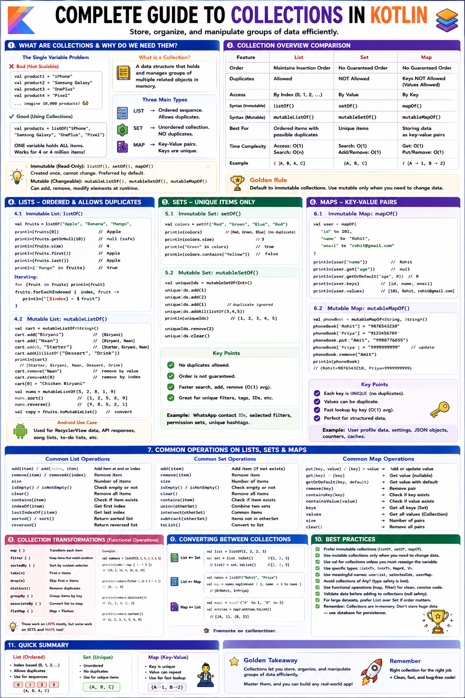

# 📚 Complete Guide to Collections in Kotlin



---

## ❓ What Are Collections and Why Do They Matter?

### 💡 The Single Variable Problem

```kotlin
// SINGLE VARIABLE PROBLEM:
val product1 = "iPhone"
val product2 = "Samsung Galaxy"
val product3 = "OnePlus"
val product4 = "Pixel"
// ... what if you have 10,000 products? You cannot create 10,000 variables!

// COLLECTION SOLUTION:
val products = listOf("iPhone", "Samsung Galaxy", "OnePlus", "Pixel")
// ONE variable holds ALL products. Works for 4 items or 4 million items.
```

> 📚 **COLLECTIONS:** Data structures that hold and manage groups of multiple related objects in memory.

---

### 🎨 Three Main Collection Types in Kotlin

```
1. LIST  → Ordered sequence. Allows duplicates. Index-based access.
           ["Song1", "Song2", "Song1"]  ← Duplicates allowed, order matters

2. SET   → Unordered collection. NO duplicates allowed.
           {"Apple", "Banana", "Cherry"}  ← Unique elements only

3. MAP   → Key-Value pairs. Each Key is unique.
           {"Rohit" → "9876543210", "Priya" → "9123456789"}  ← Fast lookup by key
```

---

### 🔒 Immutable vs Mutable Collections

```
IMMUTABLE (Read-Only):    listOf(), setOf(), mapOf()
  - Created once, cannot add/remove/modify items after creation.
  - Protected against accidental modifications.
  - Preferred by default in Kotlin.

MUTABLE (Changeable):     mutableListOf(), mutableSetOf(), mutableMapOf()
  - Allows adding, removing, and modifying elements at runtime.
  - Used when state changes over time.
```

> [!TIP]
> **KOTLIN PHILOSOPHY:** Default to immutable (`listOf()`, `setOf()`, `mapOf()`). Only use mutable collections when you genuinely need to modify data. This mirrors `val` vs `var`.

---

## 📜 SECTION 1: LISTS

---

## 📋 Part 1: What is a List?

### 📖 Key Characteristics of a List
- ✅ **Ordered Sequence:** Items maintain insertion order.
- ✅ **Allows Duplicates:** Same value can appear multiple times.
- ✅ **Index-Based Access:** Zero-indexed positions (`0, 1, 2, ...`).

```
INDEX:   0        1          2          3
LIST: ["Biryani", "Pizza", "Burger", "Biryani"]
                                       ↑
                           Duplicate allowed!
```

---

### 🔒 1. `listOf()` — Immutable List

```kotlin
fun main() {
    val fruits = listOf("Apple", "Banana", "Mango", "Orange")
    val primes = listOf(2, 3, 5, 7, 11, 13)

    // ACCESSING ELEMENTS BY INDEX:
    println(fruits[0])              // Apple (index 0)
    println(fruits[1])              // Banana (index 1)

    // SAFE ACCESS (prevents IndexOutOfBoundsException crash):
    println(fruits.getOrNull(10))   // null (instead of crashing!)
    println(fruits.getOrElse(10) { "Unknown" }) // Fallback default

    // BASIC PROPERTIES & CHECKS:
    println(fruits.size)            // 4
    println(fruits.first())         // Apple
    println(fruits.last())          // Orange
    println(fruits.firstOrNull())   // Apple (safe on empty lists)
    println("Mango" in fruits)      // true (same as fruits.contains("Mango"))

    // ITERATING OVER LISTS:
    for (fruit in fruits) {
        println(fruit)
    }

    fruits.forEachIndexed { index, fruit ->
        println("[$index] = $fruit")
    }
}
```

---

### ✏️ 2. `mutableListOf()` — Mutable List

```kotlin
fun main() {
    val shoppingCart = mutableListOf<String>()

    // ADDING ELEMENTS:
    shoppingCart.add("Biryani")              // Adds to END
    shoppingCart.add("Naan")
    shoppingCart.add(0, "Starter")           // Inserts at index 0
    shoppingCart.addAll(listOf("Dessert", "Drink")) // Adds list

    println(shoppingCart) // [Starter, Biryani, Naan, Dessert, Drink]

    // REMOVING ELEMENTS:
    shoppingCart.remove("Naan")              // Removes by value
    shoppingCart.removeAt(0)                 // Removes by index

    // REPLACING / UPDATING:
    shoppingCart[0] = "Chicken Biryani"

    // SORTING & REVERSING (In-Place):
    val numbers = mutableListOf(5, 2, 8, 1, 9)
    numbers.sort()                           // [1, 2, 5, 8, 9]
    numbers.sortDescending()                 // [9, 8, 5, 2, 1]
    numbers.reverse()                        // Reverses order

    // CONVERTING IMMUTABLE ↔ MUTABLE:
    val immutableList = listOf("A", "B", "C")
    val mutableCopy = immutableList.toMutableList()
    mutableCopy.add("D")
}
```

---

### 📱 Android Development Connection for Lists

```kotlin
// REAL ANDROID RECYCLERVIEW & VIEWMODEL PATTERN:

data class Product(val id: Int, val name: String, val price: Double)

class ProductViewModel : ViewModel() {
    // Private mutable list (only ViewModel modifies)
    private val _products = mutableListOf<Product>()

    // Public read-only list exposed to UI (prevents external modification)
    val products: List<Product> get() = _products

    fun addProduct(product: Product) {
        _products.add(product)
    }

    fun removeProduct(productId: Int) {
        _products.removeIf { it.id == productId }
    }
}
```

---

## 🎯 SECTION 2: SETS

---

## 🔮 Part 2: What is a Set?

### 📖 Key Characteristics of a Set
- ✅ **No Duplicates:** Automatically discards duplicate entries.
- ✅ **Unordered:** Does not guarantee insertion order.
- ✅ **Fast Membership Testing:** `contains()` is $O(1)$ constant time lookup.
- ❌ **No Index Access:** You cannot call `set[0]`.

```kotlin
fun main() {
    val countries = setOf("India", "USA", "Japan", "Germany")
    val uniqueScores = setOf(100, 85, 90, 75, 100) // Duplicate 100 is ignored!

    println(uniqueScores) // [100, 85, 90, 75]

    // SET MATHEMATICAL OPERATIONS:
    val setA = setOf(1, 2, 3, 4, 5)
    val setB = setOf(3, 4, 5, 6, 7)

    println("Union: ${setA.union(setB)}")          // [1, 2, 3, 4, 5, 6, 7]
    println("Intersect: ${setA.intersect(setB)}")  // [3, 4, 5]
    println("Subtract: ${setA.subtract(setB)}")    // [1, 2]

    // MUTABLE SET:
    val visitedPages = mutableSetOf<String>()
    visitedPages.add("Home")
    visitedPages.add("Products")
    visitedPages.add("Home") // Ignored duplicate!

    // DEDUPLICATE A LIST:
    val listWithDuplicates = listOf(1, 2, 2, 3, 3, 3, 4)
    val deduplicatedList = listWithDuplicates.toSet().toList() // [1, 2, 3, 4]
}
```

---

### 📊 Set vs List — Quick Comparison

| Feature | List (`listOf`) | Set (`setOf`) |
| :--- | :--- | :--- |
| **Duplicates** | Allowed | **Not Allowed** (Unique items only) |
| **Order** | Maintained (Insertion order) | Unordered / Not guaranteed |
| **Index Access** | `list[0]` | Not supported |
| **Lookup Speed** | $O(N)$ Linear time | **$O(1)$ Constant time** |

---

## 🗺️ SECTION 3: MAPS

---

## 🗺️ Part 3: What is a Map?

> 🗺️ **MAP:** A collection of **Key-Value Pairs** (`Key -> Value`) where every **Key** is unique.

```
DICTIONARY ANALOGY:
  "apple"  → "A round red or green fruit"
  "banana" → "A long yellow fruit"

- Word = KEY (Unique)
- Definition = VALUE
```

---

### 🗺️ `mapOf()` vs `mutableMapOf()`

```kotlin
fun main() {
    // IMMUTABLE MAP:
    val capitals = mapOf(
        "India" to "New Delhi",
        "Japan" to "Tokyo",
        "France" to "Paris"
    )

    val httpCodes = mapOf(
        200 to "OK",
        404 to "Not Found",
        500 to "Internal Server Error"
    )

    // GETTING VALUES BY KEY:
    println(capitals["India"])                       // New Delhi
    println(capitals["China"])                       // null (key missing)
    println(capitals.getOrDefault("China", "Unknown"))// Unknown

    // KEYS, VALUES, & ENTRIES:
    println(capitals.keys)    // [India, Japan, France]
    println(capitals.values)  // [New Delhi, Tokyo, Paris]

    // ITERATING OVER MAPS:
    for ((country, capital) in capitals) {
        println("$country → $capital")
    }

    // MUTABLE MAP:
    val userSessions = mutableMapOf<String, String>()
    userSessions["user_1042"] = "token_abc123"
    userSessions["user_1042"] = "token_updated" // Updates key user_1042

    userSessions.remove("user_1042")            // Removes entry by key
}
```

```kotlin
// REAL ANDROID MAP USAGE:

// 1. HTTP Request Headers:
val headers = mapOf(
    "Authorization" to "Bearer eyJhbGci...",
    "Content-Type" to "application/json"
)

// 2. Shopping Cart Quantities (ProductId -> Quantity):
class ShoppingCart {
    private val items = mutableMapOf<Int, Int>()

    fun addItem(productId: Int) {
        items[productId] = (items[productId] ?: 0) + 1
    }

    fun getQuantity(productId: Int) = items[productId] ?: 0
    fun getTotalItems() = items.values.sum()
}
```

---

## ⚡ SECTION 4: COLLECTION OPERATIONS

---

## ⚡ Part 4: Functional Collection Operations

Collection operations in Kotlin are functional: they do **NOT** mutate original collections, but return a **NEW** collection containing results.

---

### 🔍 1. `filter` — Keep Only Matching Items

```kotlin
data class Product(
    val id: Int,
    val name: String,
    val price: Double,
    val category: String,
    val rating: Double,
    val inStock: Boolean
)

val products = listOf(
    Product(1, "iPhone 15",          99999.0, "Electronics", 4.8, true),
    Product(2, "Samsung Galaxy S24", 79999.0, "Electronics", 4.6, true),
    Product(3, "Nike Air Max",       12999.0, "Footwear",    4.5, false),
    Product(4, "Levi's Jeans",        4999.0, "Clothing",    4.2, true)
)

fun main() {
    // Keep items matching condition:
    val electronics = products.filter { it.category == "Electronics" }
    val affordable = products.filter { it.price < 10_000 }
    val highRatedInStock = products.filter { it.rating >= 4.5 && it.inStock }
}
```

---

### 🔄 2. `map` — Transform Every Item

```kotlin
fun main() {
    val numbers = listOf(1, 2, 3, 4, 5)
    val doubled = numbers.map { it * 2 } // [2, 4, 6, 8, 10]

    // Transform list of objects to list of strings:
    val productNames = products.map { it.name }
    // ["iPhone 15", "Samsung Galaxy S24", ...]

    // Transform & filter nulls simultaneously:
    val maybeNames = listOf("Rohit", null, "Priya")
    val nonNullUpper = maybeNames.mapNotNull { it?.uppercase() } // ["ROHIT", "PRIYA"]
}
```

---

### 🔎 3. `find` — Find First Match

```kotlin
fun main() {
    // Returns first matching element, or NULL if not found:
    val firstElectronics = products.find { it.category == "Electronics" }
    println(firstElectronics?.name) // iPhone 15

    val product3 = products.find { it.id == 3 }
    println(product3?.name) // Nike Air Max
}
```

---

### 🧪 4. `any`, `all`, `none` — Logical Condition Checks

```kotlin
fun main() {
    // any -> true if AT LEAST ONE item matches
    println(products.any { it.inStock })            // true

    // all -> true if ALL items match
    println(products.all { it.rating >= 4.0 })      // true

    // none -> true if NO items match
    println(products.none { it.price > 500_000.0 }) // true
}
```

---

### 📈 5. `sortedBy` & `sortedByDescending` — Sorting

```kotlin
fun main() {
    val byPriceAsc = products.sortedBy { it.price }
    val byRatingDesc = products.sortedByDescending { it.rating }

    // Multi-criteria sorting:
    val sortedCategoryThenPrice = products.sortedWith(
        compareBy({ it.category }, { it.price })
    )
}
```

---

### 📂 6. `groupBy` — Grouping into Map

```kotlin
fun main() {
    // Groups items into Map<Category, List<Product>>:
    val byCategory = products.groupBy { it.category }

    byCategory.forEach { (category, items) ->
        println("$category (${items.size} items): ${items.map { it.name }}")
    }
}
```

---

## 🛒 Part 5: Complete Real Android Example — Shopping App Manager

```kotlin
data class Product(
    val id: Int,
    val name: String,
    val price: Double,
    val category: String,
    val rating: Double,
    val inStock: Boolean,
    val tags: List<String> = emptyList()
)

data class CartItem(val product: Product, val quantity: Int)

val allProducts = listOf(
    Product(1,  "iPhone 15 Pro",     134999.0, "Electronics", 4.9, true,  listOf("flagship", "apple")),
    Product(2,  "Samsung Galaxy S24", 79999.0, "Electronics", 4.6, true,  listOf("android", "samsung")),
    Product(3,  "MacBook Air M3",    114999.0, "Electronics", 4.8, true,  listOf("laptop", "apple")),
    Product(4,  "Sony WH-1000XM5",   29999.0, "Electronics", 4.7, false, listOf("audio")),
    Product(5,  "Nike Air Max 270",   12999.0, "Footwear",    4.5, true,  listOf("running", "nike"))
)

class ShoppingAppManager {

    fun getByCategory(category: String): List<Product> =
        allProducts.filter { it.category.equals(category, ignoreCase = true) }

    fun search(query: String): List<Product> =
        allProducts.filter { p ->
            p.name.contains(query, ignoreCase = true) ||
            p.tags.any { it.contains(query, ignoreCase = true) }
        }

    fun getTopRated(minRating: Double = 4.5): List<Product> =
        allProducts.filter { it.rating >= minRating && it.inStock }

    fun groupByCategory(): Map<String, List<Product>> =
        allProducts.groupBy { it.category }

    fun calculateCartTotal(cart: List<CartItem>): Double =
        cart.sumOf { it.product.price * it.quantity }

    fun getRecommendations(viewedProduct: Product, limit: Int = 3): List<Product> =
        allProducts
            .filter { it.id != viewedProduct.id && it.inStock && (it.category == viewedProduct.category || it.tags.any { tag -> tag in viewedProduct.tags }) }
            .sortedByDescending { it.rating }
            .take(limit)
}

fun main() {
    val manager = ShoppingAppManager()

    println("=== SHOPPING APP DEMONSTRATION ===")
    println("Electronics: ${manager.getByCategory("Electronics").map { it.name }}")
    println("Search 'apple': ${manager.search("apple").map { it.name }}")
    println("Grouped: ${manager.groupByCategory().keys}")

    val cart = listOf(CartItem(allProducts[0], 1), CartItem(allProducts[4], 2))
    println("Cart Total: ₹${manager.calculateCartTotal(cart)}")
}
```

```text
OUTPUT:
=== SHOPPING APP DEMONSTRATION ===
Electronics: [iPhone 15 Pro, Samsung Galaxy S24, MacBook Air M3, Sony WH-1000XM5]
Search 'apple': [iPhone 15 Pro, MacBook Air M3]
Grouped: [Electronics, Footwear]
Cart Total: ₹160997.0
```

---

## 📊 Complete Summary Cheat Sheet

| Collection / Operation | Type | Features & Behavior |
| :--- | :--- | :--- |
| **`listOf()`** | List | Immutable, ordered, index-based, allows duplicates. |
| **`mutableListOf()`** | List | Mutable, allows `add()`, `remove()`, `removeAt()`. |
| **`setOf()`** | Set | Immutable, unordered, **NO duplicates allowed**. |
| **`mutableSetOf()`** | Set | Mutable set. Fast $O(1)$ `contains()` checks. |
| **`mapOf()`** | Map | Immutable key-value map (`key to value`). Keys unique. |
| **`mutableMapOf()`** | Map | Mutable map. Access/assign via `map[key] = value`. |
| **`filter { }`** | Operation | Returns new list of items matching condition. |
| **`map { }`** | Operation | Transforms every item to new representation. |
| **`find { }`** | Operation | Returns first matching element or `null`. |
| **`any / all / none`**| Operation | Evaluates Boolean predicate across collection. |
| **`sortedBy { }`** | Operation | Sorts collection ascending by property. |
| **`groupBy { }`** | Operation | Groups collection into `Map<Key, List<T>>`. |

---

## ❓ 5 Quiz Questions

### 🎯 Question 1: Collection Type Selection
Select the BEST collection type (`List`, `MutableList`, `Set`, `MutableSet`, `Map`, `MutableMap`) for:
- **a)** Storing global country names displayed in fixed order.
- **b)** Tracking unique user IDs who liked a post.
- **c)** Recipe steps sequence where step order matters and steps repeat.
- **d)** Mapping student roll numbers to their scores.
- **e)** Shopping cart items list managed dynamically.

---

### 🍕 Question 2: Collection Operations Practice
Given list of `Employee(id, name, department, salary, yearsOfExperience, isActive)`:
- **a)** Filter all active Engineering employees.
- **b)** Get sorted names of employees earning > ₹80,000.
- **c)** Calculate average salary of active employees.
- **d)** Find employee with maximum years of experience.
- **e)** Group active employees by department.

---

### 🗺️ Question 3: Map Operations Deep Dive
Given `quizScores = mutableMapOf("Rohit" to 85, "Priya" to 92, "Arjun" to 78)`:
- **a)** Add user `"Vikram"` with score `95`.
- **b)** Update `"Rohit"` to `91` and inspect `put()` return value.
- **c)** Use `putIfAbsent()` for `"Kiran"`.
- **d)** Find student name with highest score using `maxByOrNull`.
- **e)** Filter map to get scores > 85 (`mapValues` / `filter`).

---

### ⛓️ Question 4: Single Expression Operation Chains
Given `Movie(id, title, genre, rating, releaseYear, isAvailable, pricePerRent)`:
- **a)** Get titles of available Sci-Fi movies sorted by rating descending.
- **b)** Calculate average rating of available movies released after 2015.
- **c)** Map available movies to display `"1. Inception (8.8⭐) - ₹49/rent"`.
- **d)** Group available movies by genre and extract only movie titles (`Map<String, List<String>>`).
- **e)** Get top 3 available movies with rating $\ge 8.5$ as `Map<String, Double>` (title $\rightarrow$ rating).

---

### 🚀 Question 5: Design a Complete Contact Management Feature
Given data class `Contact(id, name, phoneNumber, email: String?, groups: List<String>, isFavorite: Boolean, lastContactedDays: Int)`:
1. `searchContacts(query: String)`: Search by name, phone, or nullable email.
2. `getContactsByGroup(group: String)`: Filter contacts belonging to group using `any`.
3. `getFavoriteContacts()`: Return favorites sorted by recent activity.
4. `getContactSummary()`: Return summary map with counts of total, favorites, withEmail, and unique sorted groups.
5. `getSuggestedContacts()`: Filter un-contacted ($> 20$ days), non-favorites, limit 5.