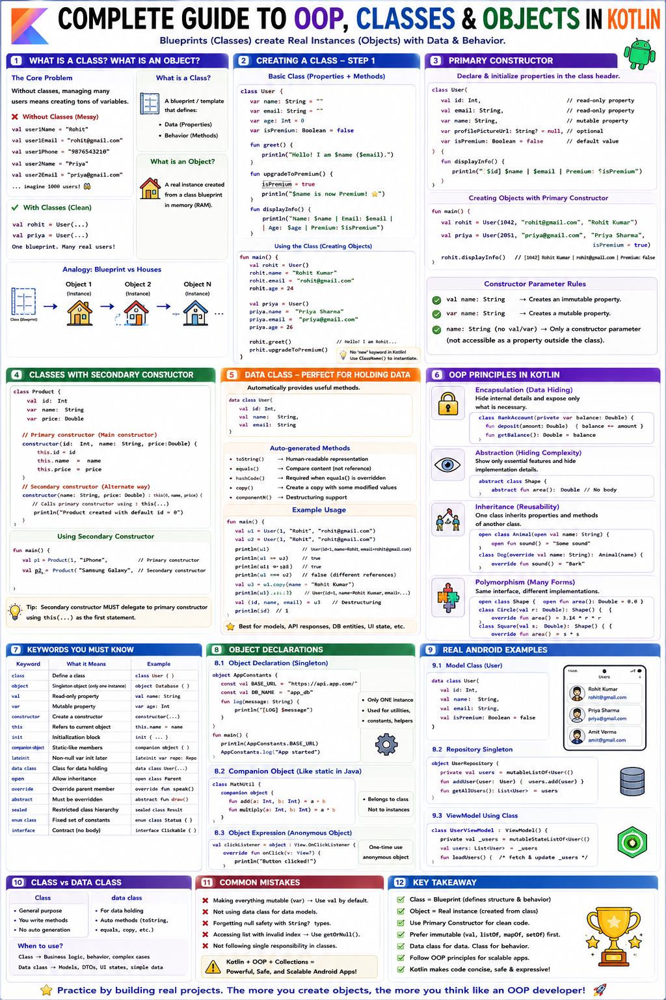

# 🏗️ Complete Guide to OOP, Classes, and Objects in Kotlin



---

## ❓ Part 1: What is a Class? What is an Object?

### 💡 Starting With the Core Problem

Imagine building an Android food delivery app. Your app manages user accounts. Each user has:
- A name
- An email
- A phone number
- A profile picture URL
- An address
- Premium membership status

```kotlin
// WITHOUT CLASSES — Managing 2 users needs 12 separate variables:
val user1Name = "Rohit Kumar"
val user1Email = "rohit@gmail.com"
val user1Phone = "9876543210"
val user1Photo = "https://cdn.app.com/photo1.jpg"
val user1IsPremium = true

val user2Name = "Priya Sharma"
val user2Email = "priya@gmail.com"
val user2Phone = "9123456789"
val user2Photo = "https://cdn.app.com/photo2.jpg"
val user2IsPremium = false

// For 1,000 users → 6,000 separate variables! Unmanageable chaos.
```

---

### 📐 What is a Class?

> 📐 **CLASS:** An architectural **BLUEPRINT** or template that defines:
> 1. **Data / Attributes:** Properties that describe the object.
> 2. **Behavior / Actions:** Methods that define what the object can do.

```
THE BLUEPRINT ANALOGY:

┌─────────────────────────────────────────────────────────────┐
│                    BLUEPRINT (Class)                        │
│  Defines structure (rooms, doors) & functions (living)       │
│  You CANNOT live in a blueprint. It describes a house.      │
└─────────────────────────────────────────────────────────────┘
                         ↓ Instantiate!
┌─────────────┐  ┌─────────────┐  ┌─────────────┐
│   House 1   │  │   House 2   │  │   House 3   │
│  (Object)   │  │  (Object)   │  │  (Object)   │
│ 42 MG Road  │  │ 15 Park St  │  │ 8 Lake View │
└─────────────┘  └─────────────┘  └─────────────┘
```

---

### 🏠 What is an Object?

> 🏠 **OBJECT:** A concrete **REAL INSTANCE** created in memory from a class blueprint.

- **Class:** `User` (The blueprint definition)
- **Object 1:** `rohit` (An actual instance with specific data)
- **Object 2:** `priya` (Another instance with its own distinct data)

> [!NOTE]
> Creating an object from a class is called **Instantiation**. In Kotlin, there is **NO `new` keyword**! `User()` directly instantiates an object.

---

## 🛠️ Part 2: Creating a Class in Kotlin

```kotlin
// Basic class with properties and methods:
class User {
    // PROPERTIES (State):
    var name: String = ""
    var email: String = ""
    var age: Int = 0
    var isPremium: Boolean = false

    // METHODS (Behavior):
    fun greet() {
        println("Hello! I am $name ($email).")
    }

    fun upgradeToPremium() {
        isPremium = true
        println("$name is now Premium! ⭐")
    }

    fun displayInfo() {
        println("Name: $name | Email: $email | Age: $age | Premium: $isPremium")
    }
}

fun main() {
    // Instantiating separate objects:
    val rohit = User()
    rohit.name = "Rohit Kumar"
    rohit.email = "rohit@gmail.com"
    rohit.age = 24

    val priya = User()
    priya.name = "Priya Sharma"
    priya.email = "priya@gmail.com"
    priya.age = 26

    rohit.greet()               // Hello! I am Rohit Kumar (rohit@gmail.com).
    rohit.upgradeToPremium()    // Rohit Kumar is now Premium! ⭐
}
```

---

## 🏗️ Part 3: Primary Constructor

> 🏗️ **PRIMARY CONSTRUCTOR:** Declares and initializes properties directly in the class header when an object is created.

```kotlin
class User(
    val id: Int,                           // Read-only property (val)
    val email: String,                     // Read-only property (val)
    var name: String,                      // Mutable property (var)
    var profilePictureUrl: String? = null, // Optional with default
    var isPremium: Boolean = false          // Optional with default
) {
    fun displayInfo() {
        println("[$id] $name | $email | Premium: $isPremium")
    }

    fun getDisplayName(): String {
        return if (isPremium) "⭐ $name" else name
    }
}

fun main() {
    // Instantiating with primary constructor:
    val rohit = User(id = 1042, email = "rohit@gmail.com", name = "Rohit Kumar")
    val priya = User(id = 2051, email = "priya@gmail.com", name = "Priya Sharma", isPremium = true)

    rohit.displayInfo() // [1042] Rohit Kumar | rohit@gmail.com | Premium: false
}
```

> [!IMPORTANT]
> **Constructor Parameter Rules:**
> - `val name: String` $\rightarrow$ Declares an **immutable property**.
> - `var name: String` $\rightarrow$ Declares a **mutable property**.
> - `name: String` (without `val`/`var`) $\rightarrow$ Constructor parameter **ONLY** (NOT a property accessible outside initialization!).

---

## 🚀 Part 4: `init` Block — Startup Initialization

> 🚀 **`init` BLOCK:** Executes automatically immediately after the primary constructor initializes properties. Used for parameter validation and setup logic.

```kotlin
class User(
    val id: Int,
    val email: String,
    var name: String,
    var age: Int
) {
    val userCode: String = "USR-${id.toString().padStart(6, '0')}"

    // FIRST init block — runs validation:
    init {
        require(id > 0) { "User ID must be positive. Got: $id" }
        require(email.contains("@")) { "Invalid email format: $email" }
        require(age in 13..120) { "Age must be between 13 and 120. Got: $age" }
        require(name.isNotBlank()) { "Name cannot be blank" }

        name = name.trim() // Clean up name
    }

    val welcomeMessage: String = "Welcome, $name!"

    // SECOND init block — runs after properties:
    init {
        println("User $userCode initialized successfully!")
    }
}
```

---

## 🔄 Part 5: Secondary Constructor

> 🔄 **SECONDARY CONSTRUCTOR:** Additional constructors defined in the class body using the `constructor` keyword to provide alternative object initialization paths. Must delegate to primary constructor via `this(...)`.

```kotlin
class User(
    val id: Int,
    val email: String,
    var name: String,
    var isPremium: Boolean = false
) {
    // SECONDARY CONSTRUCTOR 1: Create user from Map/JSON:
    constructor(dataMap: Map<String, String>) : this(
        id = dataMap["id"]?.toIntOrNull() ?: 0,
        email = dataMap["email"] ?: "",
        name = dataMap["name"] ?: "Unknown",
        isPremium = dataMap["isPremium"] == "true"
    ) {
        println("User constructed from Map data.")
    }

    // SECONDARY CONSTRUCTOR 2: Guest user creation:
    constructor(guestName: String) : this(
        id = -1,
        email = "guest@app.com",
        name = guestName,
        isPremium = false
    )
}
```

---

## ⚙️ Part 6: Properties — Custom Getters, Setters, and `field`

### 🔍 Custom Getters (Computed Properties)

```kotlin
class UserProfile(
    val id: Int,
    var firstName: String,
    var lastName: String,
    var age: Int
) {
    // COMPUTED PROPERTY — recalculated on every read access:
    val fullName: String
        get() = "$firstName $lastName"

    val isAdult: Boolean
        get() = age >= 18
}
```

---

### ✏️ Custom Setters & Backing `field`

```kotlin
class Product(val id: Int, name: String, price: Double) {

    // Property with custom setter:
    var name: String = name
        set(value) {
            require(value.isNotBlank()) { "Product name cannot be blank" }
            field = value.trim() // 'field' is the backing storage field!
        }

    var price: Double = price
        set(value) {
            require(value >= 0) { "Price cannot be negative" }
            field = value
        }

    var discountPercent: Int = 0
        get() = field.coerceIn(0, 90)
        set(value) {
            field = value.coerceIn(0, 90)
        }

    val discountedPrice: Double
        get() = price * (1 - discountPercent / 100.0)
}
```

> [!WARNING]
> **Avoid Infinite Recursion!** Inside a custom setter, always assign to **`field`** (e.g., `field = value`), **NEVER** to the property name directly (e.g., `name = value`), which recursively triggers the setter!

---

### 🎯 The `this` Keyword

```kotlin
class User(val id: Int, var name: String) {
    fun updateName(name: String) {
        this.name = name // 'this.name' refers to property, 'name' to parameter
    }

    fun setSelf(): User {
        return this // Return current object instance for method chaining
    }
}
```

---

## 🔒 Part 7: Access Modifiers & Encapsulation

> 🔒 **ENCAPSULATION:** Bundling data and methods while restricting direct access to internal components.

```
ATM ANALOGY:
- Public Interface: Screen, Card Slot, Keypad (Accessible to all)
- Private Internal: Cash Vault, Vault Lock, Encryption Keys (Hidden & Protected)
```

```kotlin
class BankAccount(
    val accountId: String,       // Public read-only
    private val ownerId: Int,    // Private — Class only
    initialBalance: Double
) {
    private var balance: Double = initialBalance // Hidden state

    protected var interestRate: Double = 0.04    // Class + Subclasses

    internal val bankCode: String = "SBIN001"    // Module wide

    fun getBalance(): Double = balance          // Controlled public read

    fun deposit(amount: Double) {
        require(amount > 0) { "Amount must be positive" }
        balance += amount
    }

    fun withdraw(amount: Double): Boolean {
        if (amount > balance) return false
        balance -= amount
        return true
    }
}
```

---

### 📊 Access Modifiers Reference Table

| Modifier | Visibility Scope |
| :--- | :--- |
| **`public`** (Default) | Visible **everywhere** in the project. |
| **`private`** | Visible **ONLY inside the defining class**. |
| **`protected`** | Visible inside defining class and **subclasses**. |
| **`internal`** | Visible **anywhere within the same compilation module** (e.g., Android app module). |

---

## 🤝 Part 8: Companion Object — Class-Level Members

> 🤝 **COMPANION OBJECT:** Replaces Java's `static` keyword. Holds class-level constants, factory functions, and utilities that belong to the class itself rather than individual instances.

```kotlin
class User private constructor(
    val id: Int,
    val name: String,
    val email: String,
    val role: String
) {
    companion object {
        const val ROLE_USER = "user"
        const val ROLE_ADMIN = "admin"

        private var userCount = 0

        // Factory Method:
        fun createRegularUser(id: Int, name: String, email: String): User {
            userCount++
            return User(id, name, email, ROLE_USER)
        }

        fun createAdmin(id: Int, name: String, email: String): User {
            require(email.endsWith("@company.com")) { "Admin requires company email" }
            userCount++
            return User(id, name, email, ROLE_ADMIN)
        }

        fun getUserCount(): Int = userCount
    }
}

fun main() {
    // Accessing companion members via Class name:
    println(User.ROLE_USER)
    val user1 = User.createRegularUser(101, "Rohit", "rohit@gmail.com")
    val admin = User.createAdmin(1, "Admin", "admin@company.com")
    println("Total Users: ${User.getUserCount()}") // 2
}
```

---

## 📱 Part 9: Complete Real Android Example — Production User Class

```kotlin
data class Address(val street: String, val city: String, val state: String, val pincode: String)

class User private constructor(
    val id: Int,
    email: String,
    name: String,
    val createdAt: Long,
    var profilePictureUrl: String?,
    var bio: String?,
    var address: Address?,
    private var passwordHash: String,
    internal var authToken: String?,
    protected var accountTier: String
) {
    var email: String = email
        private set

    var name: String = name
        set(value) {
            field = value.trim().lowercase().replaceFirstChar { it.uppercase() }
        }

    private var _followersCount: Int = 0
    val followersCount: Int get() = _followersCount

    private val _likedPostIds = mutableSetOf<Int>()
    val likedPostIds: Set<Int> get() = _likedPostIds

    init {
        require(id > 0) { "ID must be positive" }
        require(email.contains("@")) { "Invalid email" }
        this.name = name
    }

    val displayName: String
        get() = if (accountTier == TIER_PREMIUM) "⭐ $name" else name

    val isPremium: Boolean
        get() = accountTier == TIER_PREMIUM

    fun likePost(postId: Int): Boolean = _likedPostIds.add(postId)

    fun upgradeToPremium() {
        accountTier = TIER_PREMIUM
    }

    companion object {
        const val TIER_FREE = "FREE"
        const val TIER_PREMIUM = "PREMIUM"
        const val DEFAULT_AVATAR = "https://cdn.app.com/avatars/default.png"

        fun register(id: Int, name: String, email: String, password: String): User? {
            if (!email.contains("@") || password.length < 8) return null
            return User(
                id = id, email = email, name = name,
                createdAt = System.currentTimeMillis(),
                profilePictureUrl = null, bio = null, address = null,
                passwordHash = "HASH_${password.hashCode()}",
                authToken = "TOKEN_${System.currentTimeMillis()}",
                accountTier = TIER_FREE
            )
        }
    }
}

fun main() {
    val rohit = User.register(1042, "rohit kumar", "rohit@gmail.com", "SecurePass123") ?: return
    rohit.likePost(101)
    rohit.upgradeToPremium()

    println("Name: ${rohit.displayName}")    // ⭐ Rohit kumar
    println("Likes: ${rohit.likedPostIds}")   // [101]
    println("Is Premium: ${rohit.isPremium}") // true
}
```

```text
OUTPUT:
Name: ⭐ Rohit kumar
Likes: [101]
Is Premium: true
```

---

## 📊 Complete Summary Cheat Sheet

| Concept | Syntax Example | Description |
| :--- | :--- | :--- |
| **Class** | `class User(val name: String)` | Blueprint defining state & behavior. |
| **Object** | `val u = User("Rohit")` | Instance of a class created in memory. |
| **Primary Constructor** | `class User(val id: Int)` | Declares properties in header. |
| **Secondary Constructor**| `constructor(m: Map) : this(...)` | Alternate initialization path. |
| **`init` Block** | `init { require(id > 0) }` | Runs setup and validation on creation. |
| **Custom Getter** | `val fullName get() = "$first $last"`| Computed property evaluated on read. |
| **Custom Setter** | `set(v) { field = v.trim() }` | Custom validation using `field`. |
| **`private` / `public`** | `private var balance: Double` | Controls access and encapsulation. |
| **`companion object`** | `companion object { const val X = 1 }` | Holds class-level static members. |

---

## ❓ 5 Quiz Questions

### 🎯 Question 1: Class Design Fundamentals
- **Part A:** For a `BankAccount` class, classify each as Primary Constructor, Body Property, Computed Getter, or `init` validation: `accountNumber`, `balance`, `isOverdrawn`, `interestEarned`, `ownerName`.
- **Part B:** Explain what happens if constructor parameters omit `val`/`var` (e.g., `class Car(brand: String)`).
- **Part C:** Trace the exact initialization order of properties and `init` blocks in Kotlin.

---

### 🔒 Question 2: Access Modifiers and Encapsulation
Design a `PasswordManager` class:
- **a)** Choose correct modifiers for `userId`, `masterPasswordHash`, `storedPasswords`, `encryptData()`, `auditLog`.
- **b)** How do you declare a property readable everywhere but writeable only internally? (`private set`).
- **c)** Why is encapsulation critical for security and banking apps?

---

### 🤝 Question 3: Companion Object and Factory Methods
Given `ApiConfig private constructor(...)`:
- **a)** Why is the constructor private?
- **b)** How do you invoke factory methods `getProductionConfig()` vs constructor?
- **c)** Implement a factory method `fromEnvironment(env: String)` inside companion object.

---

### ⚙️ Question 4: Custom Getters and Setters
Design a `Temperature` class:
- **a)** Write setter for `celsius` validating absolute zero ($-273.15^\circ\text{C}$).
- **b)** Write computed getters for `fahrenheit` ($(C \times 9/5) + 32$) and `kelvin` ($C + 273.15$).
- **c)** Write computed getter for `description` (`Freezing`, `Cold`, `Comfortable`, `Warm`, `Hot`).

---

### 🚀 Question 5: Complete Video Streaming App Class Design
Design a production `Video` class:
- **Primary Constructor:** `id`, `title`, `durationSeconds`, `uploaderUserId`, `isPublished`, `thumbnailUrl`.
- **`init` Block:** Validate `id > 0`, `durationSeconds > 0`, non-blank `title`.
- **Computed Getters:** `durationFormatted` (`HH:MM:SS`), `isLongVideo` ($> 20$ mins).
- **Companion Object:** Constants, `createShort()` factory ($< 60$ secs), `fromApiMap()`.
- **Like System:** Set-based `likePost(userId: Int)` method preventing double likes.