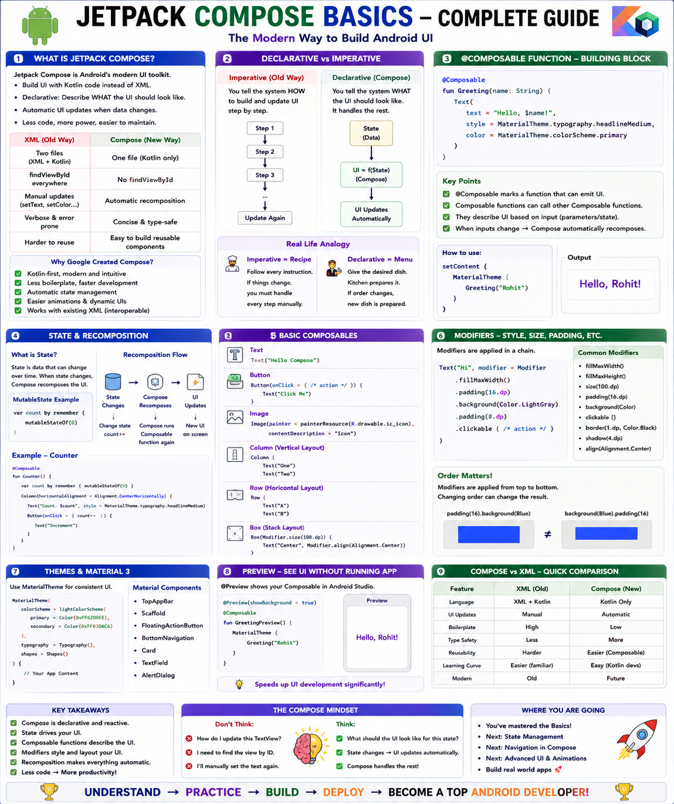

# 🎨 Complete Guide to Jetpack Compose Basics



---

## 📜 Part 1: What is Jetpack Compose and Why the Shift from XML?

### ❌ The Old Way — XML Layouts

```text
For over 10 years, Android UI was built with XML files.

You learned this approach earlier:

STEP 1: Create an XML file (res/layout/activity_main.xml)
  <LinearLayout>
      <TextView android:id="@+id/tvName" ... />
      <Button android:id="@+id/btnFollow" ... />
  </LinearLayout>

STEP 2: In your Activity, FIND the views by ID:
  val tvName = findViewById<TextView>(R.id.tvName)
  val btnFollow = findViewById<Button>(R.id.btnFollow)

STEP 3: MANUALLY update the views when data changes:
  tvName.text = "Rohit Kumar"
  btnFollow.setOnClickListener { ... }
  if (isFollowing) {
      btnFollow.text = "Following"
      btnFollow.setBackgroundColor(Color.GRAY)
  } else {
      btnFollow.text = "Follow"
      btnFollow.setBackgroundColor(Color.BLUE)
  }

PROBLEMS WITH THIS APPROACH:
  ❌ Two separate files (XML + Kotlin) for ONE screen
  ❌ findViewById is error-prone (wrong ID = crash)
  ❌ You must MANUALLY sync UI with data every time data changes
  ❌ Easy to forget to update a view → UI shows stale data
  ❌ XML is verbose (lots of boilerplate)
  ❌ Hard to create dynamic, conditional layouts
  ❌ Difficult to reuse UI components across screens
```

---

### ✅ The New Way — Jetpack Compose

```text
Jetpack Compose is Android's MODERN UI toolkit.
It lets you build UI entirely in KOTLIN CODE.
No XML files. No findViewById. No manual view updates.

SAME SCREEN IN COMPOSE:
```

```kotlin
@Composable
fun ProfileCard(name: String, isFollowing: Boolean, onFollowClick: () -> Unit) {
    Column {
        Text(text = name)
        Button(onClick = onFollowClick) {
            Text(if (isFollowing) "Following" else "Follow")
        }
    }
}
```

```text
THAT'S IT. No XML. No findViewById. No manual syncing.
The UI automatically updates when the data changes.

WHY GOOGLE CREATED COMPOSE:
  ✅ One language (Kotlin) for both logic AND UI
  ✅ Less code — same UI in 50% fewer lines
  ✅ Declarative — describe WHAT you want, not HOW to build it
  ✅ Automatic UI updates when data changes
  ✅ Easy to create reusable components
  ✅ Better support for animations and dynamic layouts
  ✅ Modern, Kotlin-first design
  ✅ Compatible with existing XML views (can mix both)
```

---

---

## 🧠 Part 2: Declarative UI vs Imperative UI

### ⚡ The Core Difference

```text
IMPERATIVE (Old XML way):
  You tell the system HOW to build and update the UI, step by step.
  Like giving someone turn-by-turn driving directions.

DECLARATIVE (Compose way):
  You tell the system WHAT the UI should look like for a given state.
  Like giving someone the destination address — they figure out the route.
```

---

### 🍕 Real-Life Analogy

```text
IMPERATIVE (XML) — Like a Chef Following Instructions:

  "Step 1: Take a plate from the shelf"
  "Step 2: Put rice on the plate"
  "Step 3: Put curry on top of the rice"
  "Step 4: If the customer wants extra spice, add chili"
  "Step 5: If the customer changes their mind, remove the chili"
  "Step 6: If they want cheese, add cheese on top"
  "Step 7: If they cancel the cheese, scrape it off"

  You must handle EVERY possible change manually.
  If you forget step 7, the cheese stays when it shouldn't.

DECLARATIVE (Compose) — Like a Menu Description:

  "Plate of rice with curry.
   If spicy requested: add chili.
   If cheese requested: add cheese."

  The kitchen automatically prepares the correct dish
  based on the current order. If the order changes,
  the kitchen makes a new dish matching the new order.
  You never say "remove the cheese" — you just say
  "no cheese" and the kitchen handles it.
```

---

### 🏗️ Code Comparison

```kotlin
// ═══════════════════════════════════════════════════════════
// IMPERATIVE (XML + Kotlin) — Manual UI Updates
// ═══════════════════════════════════════════════════════════

class ProfileActivity : AppCompatActivity() {

    private var isFollowing = false

    override fun onCreate(savedInstanceState: Bundle?) {
        super.onCreate(savedInstanceState)
        setContentView(R.layout.activity_profile)

        val tvName = findViewById<TextView>(R.id.tvName)
        val tvBio = findViewById<TextView>(R.id.tvBio)
        val btnFollow = findViewById<Button>(R.id.btnFollow)
        val tvFollowers = findViewById<TextView>(R.id.tvFollowers)

        // Manually set initial state:
        tvName.text = "Rohit Kumar"
        tvBio.text = "Android Developer"
        tvFollowers.text = "1,250 followers"
        btnFollow.text = "Follow"
        btnFollow.setBackgroundColor(Color.BLUE)

        // Manually handle state change:
        btnFollow.setOnClickListener {
            isFollowing = !isFollowing

            // YOU must manually update EVERY affected view:
            if (isFollowing) {
                btnFollow.text = "Following"
                btnFollow.setBackgroundColor(Color.GRAY)
                tvFollowers.text = "1,251 followers"  // Don't forget!
            } else {
                btnFollow.text = "Follow"
                btnFollow.setBackgroundColor(Color.BLUE)
                tvFollowers.text = "1,250 followers"  // Don't forget!
            }
            // What if you forget to update tvFollowers?
            // The UI shows wrong data. Bug!
        }
    }
}

// ═══════════════════════════════════════════════════════════
// DECLARATIVE (Compose) — UI Reflects State Automatically
// ═══════════════════════════════════════════════════════════

@Composable
fun ProfileScreen() {
    var isFollowing by remember { mutableStateOf(false) }
    val followerCount = if (isFollowing) 1251 else 1250

    // Describe WHAT the UI looks like for the CURRENT state.
    // When isFollowing changes, Compose AUTOMATICALLY
    // recomposes (redraws) everything with the new values.

    Column {
        Text(text = "Rohit Kumar")
        Text(text = "Android Developer")
        Text(text = "$followerCount followers")

        Button(
            onClick = { isFollowing = !isFollowing },
            colors = ButtonDefaults.buttonColors(
                containerColor = if (isFollowing) Color.Gray else Color.Blue
            )
        ) {
            Text(if (isFollowing) "Following" else "Follow")
        }
    }
    // No manual view updates needed!
    // Change the state → UI updates automatically.
}
```

---

### 🧩 The Mental Model

```text
IMPERATIVE: UI = f(instructions)
  You write instructions to BUILD and MODIFY the UI.
  The UI is a mutable object you keep changing.

DECLARATIVE: UI = f(state)
  The UI is a FUNCTION of the current state.
  State changes → UI automatically reflects the new state.
  You never modify the UI directly. You only change the state.

This is the SAME concept as:
  - React in web development
  - SwiftUI in iOS development
  - Flutter in cross-platform development

All modern UI frameworks are moving to declarative.
Compose is Android's version of this paradigm.
```

---

---

## 🔧 Part 3: What is a `@Composable` Function?

### 📖 The Definition

```text
A @Composable function is a special Kotlin function that
can emit (display) UI elements on the screen.

The @Composable annotation tells the Kotlin compiler:
"This function describes a piece of UI.
 Treat it specially — it can be redrawn (recomposed)
 whenever its inputs (state) change."

RULES FOR @Composable FUNCTIONS:

RULE 1: Must have the @Composable annotation
  @Composable
  fun MyScreen() { ... }

RULE 2: Name starts with a CAPITAL letter (like a class)
  ✅ fun ProfileCard() { ... }
  ❌ fun profileCard() { ... }  // Convention violation

RULE 3: Can call OTHER @Composable functions inside
  @Composable
  fun ProfileScreen() {
      ProfileHeader()  // ✅ calling another composable
      ProfileBody()    // ✅ calling another composable
  }

RULE 4: Regular (non-composable) functions CANNOT call composables
  fun regularFunction() {
      Text("Hello")  // ❌ COMPILE ERROR! Not in a @Composable context
  }

RULE 5: Return type is usually Unit (they EMIT UI, not return values)
  @Composable
  fun Greeting(name: String) {
      Text("Hello, $name")  // Emits UI, returns Unit
  }

RULE 6: Should be side-effect free (ideally)
  Don't modify external state directly inside a composable.
  Use proper state management (you'll learn this later).
```

---

### 🏗️ Basic Composable Examples

```kotlin
// Simplest possible composable:
@Composable
fun HelloWorld() {
    Text(text = "Hello, World!")
}

// Composable with parameters:
@Composable
fun Greeting(name: String, age: Int) {
    Text(text = "Hello, $name! You are $age years old.")
}

// Composable calling other composables:
@Composable
fun ProfileScreen() {
    Greeting(name = "Rohit", age = 24)
    Greeting(name = "Priya", age = 26)
}

// Composable with default parameters:
@Composable
fun SectionTitle(
    title: String,
    subtitle: String = "",
    isBold: Boolean = true
) {
    Text(
        text = title,
        fontWeight = if (isBold) FontWeight.Bold else FontWeight.Normal
    )
    if (subtitle.isNotEmpty()) {
        Text(text = subtitle, fontSize = 12.sp)
    }
}
```

---

---

## 🧱 Part 4: Basic Building Blocks

### 🔤 Text

```kotlin
@Composable
fun TextExamples() {

    // Basic text:
    Text(text = "Hello, Android!")

    // Styled text:
    Text(
        text = "Rohit Kumar",
        fontSize = 24.sp,              // sp = scalable pixels (for text)
        fontWeight = FontWeight.Bold,
        color = Color.Blue,
        fontStyle = FontStyle.Italic,
        letterSpacing = 1.5.sp,
        textDecoration = TextDecoration.Underline
    )

    // Text with max lines (truncation):
    Text(
        text = "This is a very long text that will be truncated after two lines because we set maxLines to 2.",
        maxLines = 2,
        overflow = TextOverflow.Ellipsis  // Shows "..." at the end
    )

    // Text alignment:
    Text(
        text = "Centered Text",
        textAlign = TextAlign.Center,
        modifier = Modifier.fillMaxWidth()
    )
}
```

---

### 🔘 Button

```kotlin
@Composable
fun ButtonExamples() {

    // Basic button:
    Button(onClick = {
        Log.d("Button", "Button clicked!")
    }) {
        Text("Click Me")
    }

    // Styled button:
    Button(
        onClick = { /* handle click */ },
        colors = ButtonDefaults.buttonColors(
            containerColor = Color(0xFF6200EE),  // Purple background
            contentColor = Color.White            // White text
        ),
        shape = RoundedCornerShape(12.dp),        // Rounded corners
        modifier = Modifier
            .fillMaxWidth()
            .height(56.dp)
    ) {
        Text("Follow", fontSize = 18.sp)
    }

    // Outlined button (border, no fill):
    OutlinedButton(
        onClick = { /* handle click */ },
        border = BorderStroke(2.dp, Color.Blue)
    ) {
        Text("Cancel", color = Color.Blue)
    }

    // Text button (no background, just text):
    TextButton(onClick = { /* handle click */ }) {
        Text("Learn More")
    }

    // Button with icon:
    Button(onClick = { /* handle click */ }) {
        Icon(Icons.Default.Favorite, contentDescription = "Like")
        Spacer(modifier = Modifier.width(8.dp))
        Text("Like")
    }
}
```

---

### 🖼️ Image

```kotlin
@Composable
fun ImageExamples() {

    // Image from drawable resources:
    Image(
        painter = painterResource(id = R.drawable.profile_photo),
        contentDescription = "Profile photo of Rohit",
        modifier = Modifier.size(100.dp),
        contentScale = ContentScale.Crop  // Crop to fill the space
    )

    // Circular image (common for profile pictures):
    Image(
        painter = painterResource(id = R.drawable.profile_photo),
        contentDescription = "Profile photo",
        modifier = Modifier
            .size(80.dp)
            .clip(CircleShape),  // Makes the image circular!
        contentScale = ContentScale.Crop
    )

    // Image from the internet (using Coil library):
    // Add to build.gradle: implementation("io.coil-kt:coil-compose:2.5.0")
    AsyncImage(
        model = "https://example.com/photo.jpg",
        contentDescription = "User avatar",
        modifier = Modifier
            .size(100.dp)
            .clip(CircleShape),
        contentScale = ContentScale.Crop
    )

    // Icon (built-in Material icons):
    Icon(
        imageVector = Icons.Default.Star,
        contentDescription = "Star rating",
        tint = Color.Yellow,
        modifier = Modifier.size(24.dp)
    )
}
```

---

### 📏 Spacer

```kotlin
@Composable
fun SpacerExamples() {

    Column {
        Text("First item")

        // Vertical space between items:
        Spacer(modifier = Modifier.height(16.dp))

        Text("Second item (16dp below first)")

        Spacer(modifier = Modifier.height(32.dp))

        Text("Third item (32dp below second)")
    }

    Row {
        Text("Left")

        // Horizontal space between items:
        Spacer(modifier = Modifier.width(24.dp))

        Text("Right (24dp from left)")
    }
}
```

---

---

## 📦 Part 5: Column, Row, Box — The Three Layout Containers

### ⬇️ Column — Vertical Arrangement

```text
COLUMN stacks children VERTICALLY (top to bottom).

Like a vertical list of items:
  ┌──────────────┐
  │   Item 1     │
  ├──────────────┤
  │   Item 2     │
  ├──────────────┤
  │   Item 3     │
  └──────────────┘

USE WHEN: You want items stacked on top of each other.
  - A form with fields one below another
  - A profile card (photo on top, name below, bio below)
  - A vertical list of content
```

```kotlin
@Composable
fun ColumnExample() {

    Column(
        modifier = Modifier
            .fillMaxWidth()
            .padding(16.dp),
        verticalArrangement = Arrangement.spacedBy(8.dp),  // 8dp gap between items
        horizontalAlignment = Alignment.CenterHorizontally  // Center items horizontally
    ) {
        Text("Profile", fontWeight = FontWeight.Bold, fontSize = 20.sp)
        Text("Rohit Kumar")
        Text("Android Developer")
        Button(onClick = { }) {
            Text("Follow")
        }
    }
}
```

---

### ➡️ Row — Horizontal Arrangement

```text
ROW arranges children HORIZONTALLY (left to right).

Like items in a horizontal line:
  ┌────────┬────────┬────────┐
  │ Item 1 │ Item 2 │ Item 3 │
  └────────┴────────┴────────┘

USE WHEN: You want items side by side.
  - A row of buttons (OK | Cancel)
  - An icon next to text (⭐ 4.5)
  - A horizontal list of tags
```

```kotlin
@Composable
fun RowExample() {

    Row(
        modifier = Modifier
            .fillMaxWidth()
            .padding(16.dp),
        horizontalArrangement = Arrangement.SpaceBetween,  // Spread items apart
        verticalAlignment = Alignment.CenterVertically      // Center items vertically
    ) {
        Text("Rohit Kumar", fontWeight = FontWeight.Bold)
        Row {
            Icon(Icons.Default.Star, contentDescription = null, tint = Color.Yellow)
            Spacer(modifier = Modifier.width(4.dp))
            Text("4.5")
        }
    }
}
```

---

### 🗂️ Box — Stacked on Top of Each Other

```text
BOX stacks children ON TOP of each other (like layers).

Like a stack of papers:
  ┌──────────────┐
  │  Background  │  ← Bottom layer
  │  ┌────────┐  │
  │  │ Image  │  │  ← Middle layer
  │  │ ┌────┐ │  │
  │  │ │Text│ │  │  ← Top layer
  │  │ └────┘ │  │
  │  └────────┘  │
  └──────────────┘

USE WHEN: You want to overlay elements.
  - Text on top of an image
  - A badge/counter on top of an icon
  - A loading spinner on top of content
  - Background behind content
```

```kotlin
@Composable
fun BoxExample() {

    Box(
        modifier = Modifier
            .fillMaxWidth()
            .height(200.dp),
        contentAlignment = Alignment.Center  // Center the content
    ) {
        // Background image (bottom layer):
        Image(
            painter = painterResource(id = R.drawable.food_background),
            contentDescription = null,
            modifier = Modifier.fillMaxSize(),
            contentScale = ContentScale.Crop
        )

        // Semi-transparent overlay (middle layer):
        Box(
            modifier = Modifier
                .fillMaxSize()
                .background(Color.Black.copy(alpha = 0.5f))
        )

        // Text on top (top layer):
        Text(
            text = "Biryani House",
            color = Color.White,
            fontSize = 28.sp,
            fontWeight = FontWeight.Bold
        )
    }
}
```

---

### 📊 Arrangement and Alignment Options

```kotlin
// COLUMN Arrangements (vertical):
Arrangement.Top         // Items at the top (default)
Arrangement.Bottom      // Items at the bottom
Arrangement.Center      // Items centered vertically
Arrangement.SpaceBetween // Equal space between items
Arrangement.SpaceAround  // Equal space around items
Arrangement.SpaceEvenly  // Equal space everywhere
Arrangement.spacedBy(8.dp) // Fixed 8dp gap between items

// ROW Arrangements (horizontal):
Arrangement.Start       // Items at the start (left) (default)
Arrangement.End         // Items at the end (right)
Arrangement.Center      // Items centered horizontally
Arrangement.SpaceBetween // Equal space between items
Arrangement.spacedBy(16.dp) // Fixed 16dp gap

// ALIGNMENTS:
Alignment.TopStart, Alignment.TopCenter, Alignment.TopEnd
Alignment.CenterStart, Alignment.Center, Alignment.CenterEnd
Alignment.BottomStart, Alignment.BottomCenter, Alignment.BottomEnd
```

---

---

## 🎨 Part 6: Modifiers

### 💡 What is a Modifier?

```text
A MODIFIER is a chain of decorations and behaviors that you
apply to a composable to change its appearance or behavior.

Think of modifiers as STICKERS you put on a composable:
  - A "padding" sticker adds space around it
  - A "background" sticker paints it a color
  - A "clickable" sticker makes it tappable
  - A "size" sticker sets its dimensions

KEY RULES:
  1. Modifiers are applied in ORDER (top to bottom = outside to inside)
  2. Order MATTERS — different order = different result
  3. Almost every composable accepts a modifier parameter
  4. Modifiers are chained using dot notation (.)
```

---

### ⚠️ Modifier Order Matters!

```kotlin
// EXAMPLE: Order changes the result!

// CASE A: Background THEN padding
Box(
    modifier = Modifier
        .background(Color.Blue)    // 1. Blue background fills the area
        .padding(16.dp)            // 2. Padding INSIDE the blue area
) {
    Text("Hello", color = Color.White)
}
// Result: Blue background extends to the edges, text has 16dp padding inside blue

// CASE B: Padding THEN background
Box(
    modifier = Modifier
        .padding(16.dp)            // 1. 16dp space OUTSIDE first
        .background(Color.Blue)    // 2. Blue background starts AFTER padding
) {
    Text("Hello", color = Color.White)
}
// Result: 16dp gap around the blue box, blue box wraps the text tightly

// The order is: OUTSIDE → INSIDE (first modifier = outermost)
```

---

### 🛠️ Common Modifiers

```kotlin
@Composable
fun ModifierExamples() {

    // ─── SIZE MODIFIERS ────────────────────────────────

    Text(
        text = "Fixed Size",
        modifier = Modifier
            .width(200.dp)        // Fixed width
            .height(50.dp)        // Fixed height
    )

    Text(
        text = "Fill Width",
        modifier = Modifier
            .fillMaxWidth()       // Takes full width of parent
    )

    Text(
        text = "Fill Half Width",
        modifier = Modifier
            .fillMaxWidth(0.5f)   // Takes 50% of parent width
    )

    Box(
        modifier = Modifier
            .fillMaxSize()        // Takes full width AND height of parent
    )

    Box(
        modifier = Modifier
            .size(100.dp)         // 100dp × 100dp square
    )

    // ─── PADDING MODIFIERS ─────────────────────────────

    Text(
        text = "Padded",
        modifier = Modifier
            .padding(16.dp)               // 16dp on ALL sides
    )

    Text(
        text = "Asymmetric Padding",
        modifier = Modifier
            .padding(
                start = 16.dp,            // Left side (RTL-aware)
                end = 16.dp,              // Right side (RTL-aware)
                top = 8.dp,
                bottom = 8.dp
            )
    )

    Text(
        text = "Horizontal Padding",
        modifier = Modifier
            .padding(horizontal = 16.dp, vertical = 8.dp)
    )

    // ─── BACKGROUND & SHAPE ────────────────────────────

    Box(
        modifier = Modifier
            .size(100.dp)
            .background(Color.Blue)       // Solid blue background
    )

    Box(
        modifier = Modifier
            .size(100.dp)
            .background(
                color = Color.Blue,
                shape = RoundedCornerShape(16.dp)  // Rounded corners!
            )
    )

    Box(
        modifier = Modifier
            .size(100.dp)
            .background(
                color = Color.Red,
                shape = CircleShape        // Perfect circle!
            )
    )

    // ─── BORDER ────────────────────────────────────────

    Box(
        modifier = Modifier
            .size(100.dp)
            .border(
                width = 2.dp,
                color = Color.Gray,
                shape = RoundedCornerShape(8.dp)
            )
    )

    // ─── CLICKABLE ─────────────────────────────────────

    Text(
        text = "Tap me!",
        modifier = Modifier
            .clickable {
                Log.d("Click", "Text was tapped!")
            }
            .padding(16.dp)  // Padding AFTER clickable = larger tap area
    )

    // ─── CLIP ──────────────────────────────────────────

    Image(
        painter = painterResource(id = R.drawable.photo),
        contentDescription = null,
        modifier = Modifier
            .size(80.dp)
            .clip(CircleShape)    // Clips image into a circle
    )

    // ─── COMBINING MODIFIERS (real-world example) ──────

    Text(
        text = "Order Now",
        color = Color.White,
        fontWeight = FontWeight.Bold,
        modifier = Modifier
            .fillMaxWidth()                           // Full width
            .padding(horizontal = 16.dp)              // Side margins
            .background(
                color = Color(0xFF4CAF50),            // Green background
                shape = RoundedCornerShape(12.dp)     // Rounded corners
            )
            .clickable { /* handle order */ }         // Make tappable
            .padding(vertical = 16.dp)                // Inner vertical padding
            .wrapContentWidth(Alignment.CenterHorizontally) // Center text
    )
}
```

---

---

## 👁️ Part 7: `@Preview` Annotation

### 💡 What is `@Preview`?

```text
@Preview lets you see your composable in Android Studio's
design panel WITHOUT running the app on a device or emulator.

This makes UI development MUCH faster:
  - Change code → see result instantly in the preview
  - No need to build, install, and navigate to the screen
  - Test different configurations (dark mode, font sizes, etc.)
```

---

### 🏗️ How to Use `@Preview`

```kotlin
import androidx.compose.ui.tooling.preview.Preview

// Basic preview:
@Preview(showBackground = true)
@Composable
fun GreetingPreview() {
    Greeting(name = "Rohit", age = 24)
}

// Multiple previews for different states:
@Preview(name = "Light Mode", showBackground = true)
@Composable
fun ProfileCardLightPreview() {
    ProfileCard(name = "Rohit", isFollowing = false)
}

@Preview(name = "Dark Mode", showBackground = true, uiMode = Configuration.UI_MODE_NIGHT_YES)
@Composable
fun ProfileCardDarkPreview() {
    ProfileCard(name = "Rohit", isFollowing = true)
}

// Preview with specific device:
@Preview(
    name = "Pixel 6",
    device = "id:pixel_6",
    showBackground = true,
    showSystemUi = true    // Shows status bar and navigation bar
)
@Composable
fun FullScreenPreview() {
    ProfileScreen()
}

// Preview with different font scales (accessibility testing):
@Preview(name = "Large Font", fontScale = 1.5f, showBackground = true)
@Composable
fun LargeFontPreview() {
    Greeting(name = "Rohit", age = 24)
}

// IMPORTANT RULES FOR @Preview:
// 1. The preview function must have NO parameters
//    ❌ @Preview fun Preview(name: String) { }  // ERROR
//    ✅ @Preview fun Preview() { Greeting("Rohit") }  // OK
//
// 2. You must provide sample/dummy data inside the preview
//    because the preview cannot access real data from your app.
//
// 3. Click "Split" or "Design" tab in Android Studio
//    to see the preview panel next to your code.
```

---

---

## 🌉 Part 8: `setContent {}` — Connecting Compose to an Activity

### 💡 The Bridge Between Old and New

```text
Your app still needs an Activity as the entry point.
setContent {} is the bridge that connects the Activity
lifecycle to the Compose world.

INSIDE setContent {}, you write your Compose UI.
This replaces setContentView(R.layout.activity_main).
```

---

### 🏗️ Complete Setup

```kotlin
// STEP 1: Your Activity (the entry point)
class MainActivity : ComponentActivity() {  // Note: ComponentActivity, not AppCompatActivity

    override fun onCreate(savedInstanceState: Bundle?) {
        super.onCreate(savedInstanceState)

        // THIS IS THE BRIDGE:
        setContent {
            // Everything inside here is Compose!

            // Apply your app's theme:
            MyAppTheme {
                // Surface provides the background color from your theme:
                Surface(
                    modifier = Modifier.fillMaxSize(),
                    color = MaterialTheme.colorScheme.background
                ) {
                    // Your actual UI:
                    ProfileScreen()
                }
            }
        }
    }
}

// STEP 2: Your Theme (auto-generated when you create a Compose project)
@Composable
fun MyAppTheme(
    darkTheme: Boolean = isSystemInDarkTheme(),
    content: @Composable () -> Unit
) {
    val colorScheme = if (darkTheme) DarkColorScheme else LightColorScheme

    MaterialTheme(
        colorScheme = colorScheme,
        typography = Typography,
        content = content
    )
}

// STEP 3: Your Screen Composables
@Composable
fun ProfileScreen() {
    Column(
        modifier = Modifier
            .fillMaxSize()
            .padding(16.dp),
        horizontalAlignment = Alignment.CenterHorizontally
    ) {
        Text("Welcome to My App!", style = MaterialTheme.typography.headlineMedium)
        Spacer(modifier = Modifier.height(16.dp))
        ProfileCard(name = "Rohit Kumar", isFollowing = false)
    }
}

// COMPARISON:

// OLD WAY (XML):
// class MainActivity : AppCompatActivity() {
//     override fun onCreate(savedInstanceState: Bundle?) {
//         super.onCreate(savedInstanceState)
//         setContentView(R.layout.activity_main)  // ← XML layout
//     }
// }

// NEW WAY (Compose):
// class MainActivity : ComponentActivity() {
//     override fun onCreate(savedInstanceState: Bundle?) {
//         super.onCreate(savedInstanceState)
//         setContent { ProfileScreen() }           // ← Kotlin composable
//     }
// }
```

---

---

## 🍕 Part 9: Real Example — Profile Card

### 🏗️ Building a Complete Profile Card

```kotlin
import androidx.compose.foundation.*
import androidx.compose.foundation.layout.*
import androidx.compose.foundation.shape.CircleShape
import androidx.compose.foundation.shape.RoundedCornerShape
import androidx.compose.material.icons.Icons
import androidx.compose.material.icons.filled.*
import androidx.compose.material3.*
import androidx.compose.runtime.*
import androidx.compose.ui.Alignment
import androidx.compose.ui.Modifier
import androidx.compose.ui.draw.clip
import androidx.compose.ui.graphics.Color
import androidx.compose.ui.layout.ContentScale
import androidx.compose.ui.res.painterResource
import androidx.compose.ui.text.font.FontWeight
import androidx.compose.ui.tooling.preview.Preview
import androidx.compose.ui.unit.dp
import androidx.compose.ui.unit.sp

// ─── THE COMPLETE PROFILE CARD ────────────────────────────

@Composable
fun ProfileCard(
    name: String,
    username: String,
    bio: String,
    followerCount: Int,
    followingCount: Int,
    isFollowing: Boolean,
    onFollowClick: () -> Unit
) {
    // The entire card is a Column with a card-like appearance:
    Column(
        modifier = Modifier
            .fillMaxWidth()
            .background(
                color = MaterialTheme.colorScheme.surface,
                shape = RoundedCornerShape(16.dp)
            )
            .border(
                width = 1.dp,
                color = Color.LightGray,
                shape = RoundedCornerShape(16.dp)
            )
            .padding(20.dp),
        horizontalAlignment = Alignment.CenterHorizontally
    ) {

        // ── PROFILE IMAGE (circular) ──
        Image(
            painter = painterResource(id = R.drawable.profile_photo),
            contentDescription = "Profile photo of $name",
            modifier = Modifier
                .size(100.dp)
                .clip(CircleShape)
                .border(3.dp, Color(0xFF6200EE), CircleShape),
            contentScale = ContentScale.Crop
        )

        Spacer(modifier = Modifier.height(12.dp))

        // ── NAME ──
        Text(
            text = name,
            fontSize = 22.sp,
            fontWeight = FontWeight.Bold,
            color = MaterialTheme.colorScheme.onSurface
        )

        // ── USERNAME ──
        Text(
            text = "@$username",
            fontSize = 14.sp,
            color = Color.Gray
        )

        Spacer(modifier = Modifier.height(8.dp))

        // ── BIO ──
        Text(
            text = bio,
            fontSize = 14.sp,
            color = Color.DarkGray,
            textAlign = TextAlign.Center,
            modifier = Modifier.padding(horizontal = 16.dp)
        )

        Spacer(modifier = Modifier.height(16.dp))

        // ── FOLLOWER STATS (Row with 3 items) ──
        Row(
            modifier = Modifier.fillMaxWidth(),
            horizontalArrangement = Arrangement.SpaceEvenly
        ) {
            StatItem(count = followerCount, label = "Followers")
            StatItem(count = followingCount, label = "Following")
            StatItem(count = 42, label = "Posts")
        }

        Spacer(modifier = Modifier.height(16.dp))

        // ── FOLLOW BUTTON ──
        Button(
            onClick = onFollowClick,
            modifier = Modifier
                .fillMaxWidth()
                .height(48.dp),
            colors = ButtonDefaults.buttonColors(
                containerColor = if (isFollowing) Color.Gray else Color(0xFF6200EE)
            ),
            shape = RoundedCornerShape(24.dp)
        ) {
            if (isFollowing) {
                Icon(
                    Icons.Default.Check,
                    contentDescription = null,
                    modifier = Modifier.size(18.dp)
                )
                Spacer(modifier = Modifier.width(8.dp))
            }
            Text(
                text = if (isFollowing) "Following" else "Follow",
                fontSize = 16.sp,
                fontWeight = FontWeight.SemiBold
            )
        }
    }
}

// ─── REUSABLE STAT ITEM ───────────────────────────────────

@Composable
fun StatItem(count: Int, label: String) {
    Column(horizontalAlignment = Alignment.CenterHorizontally) {
        Text(
            text = formatCount(count),
            fontSize = 18.sp,
            fontWeight = FontWeight.Bold
        )
        Text(
            text = label,
            fontSize = 12.sp,
            color = Color.Gray
        )
    }
}

// Helper function to format large numbers:
fun formatCount(count: Int): String {
    return when {
        count >= 1_000_000 -> "${count / 1_000_000}M"
        count >= 1_000 -> "${count / 1_000}K"
        else -> count.toString()
    }
}

// ─── SCREEN THAT USES THE PROFILE CARD ────────────────────

@Composable
fun ProfileScreen() {
    // State: whether the current user is following this profile
    var isFollowing by remember { mutableStateOf(false) }
    var followerCount by remember { mutableIntStateOf(1250) }

    Column(
        modifier = Modifier
            .fillMaxSize()
            .background(Color(0xFFF5F5F5))
            .padding(16.dp),
        verticalArrangement = Arrangement.Center
    ) {
        ProfileCard(
            name = "Rohit Kumar",
            username = "rohitdev",
            bio = "Android Developer | Kotlin Enthusiast | Building apps that matter 🚀",
            followerCount = followerCount,
            followingCount = 342,
            isFollowing = isFollowing,
            onFollowClick = {
                isFollowing = !isFollowing
                followerCount = if (isFollowing) followerCount + 1 else followerCount - 1
            }
        )
    }
}

// ─── PREVIEWS ─────────────────────────────────────────────

@Preview(showBackground = true, name = "Not Following")
@Composable
fun ProfileCardNotFollowingPreview() {
    ProfileCard(
        name = "Rohit Kumar",
        username = "rohitdev",
        bio = "Android Developer | Kotlin Enthusiast",
        followerCount = 1250,
        followingCount = 342,
        isFollowing = false,
        onFollowClick = {}
    )
}

@Preview(showBackground = true, name = "Following")
@Composable
fun ProfileCardFollowingPreview() {
    ProfileCard(
        name = "Rohit Kumar",
        username = "rohitdev",
        bio = "Android Developer | Kotlin Enthusiast",
        followerCount = 1251,
        followingCount = 342,
        isFollowing = true,
        onFollowClick = {}
    )
}

@Preview(showBackground = true, showSystemUi = true, name = "Full Screen")
@Composable
fun ProfileScreenPreview() {
    ProfileScreen()
}
```

---

### 🖼️ Visual Structure of the Profile Card

```text
┌─────────────────────────────────────┐
│                                     │
│         ┌──────────┐               │
│         │  👤      │  ← Circular   │
│         │  Profile │    Image      │
│         │  Photo   │    (100dp)    │
│         └──────────┘               │
│                                     │
│          Rohit Kumar               │  ← Bold, 22sp
│          @rohitdev                 │  ← Gray, 14sp
│                                     │
│   Android Developer | Kotlin       │  ← Bio, centered
│   Enthusiast | Building apps 🚀    │
│                                     │
│   ┌───────┬─────────┬───────┐      │
│   │ 1.2K  │   342   │  42   │      │  ← Row of stats
│   │Follow-│Following│ Posts │      │
│   │ ers   │         │       │      │
│   └───────┴─────────┴───────┘      │
│                                     │
│   ┌───────────────────────────┐     │
│   │       ✅ Following        │     │  ← Button (changes
│   └───────────────────────────┘     │    color & text)
│                                     │
└─────────────────────────────────────┘
```

---

---

## 📋 Complete Summary

```text
┌──────────────────────────────────────────────────────────────┐
│              JETPACK COMPOSE BASICS SUMMARY                  │
├───────────────────────┬──────────────────────────────────────┤
│ CONCEPT               │ KEY POINTS                           │
├───────────────────────┼──────────────────────────────────────┤
│ Jetpack Compose       │ Modern Android UI toolkit            │
│                       │ Build UI in Kotlin, no XML           │
│                       │ Declarative: UI = f(state)           │
├───────────────────────┼──────────────────────────────────────┤
│ Declarative vs        │ Declarative: describe WHAT you want  │
│ Imperative            │ Imperative: describe HOW to build it │
│                       │ Compose auto-updates UI on state     │
│                       │ change — no manual view updates      │
├───────────────────────┼──────────────────────────────────────┤
│ @Composable           │ Annotation for UI functions          │
│                       │ Name starts with Capital letter      │
│                       │ Can call other composables           │
│                       │ Usually returns Unit                 │
├───────────────────────┼──────────────────────────────────────┤
│ Text                  │ Display text with styling            │
│ Button                │ Tappable button (Button,             │
│                       │ OutlinedButton, TextButton)          │
│ Image                 │ Display images (resource or network) │
│ Spacer                │ Add empty space between elements     │
├───────────────────────┼──────────────────────────────────────┤
│ Column                │ Vertical layout (top to bottom)      │
│ Row                   │ Horizontal layout (left to right)    │
│ Box                   │ Stacked layout (layers on top)       │
├───────────────────────┼──────────────────────────────────────┤
│ Modifier              │ Chain of decorations/behaviors       │
│                       │ Order matters!                       │
│                       │ padding, size, background, clip,     │
│                       │ clickable, fillMaxWidth, etc.        │
├───────────────────────┼──────────────────────────────────────┤
│ @Preview              │ See UI in Android Studio without     │
│                       │ running the app. No parameters.      │
├───────────────────────┼──────────────────────────────────────┤
│ setContent {}         │ Bridge from Activity to Compose      │
│                       │ Replaces setContentView()            │
│                       │ Used in ComponentActivity.onCreate() │
└───────────────────────┴──────────────────────────────────────┘
```

---

---

## 📝 Quiz — Test Your Understanding

> Answer these in your head or write them out before checking!

---

### ❓ Question 1: Declarative vs Imperative

```text
a) Explain the difference between Declarative and Imperative UI
   using your OWN analogy (not the chef or driving one from the lesson).
   Be specific about how each approach handles state changes.

b) Look at this Imperative code (XML + Kotlin):

   var isLoggedIn = false
   
   fun updateUI() {
       if (isLoggedIn) {
           tvStatus.text = "Welcome back!"
           btnLogin.text = "Logout"
           btnLogin.setBackgroundColor(Color.RED)
           profileSection.visibility = View.VISIBLE
       } else {
           tvStatus.text = "Please log in"
           btnLogin.text = "Login"
           btnLogin.setBackgroundColor(Color.BLUE)
           profileSection.visibility = View.GONE
       }
   }

   Rewrite this as a Declarative Compose function.
   Show how the UI automatically reflects the state.

c) Why is the Imperative approach more bug-prone?
   Give a specific example of a bug that could happen
   in the Imperative code above but is IMPOSSIBLE
   in the Declarative Compose version.
```

---

### ❓ Question 2: Composable Rules and Structure

```text
a) Identify ALL the errors in this code:

   @Composable
   fun greetingCard(name: String) {
       Text("Hello, $name")
       RegularFunction()
   }
   
   fun RegularFunction() {
       Text("This is regular")
       greetingCard("Rohit")
   }

b) Write a @Composable function called MovieCard that takes:
   - title: String
   - rating: Double
   - year: Int
   - isFavorite: Boolean
   - onFavoriteClick: () -> Unit
   
   It should display the movie info and a favorite button.
   Include a @Preview function for it.

c) Why do composable function names start with a Capital letter
   (like ProfileCard) instead of lowercase (like profileCard)?
   Is this enforced by the compiler or just a convention?
   Why was this convention chosen?
```

---

### ❓ Question 3: Layout Containers

```text
a) For each UI design, choose the BEST layout container
   (Column, Row, or Box) and explain why:

   Design 1: A notification badge showing "3" on top of a bell icon
   
   Design 2: A settings screen with options listed vertically:
     - Dark Mode (toggle)
     - Notifications (toggle)
     - Language (dropdown)
     - About (clickable text)
   
   Design 3: A search bar with a magnifying glass icon on the left,
     text field in the middle, and clear button on the right
   
   Design 4: A product card with an image, and a "SALE" tag
     overlaid on the top-right corner of the image

b) Write the Compose code for Design 3 (the search bar).
   Use Row, Icon, TextField, and appropriate modifiers.
   Include proper arrangement and alignment.

c) What is the difference between:
   - Arrangement.SpaceBetween
   - Arrangement.SpaceAround
   - Arrangement.SpaceEvenly
   
   Draw a simple text diagram showing how 3 items would be
   spaced in a Row for each arrangement.
```

---

### ❓ Question 4: Modifiers Deep Dive

Read these two composables and predict the visual difference:

```kotlin
// Version A:
Box(
    modifier = Modifier
        .size(100.dp)
        .background(Color.Red)
        .padding(20.dp)
        .background(Color.Blue)
) {
    Text("A")
}

// Version B:
Box(
    modifier = Modifier
        .size(100.dp)
        .padding(20.dp)
        .background(Color.Red)
        .background(Color.Blue)
) {
    Text("B")
}
```

```text
a) What will be the visual difference between these two composables?
   Explain WHY the order produces different results.

b) Write a composable that creates this exact UI:
   - A rounded rectangle card (16dp corner radius)
   - Light gray background (#F0F0F0)
   - 2dp blue border
   - 16dp padding on all sides
   - Contains a Text "Hello World" centered inside
   - The entire card is clickable (logs "Card clicked!")
   - Card takes full width with 16dp horizontal margin

c) Explain what each modifier does in this chain:

   Modifier
       .fillMaxWidth()
       .padding(horizontal = 16.dp)
       .height(56.dp)
       .background(Color.Blue, RoundedCornerShape(28.dp))
       .clickable { }
       .padding(horizontal = 24.dp)

   Why is there padding TWICE? What does each one achieve?
```

---

### ❓ Question 5: Build a Complete Screen

```text
Build a Restaurant Detail Screen using Jetpack Compose.

REQUIREMENTS:

1. TOP SECTION (Box):
   - Restaurant image as background (full width, 200dp height)
   - Semi-transparent dark overlay on the image
   - Restaurant name in white, bold, 28sp on top of the overlay
   - Rating (e.g., "⭐ 4.5") below the name in white

2. MIDDLE SECTION (Column):
   - Cuisine type (e.g., "Indian • Mughlai • Biryani")
   - Delivery info row: "🕐 30-40 min  •  📍 2.5 km  •  ₹40 delivery"
   - A horizontal divider line
   - "Popular Items" section title (bold, 18sp)

3. MENU ITEMS (Column of Rows):
   - At least 2 menu items, each as a Row containing:
     - Item name (bold)
     - Item price (green color)
     - "ADD" button (small, outlined) on the right

4. BOTTOM BUTTON (fixed at bottom):
   - "View Full Menu" button
   - Full width, green background, white text
   - Rounded corners (12dp)

TECHNICAL REQUIREMENTS:
   - Use Column, Row, and Box appropriately
   - Use at least 8 different modifiers
   - Include a @Preview function
   - Use MaterialTheme colors where possible
   - Make the "ADD" buttons clickable (log the item name)
   - Use Spacer for spacing (not padding hacks)

BONUS:
   Add a state variable for the number of items in cart.
   When user taps "ADD", increment the count.
   Show the count in the bottom button: "View Full Menu (3 items)"
   Explain why this works automatically in Compose
   but would require manual updates in the XML approach.
```