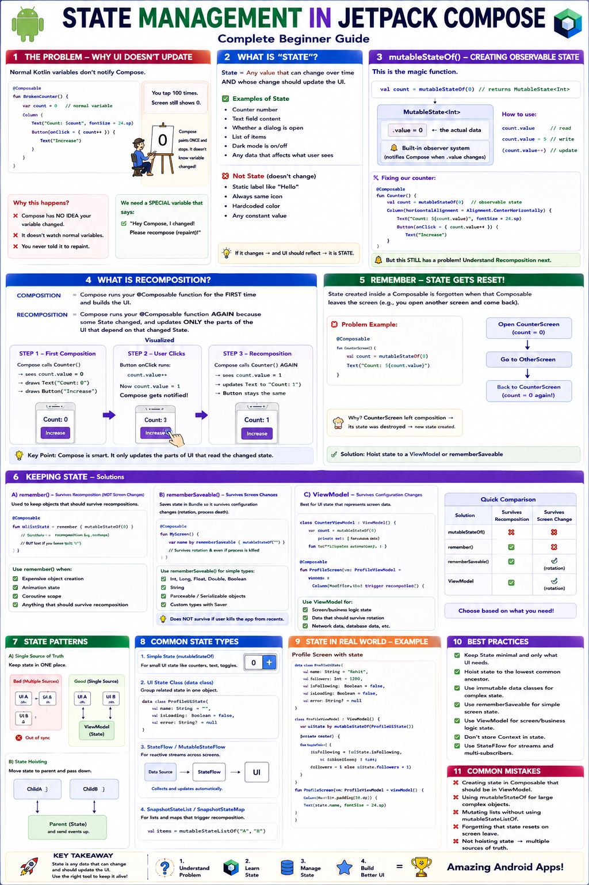

# 🧠 State Management in Jetpack Compose — Complete Beginner Guide



---

## 🚨 Chapter 1: The Problem — Why Compose UI Doesn't Update On Its Own

Let's start with something that every beginner tries and gets confused by.

```kotlin
@Composable
fun BrokenCounter() {
    var count = 0  // ← just a normal Kotlin variable

    Column(
        modifier = Modifier.fillMaxSize(),
        horizontalAlignment = Alignment.CenterHorizontally,
        verticalArrangement = Arrangement.Center
    ) {
        Text(text = "Count: $count", fontSize = 24.sp)

        Button(onClick = { 
            count++  // ← This DOES increase count in memory...
            // ...but the screen will NEVER update!
        }) {
            Text("Increase")
        }
    }
}
```

You tap the button 100 times. The screen still shows "Count: 0".

**Why?**
Think of Compose like a painter.

```text
You give the painter instructions:
  "Paint the number 0 on the wall."

The painter paints it. Done.

Now you change a variable in your notebook.
But you NEVER TOLD the painter to repaint!

The painter is sitting idle. The wall still shows 0.
```

Compose works the same way.

Compose has **NO IDEA** that your variable changed.
It doesn't watch normal variables. It painted the UI once and stopped.
You need a **SPECIAL** kind of variable that notifies Compose: *"Hey, I changed! Repaint!"*

---

---

## 🔍 Chapter 2: What is "State" in Compose?

**State = Any value that can change over time AND whose change should cause the UI to update.**

### ✅ Examples of State

```text
✅ A counter number           → changes when user taps a button
✅ A text field's content      → changes as user types
✅ Whether a dialog is open    → changes when user taps open/close
✅ A list of items             → changes when items are added/removed
✅ Whether dark mode is on     → changes when user toggles switch
```

### ❌ Things That Are NOT State

```text
❌ A label that always says "Hello"      → never changes
❌ An icon that's always a heart         → never changes
❌ A hardcoded color                     → never changes
```

> **📌 Key Definition:** State in Compose is a value that, when modified, triggers **recomposition** (which means Compose redraws the affected parts of the UI).

---

---

## ⚡ Chapter 3: `mutableStateOf()` — Creating Observable State

This is the magic function that makes Compose aware of changes.

```kotlin
import androidx.compose.runtime.mutableStateOf

val count = mutableStateOf(0)
// count is now of type MutableState<Int>
```

### 🔔 What `mutableStateOf()` Returns

```text
┌─────────────────────────────────┐
│      MutableState<Int>          │
│                                 │
│   .value = 0                    │  ← the actual data
│                                 │
│   🔔 Built-in observer system  │  ← notifies Compose when .value changes
│                                 │
└─────────────────────────────────┘
```

### 🛠️ How You Read/Write It

```kotlin
val count = mutableStateOf(0)

// READ the value
println(count.value)  // prints: 0

// WRITE (change) the value
count.value = 5       // Compose gets NOTIFIED → triggers UI update!
```

---

### 🐛 Let's Fix Our Broken Counter

```kotlin
@Composable
fun StillBrokenCounter() {
    // ✅ Compose CAN observe this... but there's still a problem!
    val count = mutableStateOf(0)

    Column(
        modifier = Modifier.fillMaxSize(),
        horizontalAlignment = Alignment.CenterHorizontally,
        verticalArrangement = Arrangement.Center
    ) {
        Text(text = "Count: ${count.value}", fontSize = 24.sp)

        Button(onClick = { count.value++ }) {
            Text("Increase")
        }
    }
}
```

This is **STILL broken**. But for a different reason now. The button click
actually triggers a UI update, but then something strange happens. Let me
explain what **Recomposition** is first to show you the problem.

---

---

## 🔄 Chapter 4: What is Recomposition?

### 🧠 The Core Concept

```text
COMPOSITION    = Compose runs your @Composable function for the FIRST time
                 and builds the UI.

RECOMPOSITION  = Compose runs your @Composable function AGAIN because
                 some State changed, and it updates ONLY the parts
                 of the UI that depend on that changed State.
```

### 👁️ Visualized

```text
STEP 1 — First Composition
──────────────────────────
Compose calls BrokenCounter()
  → sees count.value = 0
  → draws Text("Count: 0")
  → draws Button
  → Done. UI is on screen.


STEP 2 — User taps button
──────────────────────────
onClick runs → count.value becomes 1
Compose detects: "count changed!"


STEP 3 — Recomposition
──────────────────────
Compose calls BrokenCounter() AGAIN ← the ENTIRE function re-runs!
  → val count = mutableStateOf(0)   ← 😱 creates a BRAND NEW state = 0!
  → sees count.value = 0            ← back to 0, not 1!
  → draws Text("Count: 0")          ← user sees 0 again
```

**The Problem:** Every time Compose re-runs the function (recomposition),
`mutableStateOf(0)` creates a fresh new state object with value 0.
Your old state (that had value 1) is thrown away.

This is exactly why we need `remember`.

---

---

## 💾 Chapter 5: `remember {}` — Surviving Recomposition

`remember` tells Compose:

*"The first time you run this function, compute and store this value.
On every recomposition after that, give me back the stored value
instead of creating a new one."*

```kotlin
@Composable
fun WorkingCounter() {
    // ✅ remember PRESERVES this state across recompositions!
    val count = remember { mutableStateOf(0) }

    Column(
        modifier = Modifier.fillMaxSize(),
        horizontalAlignment = Alignment.CenterHorizontally,
        verticalArrangement = Arrangement.Center
    ) {
        Text(text = "Count: ${count.value}", fontSize = 24.sp)

        Button(onClick = { count.value++ }) {
            Text("Increase")
        }
    }
}
```

---

### ✅ What Happens Now

```text
STEP 1 — First Composition
──────────────────────────
Compose calls WorkingCounter()
  → remember { mutableStateOf(0) }
  → First time? YES → creates MutableState(0) and STORES it in memory
  → count.value = 0
  → draws Text("Count: 0")


STEP 2 — User taps button
──────────────────────────
onClick → count.value becomes 1
Compose: "count changed! Recompose!"


STEP 3 — Recomposition
──────────────────────
Compose calls WorkingCounter() AGAIN
  → remember { mutableStateOf(0) }
  → First time? NO → returns the STORED MutableState (which has value 1)
  → count.value = 1   ← ✅ Preserved!
  → draws Text("Count: 1")  ← ✅ Correct!
```

---

### 🔐 `remember` Visualized as a Locker

```text
┌──────────────── Compose's Memory Locker ─────────────────┐
│                                                          │
│  Locker #47:  MutableState<Int>  →  current value: 3     │
│               ↑                                          │
│               This is what remember{} stores             │
│               It SURVIVES recomposition                   │
│               It gets DESTROYED only when the             │
│               composable LEAVES the screen                │
│                                                          │
└──────────────────────────────────────────────────────────┘
```

---

---

## ⚖️ Chapter 6: Normal Variable vs `remember { mutableStateOf() }`

Let's put them side by side.

```kotlin
@Composable
fun ComparisonDemo() {

    // ❌ NORMAL VARIABLE
    var normalVar = 0

    // ✅ REMEMBERED OBSERVABLE STATE
    val stateVar = remember { mutableStateOf(0) }

    Column(
        modifier = Modifier.fillMaxSize(),
        horizontalAlignment = Alignment.CenterHorizontally,
        verticalArrangement = Arrangement.Center
    ) {
        // This will NEVER update on screen
        Text("Normal: $normalVar", fontSize = 20.sp)

        // This WILL update on screen
        Text("State: ${stateVar.value}", fontSize = 20.sp)

        Button(onClick = {
            normalVar++         // ❌ Compose doesn't know, doesn't care
            stateVar.value++    // ✅ Compose detects change, recomposes
        }) {
            Text("Tap Me")
        }
    }
}
```

---

### 📊 Full Comparison Table

```text
┌──────────────────┬───────────────────────┬──────────────────────────────────┐
│     Feature      │   var count = 0       │ remember { mutableStateOf(0) }  │
├──────────────────┼───────────────────────┼──────────────────────────────────┤
│ Compose aware?   │ ❌ No                 │ ✅ Yes                           │
│ Triggers redraw? │ ❌ No                 │ ✅ Yes (recomposition)           │
│ Survives         │ ❌ No (reset to 0     │ ✅ Yes (remember keeps it)      │
│ recomposition?   │    every time)        │                                  │
│ When to use?     │ Temporary calculation │ Any value shown in UI that      │
│                  │ inside the function   │ can change                       │
└──────────────────┴───────────────────────┴──────────────────────────────────┘
```

---

---

## ✨ Chapter 7: The `by` Keyword — Delegated Properties

Writing `.value` everywhere is annoying.

```kotlin
// WITHOUT delegation — have to write .value every time
val count = remember { mutableStateOf(0) }
Text("Count: ${count.value}")
count.value = count.value + 1
```

Kotlin has a feature called **delegated properties** using the `by` keyword.
It lets you treat a `MutableState<Int>` as if it were a plain `Int`.

```kotlin
// WITH delegation — clean and simple!
var count by remember { mutableStateOf(0) }
Text("Count: $count")         // no .value needed!
count = count + 1             // no .value needed!
count++                       // works too!
```

---

### 📦 Required Imports

```kotlin
import androidx.compose.runtime.getValue
import androidx.compose.runtime.setValue
```

### 🔧 How `by` Works Under the Hood

```text
var count by remember { mutableStateOf(0) }

// When you READ count:
//   Kotlin secretly calls count_state.value (getter)

// When you WRITE count = 5:
//   Kotlin secretly calls count_state.value = 5 (setter)

// You get clean syntax. Compose still gets notified. Everyone wins.
```

---

### 🛠️ The Three Ways to Declare State (All Valid)

```kotlin
@Composable
fun ThreeWays() {
    // Way 1: Direct — you use .value everywhere
    val count1 = remember { mutableStateOf(0) }
    // Usage: count1.value++

    // Way 2: Destructuring — separate getter and setter
    val (count2, setCount2) = remember { mutableStateOf(0) }
    // Usage: setCount2(count2 + 1)
    // Note: count2 is read-only here, setCount2 is the setter function

    // Way 3: Delegation (MOST COMMON ✅) — cleanest syntax
    var count3 by remember { mutableStateOf(0) }
    // Usage: count3++
}
```

> **💡 Best Practice:** Use `by` delegation (Way 3) in most cases. It is the cleanest and most widely used in professional Compose code.

---

### ⚠️ Important: `val` vs `var` with `by`

```kotlin
// ❌ WRONG — val means you can't reassign
val count by remember { mutableStateOf(0) }
count++  // COMPILER ERROR: Val cannot be reassigned

// ✅ CORRECT — var allows reassignment
var count by remember { mutableStateOf(0) }
count++  // Works! Secretly calls mutableState.value = value + 1
```

---

---

## 🧮 Chapter 8: Full Counter Example — Without State Hoisting

Let's build a complete counter with + and - buttons.

```kotlin
@Composable
fun CounterScreen() {
    // State lives INSIDE this composable
    var count by remember { mutableStateOf(0) }

    Column(
        modifier = Modifier
            .fillMaxSize()
            .padding(32.dp),
        horizontalAlignment = Alignment.CenterHorizontally,
        verticalArrangement = Arrangement.Center
    ) {
        Text(
            text = "Count: $count",
            fontSize = 48.sp,
            fontWeight = FontWeight.Bold
        )

        Spacer(modifier = Modifier.height(24.dp))

        Row(horizontalArrangement = Arrangement.spacedBy(16.dp)) {
            Button(
                onClick = { count-- },
                enabled = count > 0   // disable when count is 0
            ) {
                Text("-", fontSize = 24.sp)
            }

            Button(onClick = { count++ }) {
                Text("+", fontSize = 24.sp)
            }
        }

        Spacer(modifier = Modifier.height(16.dp))

        Button(onClick = { count = 0 }) {
            Text("Reset")
        }
    }
}
```

This works! But there is a **design problem**.

```text
┌────────────────────────────────────┐
│          CounterScreen             │
│                                    │
│   var count = state(0)  ← owns    │
│                            state   │
│   ┌──────────────────────────┐     │
│   │ Text("Count: $count")   │     │  ← reads state
│   └──────────────────────────┘     │
│   ┌──────────────────────────┐     │
│   │ Button(onClick=count++)  │     │  ← changes state
│   └──────────────────────────┘     │
│   ┌──────────────────────────┐     │
│   │ Button(onClick=count--)  │     │  ← changes state
│   └──────────────────────────┘     │
│                                    │
│   Everything is MIXED together     │
│   State + Logic + UI all in one    │
└────────────────────────────────────┘
```

**Problems with this approach:**

- ❌ You cannot reuse the counter display separately from the buttons.
- ❌ You cannot test the counter logic without running the actual UI.
- ❌ You cannot preview the counter display in different states easily.
- ❌ The component is doing too many things — it manages state AND renders UI.

This leads us to the most important Compose principle.

---

---

## 🏆 Chapter 9: State Hoisting — The Core Compose Principle

### 🤔 What is State Hoisting?

**State Hoisting** = Moving state **UP** from a child composable to a parent
composable, so the child becomes **stateless** (it receives state and sends
events, but doesn't own or manage any state itself).

---

### 📐 The Pattern

```text
Before Hoisting:
────────────────
┌──────────────────────┐
│  ChildComposable     │
│                      │
│  var count = state(0)│  ← child OWNS the state
│  Text(count)         │
│  Button(count++)     │
└──────────────────────┘


After Hoisting:
───────────────
┌──────────────────────────────────────┐
│  ParentComposable                    │
│                                      │
│  var count = state(0)  ← parent      │
│                          OWNS state  │
│                                      │
│  ┌────────────────────────────────┐  │
│  │  ChildComposable(             │  │
│  │    count = count,        ←─── state DOWN    (as parameter)  │
│  │    onIncrement = {count++} ── events UP     (as lambda)     │
│  │  )                           │  │
│  └────────────────────────────────┘  │
└──────────────────────────────────────┘
```

---

### 🌟 The Golden Rule

```text
╔═══════════════════════════════════════════════════╗
║                                                   ║
║   STATE flows DOWN  ⬇️  (parent → child)          ║
║   EVENTS flow UP    ⬆️  (child → parent)          ║
║                                                   ║
║   This is called UNIDIRECTIONAL DATA FLOW (UDF)   ║
║                                                   ║
╚═══════════════════════════════════════════════════╝
```

---

---

## 🔧 Chapter 10: Refactored Counter — With State Hoisting

### Step 1: Create a Stateless Counter Display Component

```kotlin
// This composable DOES NOT own any state.
// It RECEIVES everything it needs via parameters.
// It SENDS events up via lambda callbacks.

@Composable
fun CounterDisplay(
    count: Int,                // ⬇️ State flows DOWN (from parent)
    onIncrement: () -> Unit,   // ⬆️ Event flows UP (to parent)
    onDecrement: () -> Unit,   // ⬆️ Event flows UP (to parent)
    onReset: () -> Unit,       // ⬆️ Event flows UP (to parent)
    modifier: Modifier = Modifier
) {
    Column(
        modifier = modifier,
        horizontalAlignment = Alignment.CenterHorizontally,
        verticalArrangement = Arrangement.Center
    ) {
        Text(
            text = "Count: $count",
            fontSize = 48.sp,
            fontWeight = FontWeight.Bold
        )

        Spacer(modifier = Modifier.height(24.dp))

        Row(horizontalArrangement = Arrangement.spacedBy(16.dp)) {
            Button(
                onClick = onDecrement,   // ⬆️ just calls the lambda
                enabled = count > 0
            ) {
                Text("-", fontSize = 24.sp)
            }

            Button(onClick = onIncrement) {   // ⬆️ just calls the lambda
                Text("+", fontSize = 24.sp)
            }
        }

        Spacer(modifier = Modifier.height(16.dp))

        Button(onClick = onReset) {   // ⬆️ just calls the lambda
            Text("Reset")
        }
    }
}
```

---

### Step 2: Create a Stateful Parent That Owns the State

```kotlin
@Composable
fun CounterScreen() {
    // State is HOISTED here — the parent owns it
    var count by remember { mutableStateOf(0) }

    // Pass state DOWN and receive events UP
    CounterDisplay(
        count = count,                          // ⬇️ state DOWN
        onIncrement = { count++ },              // ⬆️ event UP
        onDecrement = { if (count > 0) count-- }, // ⬆️ event UP
        onReset = { count = 0 },                // ⬆️ event UP
        modifier = Modifier
            .fillMaxSize()
            .padding(32.dp)
    )
}
```

---

### 🔄 The Complete Flow Visualized

```text
┌─────────────────────── CounterScreen (STATEFUL) ───────────────┐
│                                                                 │
│  var count by remember { mutableStateOf(0) }                    │
│                                                                 │
│  ┌──────────────── CounterDisplay (STATELESS) ──────────────┐   │
│  │                                                          │   │
│  │  Receives: count = 0                    ⬇️ State DOWN    │   │
│  │  Shows:    Text("Count: 0")                              │   │
│  │                                                          │   │
│  │  User taps "+"                                           │   │
│  │  Calls:    onIncrement()                ⬆️ Event UP      │   │
│  │                                                          │   │
│  └──────────────────────────────────────────────────────────┘   │
│                                                                 │
│  onIncrement runs → count becomes 1                             │
│  Recomposition triggers                                         │
│  CounterDisplay receives count = 1    ⬇️ new state flows down   │
│  Text updates to "Count: 1"                                     │
│                                                                 │
└─────────────────────────────────────────────────────────────────┘
```

---

---

## 🎯 Chapter 11: Why State Hoisting is Better — Concrete Benefits

### 🔁 Benefit 1: Reusability

```kotlin
// You can now use CounterDisplay in COMPLETELY different scenarios!

@Composable
fun ShoppingCartScreen() {
    var itemCount by remember { mutableStateOf(1) }

    CounterDisplay(
        count = itemCount,
        onIncrement = { if (itemCount < 99) itemCount++ },  // max 99
        onDecrement = { if (itemCount > 1) itemCount-- },   // min 1
        onReset = { itemCount = 1 }                         // reset to 1, not 0
    )
}

@Composable
fun ScoreBoard() {
    var score by remember { mutableStateOf(0) }

    CounterDisplay(
        count = score,
        onIncrement = { score += 10 },     // +10 instead of +1!
        onDecrement = { score -= 5 },      // -5 instead of -1!
        onReset = { score = 0 }
    )
}
```

Same UI component, completely different behavior — because the **parent controls the logic**.

---

### 👁️ Benefit 2: Easy Preview and Testing

```kotlin
// You can preview ANY state without needing real logic!
@Preview(showBackground = true)
@Composable
fun CounterPreviewAtZero() {
    CounterDisplay(
        count = 0,
        onIncrement = {},
        onDecrement = {},
        onReset = {}
    )
}

@Preview(showBackground = true)
@Composable
fun CounterPreviewAtHundred() {
    CounterDisplay(
        count = 100,
        onIncrement = {},
        onDecrement = {},
        onReset = {}
    )
}

// You can see what the UI looks like at count=0 and count=100
// without EVER tapping a button!
```

---

### 🎯 Benefit 3: Single Source of Truth

```kotlin
// Multiple children can share the SAME state from the parent

@Composable
fun DashboardScreen() {
    var count by remember { mutableStateOf(0) }

    Column {
        // Both components show the SAME count
        // because the parent is the SINGLE SOURCE OF TRUTH
        
        CounterDisplay(
            count = count,
            onIncrement = { count++ },
            onDecrement = { count-- },
            onReset = { count = 0 }
        )

        // Another component that also uses the same count
        ProgressBar(progress = count / 100f)

        // A message that depends on the same count
        if (count >= 10) {
            Text("🎉 You reached 10!", color = Color.Green)
        }
    }
}
```

---

### 📊 Side by Side Summary

```text
┌────────────────────────────┬─────────────────────────────────┐
│   WITHOUT State Hoisting   │     WITH State Hoisting         │
├────────────────────────────┼─────────────────────────────────┤
│ State trapped inside child │ State owned by parent           │
│ Child controls logic       │ Parent controls logic           │
│ Not reusable               │ Fully reusable                  │
│ Hard to preview            │ Easy to preview any state       │
│ Hard to test               │ Easy to test                    │
│ Cannot share state         │ Multiple children share state   │
│ Tightly coupled            │ Loosely coupled                 │
└────────────────────────────┴─────────────────────────────────┘
```

---

---

## 🔄 Chapter 12: The Complete "State Down, Events Up" Pattern

This pattern appears everywhere in Compose. Here is one more example to
make it crystal clear — a text input.

```kotlin
// ═══════════════════════════════════════════════════
// STATELESS child — just shows UI and reports events
// ═══════════════════════════════════════════════════
@Composable
fun GreetingInput(
    name: String,              // ⬇️ State DOWN
    onNameChange: (String) -> Unit,  // ⬆️ Event UP
    modifier: Modifier = Modifier
) {
    Column(modifier = modifier, horizontalAlignment = Alignment.CenterHorizontally) {
        TextField(
            value = name,                    // ⬇️ displays current state
            onValueChange = onNameChange,    // ⬆️ reports changes to parent
            label = { Text("Enter your name") }
        )

        Spacer(modifier = Modifier.height(16.dp))

        if (name.isNotBlank()) {
            Text(
                text = "Hello, $name! 👋",
                fontSize = 24.sp,
                fontWeight = FontWeight.Bold
            )
        }
    }
}


// ═══════════════════════════════
// STATEFUL parent — owns state
// ═══════════════════════════════
@Composable
fun GreetingScreen() {
    var name by remember { mutableStateOf("") }   // parent OWNS state

    GreetingInput(
        name = name,                   // ⬇️ pass state DOWN
        onNameChange = { name = it },  // ⬆️ receive events UP, update state
        modifier = Modifier
            .fillMaxSize()
            .padding(32.dp)
    )
}
```

---

### 🔁 The Cycle Repeats Forever

```text
1. Parent holds state: name = ""
2. Parent passes name="" to child          ⬇️ state DOWN
3. Child shows TextField with ""
4. User types "A"
5. Child calls onNameChange("A")           ⬆️ event UP
6. Parent updates: name = "A"
7. Recomposition triggers
8. Parent passes name="A" to child         ⬇️ state DOWN
9. Child shows TextField with "A"
10. Child shows "Hello, A! 👋"
11. User types "l" → onNameChange("Al")    ⬆️ event UP
12. Repeat forever...
```

---

---

## 📋 Complete Final Code — Counter App With Both Approaches

Here is the full runnable file so you can paste it into Android Studio.

```kotlin
package com.example.counterapp

import android.os.Bundle
import androidx.activity.ComponentActivity
import androidx.activity.compose.setContent
import androidx.compose.foundation.layout.*
import androidx.compose.material3.*
import androidx.compose.runtime.*
import androidx.compose.ui.Alignment
import androidx.compose.ui.Modifier
import androidx.compose.ui.text.font.FontWeight
import androidx.compose.ui.tooling.preview.Preview
import androidx.compose.ui.unit.dp
import androidx.compose.ui.unit.sp

class MainActivity : ComponentActivity() {
    override fun onCreate(savedInstanceState: Bundle?) {
        super.onCreate(savedInstanceState)
        setContent {
            MaterialTheme {
                Surface(
                    modifier = Modifier.fillMaxSize(),
                    color = MaterialTheme.colorScheme.background
                ) {
                    // Use the HOISTED version
                    CounterScreenHoisted()
                }
            }
        }
    }
}


// ╔══════════════════════════════════════════════════════════════╗
// ║        APPROACH 1: WITHOUT State Hoisting                   ║
// ║        (State is trapped inside — not ideal)                ║
// ╚══════════════════════════════════════════════════════════════╝

@Composable
fun CounterScreenNotHoisted() {
    var count by remember { mutableStateOf(0) }

    Column(
        modifier = Modifier
            .fillMaxSize()
            .padding(32.dp),
        horizontalAlignment = Alignment.CenterHorizontally,
        verticalArrangement = Arrangement.Center
    ) {
        Text(
            text = "Count: $count",
            fontSize = 48.sp,
            fontWeight = FontWeight.Bold
        )

        Spacer(modifier = Modifier.height(24.dp))

        Row(horizontalArrangement = Arrangement.spacedBy(16.dp)) {
            Button(
                onClick = { if (count > 0) count-- },
                enabled = count > 0
            ) {
                Text("-", fontSize = 24.sp)
            }

            Button(onClick = { count++ }) {
                Text("+", fontSize = 24.sp)
            }
        }

        Spacer(modifier = Modifier.height(16.dp))

        Button(onClick = { count = 0 }) {
            Text("Reset")
        }
    }
}


// ╔══════════════════════════════════════════════════════════════╗
// ║        APPROACH 2: WITH State Hoisting (✅ Recommended)     ║
// ║        State owned by parent, child is stateless            ║
// ╚══════════════════════════════════════════════════════════════╝

// ─── STATELESS CHILD ────────────────────────────────────────────
@Composable
fun CounterDisplay(
    count: Int,
    onIncrement: () -> Unit,
    onDecrement: () -> Unit,
    onReset: () -> Unit,
    modifier: Modifier = Modifier
) {
    Column(
        modifier = modifier,
        horizontalAlignment = Alignment.CenterHorizontally,
        verticalArrangement = Arrangement.Center
    ) {
        Text(
            text = "Count: $count",
            fontSize = 48.sp,
            fontWeight = FontWeight.Bold
        )

        Spacer(modifier = Modifier.height(24.dp))

        Row(horizontalArrangement = Arrangement.spacedBy(16.dp)) {
            Button(
                onClick = onDecrement,
                enabled = count > 0
            ) {
                Text("-", fontSize = 24.sp)
            }

            Button(onClick = onIncrement) {
                Text("+", fontSize = 24.sp)
            }
        }

        Spacer(modifier = Modifier.height(16.dp))

        Button(onClick = onReset) {
            Text("Reset")
        }
    }
}


// ─── STATEFUL PARENT ────────────────────────────────────────────
@Composable
fun CounterScreenHoisted() {
    var count by remember { mutableStateOf(0) }

    CounterDisplay(
        count = count,
        onIncrement = { count++ },
        onDecrement = { if (count > 0) count-- },
        onReset = { count = 0 },
        modifier = Modifier
            .fillMaxSize()
            .padding(32.dp)
    )
}


// ─── PREVIEWS (only possible with hoisted/stateless components!) ─
@Preview(showBackground = true, name = "Count at 0")
@Composable
fun PreviewCounterAtZero() {
    MaterialTheme {
        CounterDisplay(
            count = 0,
            onIncrement = {},
            onDecrement = {},
            onReset = {}
        )
    }
}

@Preview(showBackground = true, name = "Count at 42")
@Composable
fun PreviewCounterAtFortyTwo() {
    MaterialTheme {
        CounterDisplay(
            count = 42,
            onIncrement = {},
            onDecrement = {},
            onReset = {}
        )
    }
}
```

---

---

## 📋 Quick Reference Cheat Sheet

```text
╔══════════════════════════════════════════════════════════════════╗
║                  COMPOSE STATE CHEAT SHEET                      ║
╠══════════════════════════════════════════════════════════════════╣
║                                                                  ║
║  CREATE state:     mutableStateOf(initialValue)                  ║
║  REMEMBER state:   remember { mutableStateOf(initialValue) }     ║
║  CLEAN syntax:     var x by remember { mutableStateOf(value) }   ║
║                                                                  ║
║  RECOMPOSITION:    Compose re-runs the function when state       ║
║                    changes. Only affected UI parts update.        ║
║                                                                  ║
║  STATE HOISTING:   Move state to parent.                         ║
║                    Child receives state via parameters.           ║
║                    Child sends events via lambda callbacks.       ║
║                                                                  ║
║  THE PATTERN:      State ⬇️ DOWN  |  Events ⬆️ UP               ║
║                                                                  ║
║  IMPORTS NEEDED:                                                 ║
║    import androidx.compose.runtime.*                             ║
║    import androidx.compose.runtime.getValue                      ║
║    import androidx.compose.runtime.setValue                       ║
║                                                                  ║
╚══════════════════════════════════════════════════════════════════╝
```

---

---

## 📝 Quiz — Test Your Understanding

> Answer each question, then check the answer below it.

---

### ❓ Question 1

```kotlin
@Composable
fun MyScreen() {
    var name = "Hello"
    
    Button(onClick = { name = "World" }) {
        Text(name)
    }
}
```

What happens when the user taps the button?

```text
A) The text changes from "Hello" to "World"
B) The text stays "Hello" — nothing visible happens
C) The app crashes
D) The text flickers between "Hello" and "World"
```

<details> <summary>Click to reveal answer</summary>

**Answer: B**

`name` is a normal variable, not a `MutableState`. Compose has no idea it changed,
so it never recomposes. The variable changes in memory, but the UI never updates.
Even if recomposition were triggered by something else, `name` would be reset to
`"Hello"` because it's not wrapped in `remember`.

</details>

---

### ❓ Question 2

```kotlin
@Composable
fun MyScreen() {
    val count = mutableStateOf(0)
    
    Button(onClick = { count.value++ }) {
        Text("Count: ${count.value}")
    }
}
```

What happens when the user taps the button multiple times?

```text
A) The count increases correctly: 1, 2, 3, 4...
B) The count always shows 0
C) The count shows 1 after the first tap, then stays at 1
D) The app crashes
```

<details> <summary>Click to reveal answer</summary>

**Answer: B**

`mutableStateOf(0)` creates observable state so Compose WILL detect the change
and trigger recomposition. BUT there is no `remember`, so when Compose re-runs
the function during recomposition, it creates a BRAND NEW `mutableStateOf(0)`,
throwing away the old one. The count resets to 0 every single recomposition.

</details>

---

### ❓ Question 3

```kotlin
@Composable
fun CounterButton(
    count: Int,
    onCountChange: (Int) -> Unit
) {
    Button(onClick = { onCountChange(count + 1) }) {
        Text("Count: $count")
    }
}
```

Is this composable stateful or stateless? Why?

```text
A) Stateful — because it shows a count
B) Stateless — because it doesn't own or manage any state; it receives state
   and sends events via callbacks
C) Stateful — because it has a Button that changes something
D) Stateless — because it uses val instead of var
```

<details> <summary>Click to reveal answer</summary>

**Answer: B**

This composable is **stateless**. It does not declare `remember` or
`mutableStateOf` anywhere. It RECEIVES the current count as a parameter
(state flows DOWN) and REPORTS changes through `onCountChange` (events
flow UP). The parent that calls this composable is the one that owns and
manages the state. This is the state hoisting pattern.

</details>

---

### ❓ Question 4

What is the difference between these two lines?

```kotlin
// Line A
val count = remember { mutableStateOf(0) }

// Line B  
var count by remember { mutableStateOf(0) }
```

```text
A) Line A creates state, Line B does not
B) They both create the same state. Line A requires .value to read/write.
   Line B uses delegation so you can read/write without .value.
C) Line B is faster at runtime
D) Line A survives recomposition, Line B does not
```

<details> <summary>Click to reveal answer</summary>

**Answer: B**

Both create exactly the same `MutableState<Int>` wrapped in `remember`.
The only difference is syntax.

**Line A:** `count` is of type `MutableState<Int>`. You access the value via `count.value`.
**Line B:** `count` is of type `Int` (delegated). Kotlin's `by` keyword automatically
calls `.value` for you behind the scenes. You use `count` directly as if it were
a plain integer. Line B requires `import getValue` and `import setValue`.

</details>

---

### ❓ Question 5

You have a parent screen and two child composables that both need to display
and modify the same score value. Where should the state live?

```text
A) Each child should have its own remember { mutableStateOf(0) } for score
B) The state should live in the parent, passed DOWN to both children, with event
   callbacks flowing UP
C) Put it in a global variable outside all composables
D) The first child that uses it should own the state
```

<details> <summary>Click to reveal answer</summary>

**Answer: B**

This is the **state hoisting** principle. When multiple composables need the same
state, hoist the state UP to their nearest common ancestor (the parent).
The parent becomes the **single source of truth**. It passes the current score
down to both children as a parameter, and both children send events up via
lambda callbacks when they want to change the score.

```kotlin
@Composable
fun GameScreen() {
    var score by remember { mutableStateOf(0) }  // parent owns state

    ScoreDisplay(score = score)                  // child 1 reads state
    ScoreControls(                               // child 2 reads & modifies
        score = score,
        onScoreChange = { score = it }           // event up
    )
}
```

Option A would create two independent scores that don't stay in sync.
Option C is bad practice and breaks the Compose reactive model.
Option D prevents the other child from accessing or modifying the score properly.

</details>