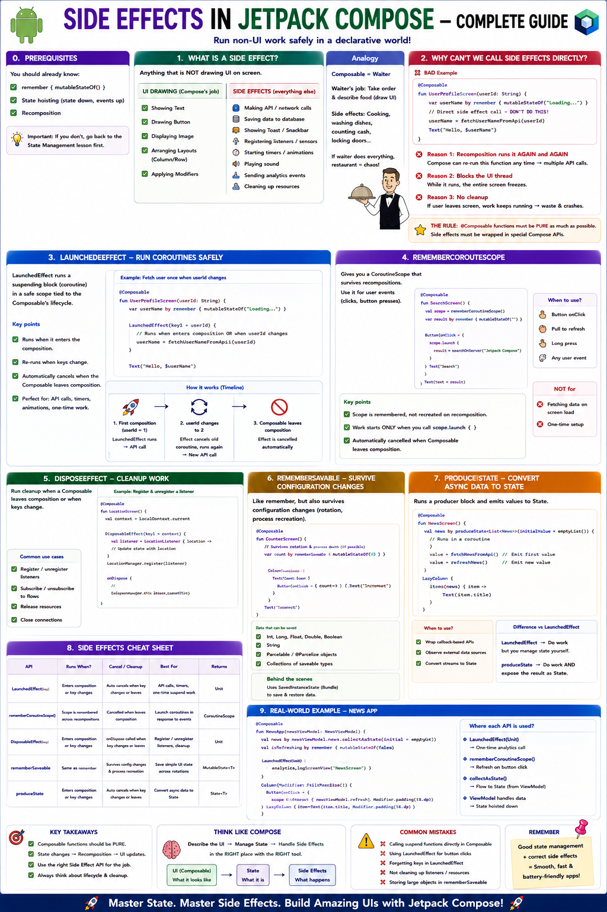

# ⚡ Side Effects in Jetpack Compose — Complete Beginner Guide



---

## 📋 Prerequisites

This lesson builds on the **State Management** lesson. You should already know:

- `remember { mutableStateOf() }`
- State hoisting (state down, events up)
- Recomposition

> **📌 Important:** If you don't, go back to that lesson first. Everything here will make much more sense.

---

---

## 🤔 Chapter 1: What is a "Side Effect"?

### 💡 The Simple Definition

A **side effect** is anything your code does that is **NOT** drawing UI on screen.

When Compose runs a `@Composable` function, its only job should be to describe
what the UI looks like. **Everything else** is a side effect.

### 📊 Examples

```text
UI DRAWING (Compose's job)          SIDE EFFECTS (everything else)
─────────────────────────           ──────────────────────────────
Showing a Text                      🌐 Making an API/network call
Drawing a Button                    💾 Saving data to a database
Displaying an Image                 📋 Showing a Toast or Snackbar
Arranging a Column/Row              🔔 Registering a sensor listener
Applying a Modifier                 📍 Starting GPS location tracking
                                    ⏱️  Starting a timer/countdown
                                    🎵 Playing a sound
                                    📤 Sending an analytics event
                                    🧹 Cleaning up a resource
```

### 🍕 Analogy

```text
Think of a Composable as a WAITER in a restaurant.

The waiter's ONLY job:
  → Take the order and describe the food to the kitchen (draw UI)

Side effects (NOT the waiter's job):
  → Cooking the food          (API call)
  → Washing the dishes        (cleanup)
  → Counting the cash         (saving to database)
  → Locking the front door    (unregistering listener)

If the waiter tries to do ALL of these while taking orders,
the restaurant falls into chaos.
```

---

---

## 🚨 Chapter 2: Why Can't We Just Call Side-Effect Code Directly?

Let's see what happens when a beginner tries it.

```kotlin
@Composable
fun UserProfileScreen(userId: String) {
    var userName by remember { mutableStateOf("Loading...") }

    // ❌ BAD: Calling a side effect directly inside a Composable!
    // This is a network call — it's a side effect!
    userName = fetchUserNameFromApi(userId)  // ← DON'T DO THIS

    Text(text = "Hello, $userName")
}
```

**Why is this terrible? Three reasons.**

---

### 💀 Reason 1: Recomposition Runs Your Code AGAIN and AGAIN

```text
Remember from the State lesson: Compose can re-run your function
at ANY time, as many times as it wants.

Timeline of what happens:
──────────────────────────
0.0s  Compose calls UserProfileScreen()
      → fetchUserNameFromApi()  ← 1st API call (takes 2 seconds)

0.5s  Some state changes somewhere → recomposition!
      Compose calls UserProfileScreen() AGAIN
      → fetchUserNameFromApi()  ← 2nd API call! 😱

1.0s  Another recomposition!
      → fetchUserNameFromApi()  ← 3rd API call! 😱😱

1.5s  Recomposition again!
      → fetchUserNameFromApi()  ← 4th API call! 😱😱😱

You just hammered your server with 4 API calls in 1.5 seconds
for a screen that only needed ONE call.
```

---

### 🧊 Reason 2: It Blocks the UI Thread

```kotlin
// fetchUserNameFromApi() takes 2 seconds to complete.
// While it's running, the ENTIRE screen is FROZEN.
// The user can't scroll, tap, or do anything.
// The app looks like it crashed.
```

---

### 💥 Reason 3: No Cleanup

```text
What if the user navigates AWAY from this screen while the
API call is still in progress?

→ The API call keeps running in the background
→ It wastes battery and data
→ When it finishes, it tries to update a screen that no longer exists
→ Potential crash! 💥
```

---

### 🏆 The Rule

```text
╔═══════════════════════════════════════════════════════════════╗
║                                                               ║
║   @Composable functions must be PURE as much as possible.     ║
║                                                               ║
║   PURE = Given the same inputs, always produce the same UI.   ║
║          No hidden actions. No network calls. No saves.       ║
║                                                               ║
║   Side effects must be wrapped in special Compose APIs        ║
║   that CONTROL when they run and when they stop.              ║
║                                                               ║
╚═══════════════════════════════════════════════════════════════╝
```

---

---

## 🚀 Chapter 3: `LaunchedEffect` — Running Coroutines Safely

### 💡 What It Does

`LaunchedEffect` is Compose's way of saying:

*"Run this block of code safely when the composable enters the screen.
Run it inside a coroutine (so it doesn't freeze the UI).
Cancel it automatically if the composable leaves the screen."*

---

### 🛠️ Basic Syntax

```kotlin
@Composable
fun MyScreen() {
    LaunchedEffect(Unit) {
        // This code runs ONCE when MyScreen first appears.
        // It runs in a coroutine, so it won't freeze the UI.
        // It gets CANCELLED automatically when MyScreen disappears.

        val data = api.fetchData()  // ✅ Safe! Runs in background
        // update state with data...
    }

    Text("Hello")
}
```

---

### 📦 Key Points

```text
┌─────────────────────────────────────────────────────────┐
│                    LaunchedEffect                       │
│                                                         │
│  ✅ Runs inside a coroutine (non-blocking)              │
│  ✅ Runs when the composable ENTERS composition          │
│  ✅ Cancels when the composable LEAVES composition       │
│  ✅ Can call suspend functions (like API calls)          │
│  ❌ Cannot be triggered by a button click                │
│     (it's tied to composition lifecycle, not user input) │
│                                                         │
└─────────────────────────────────────────────────────────┘
```

---

### 🍕 Simple Example — Show a Toast After 2 Seconds

```kotlin
@Composable
fun WelcomeScreen() {
    val context = LocalContext.current

    LaunchedEffect(Unit) {
        delay(2000)  // Wait 2 seconds (suspend function — safe in coroutine!)
        Toast.makeText(context, "Welcome! 👋", Toast.LENGTH_SHORT).show()
    }

    Text(
        text = "Welcome to the App!",
        fontSize = 24.sp,
        modifier = Modifier.fillMaxSize().wrapContentSize()
    )
}
```

### 🔄 What Happens Step by Step

```text
1. User opens WelcomeScreen
2. Compose runs WelcomeScreen()
3. LaunchedEffect(Unit) starts a coroutine
4. Text("Welcome to the App!") is drawn immediately ← UI is NOT frozen
5. Inside the coroutine: delay(2000) waits 2 seconds in background
6. After 2 seconds: Toast appears
7. If user leaves the screen before 2 seconds:
   → coroutine is CANCELLED automatically
   → Toast never shows (which is correct!)
```

---

---

## 🔑 Chapter 4: `LaunchedEffect(key1)` — The Key Parameter

This is the part that confuses most beginners. Let's make it crystal clear.

### ⚙️ The Key Controls WHEN the Effect Re-runs

```kotlin
LaunchedEffect(key1) {
    // This block runs:
    //   1. When the composable first enters composition
    //   2. AGAIN whenever key1 CHANGES to a different value
}
```

---

### 📌 Three Common Patterns

#### Pattern A: `LaunchedEffect(Unit)` — Run Once, Never Again

```kotlin
@Composable
fun ProfileScreen(userId: String) {
    LaunchedEffect(Unit) {
        // Runs EXACTLY ONCE when ProfileScreen first appears.
        // Even if userId changes later, this will NOT re-run.
        // (This is usually a BUG if userId can change — see Pattern B)
        loadProfile(userId)
    }
}
```

```text
Timeline:
─────────
Screen appears → LaunchedEffect runs → loadProfile("user123") ✅
userId changes to "user456" → LaunchedEffect does NOT re-run ❌
                              (still showing user123's data!)
```

---

#### Pattern B: `LaunchedEffect(userId)` — Re-run When Key Changes

```kotlin
@Composable
fun ProfileScreen(userId: String) {
    var profile by remember { mutableStateOf<Profile?>(null) }

    LaunchedEffect(userId) {  // ← userId is the key!
        // Runs when:
        //   1. ProfileScreen first appears
        //   2. userId changes to a DIFFERENT value
        profile = api.fetchProfile(userId)
    }

    if (profile != null) {
        Text("Name: ${profile!!.name}")
    } else {
        Text("Loading...")
    }
}
```

```text
Timeline:
─────────
Screen appears with userId="user123"
  → LaunchedEffect("user123") runs
  → fetchProfile("user123") ✅

userId changes to "user456"
  → Compose sees key changed: "user123" → "user456"
  → CANCELS the old coroutine (if still running)
  → LaunchedEffect("user456") runs
  → fetchProfile("user456") ✅

userId stays "user456" but other state changes → recomposition
  → Key is still "user456" (no change)
  → LaunchedEffect does NOT re-run ✅ (correct!)
```

---

#### Pattern C: Multiple Keys

```kotlin
@Composable
fun SearchScreen(query: String, category: String) {
    LaunchedEffect(query, category) {
        // Re-runs when EITHER query OR category changes
        searchResults = api.search(query, category)
    }
}
```

---

### 📊 Visual Summary of Keys

```text
┌────────────────────────────────────────────────────────────────┐
│                                                                │
│  LaunchedEffect(Unit)                                          │
│    → Runs ONCE. Never re-runs.                                 │
│    → Use for: one-time setup, initial data load                │
│                                                                │
│  LaunchedEffect(someVariable)                                  │
│    → Runs on first composition AND when someVariable changes   │
│    → Use for: loading data that depends on a changing input    │
│                                                                │
│  LaunchedEffect(key1, key2, key3)                              │
│    → Re-runs when ANY of the keys change                       │
│    → Use for: loading data that depends on multiple inputs     │
│                                                                │
│  ⚠️  When the key changes:                                     │
│    1. The OLD coroutine is CANCELLED                           │
│    2. A NEW coroutine starts with the new key                  │
│                                                                │
└────────────────────────────────────────────────────────────────┘
```

---

---

## 🧹 Chapter 5: `DisposableEffect` — Cleanup When Leaving

### 🤔 The Problem

Some side effects need **cleanup** when the composable leaves the screen.

```text
Examples that need cleanup:
───────────────────────────
📡 Registered a BroadcastReceiver    → must unregister
📍 Started GPS tracking              → must stop
🔌 Opened a database connection      → must close
👁️  Added a lifecycle observer        → must remove
🎵 Started playing music              → must stop
```

> **⚠️ Warning:** If you don't clean up, you get **memory leaks** and **crashes**.

---

### 💡 What `DisposableEffect` Does

```kotlin
DisposableEffect(key) {
    // SETUP: Runs when composable enters composition
    // (or when the key changes)

    onDispose {
        // CLEANUP: Runs when composable leaves composition
        // (or when the key changes, before the new setup runs)
    }
}
```

---

### 📡 Real Example — Registering a BroadcastReceiver

```kotlin
@Composable
fun BatteryLevelScreen() {
    val context = LocalContext.current
    var batteryLevel by remember { mutableStateOf(-1) }

    DisposableEffect(Unit) {
        // ─── SETUP ──────────────────────────────────────
        // Register a receiver to listen for battery changes
        val receiver = object : BroadcastReceiver() {
            override fun onReceive(ctx: Context?, intent: Intent?) {
                val level = intent?.getIntExtra(BatteryManager.EXTRA_LEVEL, -1) ?: -1
                batteryLevel = level
            }
        }

        val filter = IntentFilter(Intent.ACTION_BATTERY_CHANGED)
        context.registerReceiver(receiver, filter)

        // ─── CLEANUP ────────────────────────────────────
        onDispose {
            // This runs when BatteryLevelScreen leaves the screen.
            // If we DON'T unregister, the receiver stays alive forever
            // → memory leak! → potential crash!
            context.unregisterReceiver(receiver)
        }
    }

    Text(
        text = if (batteryLevel >= 0) "Battery: $batteryLevel%" else "Reading...",
        fontSize = 24.sp
    )
}
```

---

### 🔄 Lifecycle Visualized

```text
User navigates TO BatteryLevelScreen
─────────────────────────────────────
  DisposableEffect runs SETUP:
    ✅ registerReceiver(receiver)
  Screen shows "Battery: 85%"
  Battery changes → receiver fires → "Battery: 84%"


User navigates AWAY from BatteryLevelScreen
───────────────────────────────────────────
  DisposableEffect runs CLEANUP:
    ✅ unregisterReceiver(receiver)
  Receiver is gone. No memory leak. No crash.


Without DisposableEffect:
─────────────────────────
  User navigates away
  ❌ Receiver is STILL registered
  ❌ It keeps receiving battery updates in the background
  ❌ It tries to update batteryLevel on a screen that's gone
  ❌ Memory leak! 💀
```

---

### 🔑 `DisposableEffect` with a Key

```kotlin
@Composable
fun ChatScreen(chatRoomId: String) {
    DisposableEffect(chatRoomId) {
        // SETUP: Join the chat room
        chatService.joinRoom(chatRoomId)

        onDispose {
            // CLEANUP: Leave the chat room
            // This runs when:
            //   1. ChatScreen leaves the screen, OR
            //   2. chatRoomId changes (leaves old room before joining new one)
            chatService.leaveRoom(chatRoomId)
        }
    }
}
```

```text
Timeline:
─────────
chatRoomId = "room-A"
  → joinRoom("room-A") ✅

chatRoomId changes to "room-B"
  → leaveRoom("room-A")  ✅ (cleanup old)
  → joinRoom("room-B")   ✅ (setup new)

User leaves ChatScreen
  → leaveRoom("room-B")  ✅ (final cleanup)
```

---

---

## ⚡ Chapter 6: `SideEffect` — Brief Awareness

### 💡 What It Does

`SideEffect` runs after **every successful recomposition**. It's the simplest
side-effect API.

```kotlin
@Composable
fun AnalyticsScreen(screenName: String) {
    SideEffect {
        // This runs after EVERY recomposition.
        // Use it for things that need to stay in sync with the UI state.
        analyticsTracker.setCurrentScreen(screenName)
    }

    Text("Welcome to $screenName")
}
```

---

### 🛠️ When to Use It

```text
Use SideEffect when:
  ✅ You need to sync Compose state with non-Compose code
  ✅ You need to update an external system after every UI update
  ✅ The operation is FAST and non-blocking (no API calls!)

Do NOT use SideEffect when:
  ❌ You need to call suspend functions (use LaunchedEffect instead)
  ❌ You need cleanup (use DisposableEffect instead)
  ❌ You only want to run once (use LaunchedEffect(Unit) instead)
```

---

### 📊 Quick Comparison

```text
┌──────────────────┬──────────────┬───────────┬──────────────┐
│                  │ When it runs │ Suspend?  │ Cleanup?     │
├──────────────────┼──────────────┼───────────┼──────────────┤
│ LaunchedEffect   │ Enter + key  │ ✅ Yes    │ Auto-cancel  │
│ DisposableEffect │ Enter + key  │ ❌ No     │ onDispose{}  │
│ SideEffect       │ Every recom. │ ❌ No     │ None         │
└──────────────────┴──────────────┴───────────┴──────────────┘
```

> **💡 Tip:** For beginners: You will use `LaunchedEffect` **90% of the time**. `SideEffect` is rare. Just know it exists.

---

---

## 🎯 Chapter 7: `rememberCoroutineScope` — Coroutines from Button Clicks

### 🤔 The Problem with `LaunchedEffect`

`LaunchedEffect` is tied to the composition lifecycle. It runs automatically
when the screen appears. But what if you want to run a coroutine in response
to a **user action**, like a button click?

```kotlin
@Composable
fun SaveButton() {
    Button(onClick = {
        // ❌ CAN'T do this — onClick is NOT a composable context!
        // LaunchedEffect can only be called from a @Composable function,
        // not from a lambda callback.
        LaunchedEffect(Unit) {  // COMPILER ERROR!
            api.saveData()
        }
    }) {
        Text("Save")
    }
}
```

---

### ✅ The Solution: `rememberCoroutineScope`

```kotlin
@Composable
fun SaveButton() {
    // Get a coroutine scope that is tied to this composable's lifecycle.
    // When this composable leaves the screen, all launched coroutines
    // are automatically cancelled.
    val scope = rememberCoroutineScope()

    Button(onClick = {
        // ✅ Launch a coroutine from a click handler!
        scope.launch {
            api.saveData()  // Runs in background, doesn't freeze UI
        }
    }) {
        Text("Save")
    }
}
```

---

### 🏗️ Full Example — Save with Loading State

```kotlin
@Composable
fun SaveProfileScreen() {
    val scope = rememberCoroutineScope()
    var isSaving by remember { mutableStateOf(false) }
    var saveMessage by remember { mutableStateOf("") }

    Column(
        modifier = Modifier.fillMaxSize().padding(16.dp),
        horizontalAlignment = Alignment.CenterHorizontally,
        verticalArrangement = Arrangement.Center
    ) {
        Button(
            onClick = {
                scope.launch {
                    isSaving = true
                    saveMessage = ""

                    try {
                        api.saveProfile()      // suspend function
                        delay(1500)            // simulate network delay
                        saveMessage = "Saved! ✅"
                    } catch (e: Exception) {
                        saveMessage = "Error: ${e.message} ❌"
                    } finally {
                        isSaving = false
                    }
                }
            },
            enabled = !isSaving  // Disable while saving
        ) {
            if (isSaving) {
                CircularProgressIndicator(
                    modifier = Modifier.size(20.dp),
                    strokeWidth = 2.dp
                )
            } else {
                Text("Save Profile")
            }
        }

        if (saveMessage.isNotEmpty()) {
            Spacer(modifier = Modifier.height(8.dp))
            Text(saveMessage)
        }
    }
}
```

---

### 📊 `LaunchedEffect` vs `rememberCoroutineScope`

```text
┌────────────────────────┬───────────────────────────────────────┐
│    LaunchedEffect      │     rememberCoroutineScope            │
├────────────────────────┼───────────────────────────────────────┤
│ Runs AUTOMATICALLY     │ Runs MANUALLY (you call scope.launch) │
│ when composable enters │                                       │
│                        │                                       │
│ Tied to COMPOSITION    │ Tied to USER ACTIONS                  │
│ lifecycle              │ (button clicks, gestures, etc.)       │
│                        │                                       │
│ Use for:               │ Use for:                              │
│  • Initial data load   │  • Save button                        │
│  • One-time setup      │  • Submit form                        │
│  • Auto-refresh        │  • Pull-to-refresh                    │
│                        │  • Any user-triggered async work      │
│                        │                                       │
│ Can call suspend       │ Can call suspend functions            │
│ functions directly     │ inside scope.launch { }               │
│                        │                                       │
│ Auto-cancels when      │ Auto-cancels when composable          │
│ composable leaves      │ leaves the screen                     │
└────────────────────────┴───────────────────────────────────────┘
```

---

---

## 📌 Chapter 8: `rememberUpdatedState` — Brief Awareness

### 🤔 The Problem It Solves

When you have a long-running `LaunchedEffect` that captures a variable,
it captures the value **at the time the effect started**. If the variable
changes later, the effect still sees the old value.

```kotlin
@Composable
fun TimerScreen(onTimeout: () -> Unit) {
    LaunchedEffect(Unit) {
        delay(10_000)  // Wait 10 seconds
        onTimeout()    // ⚠️ Calls the onTimeout from 10 seconds AGO!
                       // If the parent passed a NEW onTimeout since then,
                       // we're calling the STALE one.
    }
}
```

---

### ✅ The Fix

```kotlin
@Composable
fun TimerScreen(onTimeout: () -> Unit) {
    // This always holds the LATEST version of onTimeout,
    // even if the LaunchedEffect started long ago.
    val currentOnTimeout by rememberUpdatedState(onTimeout)

    LaunchedEffect(Unit) {
        delay(10_000)
        currentOnTimeout()  // ✅ Calls the LATEST onTimeout!
    }
}
```

---

### 🛠️ When You Need It

```text
You need rememberUpdatedState when ALL of these are true:
  1. You have a LaunchedEffect with a FIXED key (like Unit)
  2. The effect runs for a LONG time (timer, countdown, animation)
  3. The effect uses a lambda or value that might CHANGE over time

If your LaunchedEffect key includes the changing value,
you DON'T need rememberUpdatedState (the effect re-runs anyway).
```

> **💡 Tip:** For beginners: You will rarely need this. Just know it exists for the day you encounter a "stale lambda" bug in a long-running effect.

---

---

## 🌐 Chapter 9: Real Example — Fetching Data from an API

Let's build a complete screen that fetches user data when it first appears.

### 🔧 The Simulated API (so you can run this without a real server)

```kotlin
// Simulates a real API call with a network delay
data class User(val id: String, val name: String, val email: String)

suspend fun fetchUserFromApi(userId: String): User {
    delay(2000)  // Simulate 2-second network delay
    // In a real app, this would be:
    // return RetrofitClient.api.getUser(userId)
    return User(
        id = userId,
        name = "Jane Doe",
        email = "jane@example.com"
    )
}
```

---

### 🏗️ The Complete Screen

```kotlin
@Composable
fun UserProfileScreen(userId: String) {
    // ─── STATE ────────────────────────────────────────
    var user by remember { mutableStateOf<User?>(null) }
    var isLoading by remember { mutableStateOf(true) }
    var errorMessage by remember { mutableStateOf<String?>(null) }

    // ─── SIDE EFFECT: Fetch data ONCE ─────────────────
    LaunchedEffect(userId) {
        // This runs when:
        //   1. UserProfileScreen first appears
        //   2. userId changes (e.g., navigating to a different user)
        //
        // It runs in a coroutine, so the UI is NOT frozen.
        // If the user leaves the screen, this is auto-cancelled.

        isLoading = true
        errorMessage = null

        try {
            user = fetchUserFromApi(userId)  // suspend function — safe here!
        } catch (e: Exception) {
            errorMessage = "Failed to load: ${e.message}"
        } finally {
            isLoading = false
        }
    }

    // ─── UI ───────────────────────────────────────────
    Column(
        modifier = Modifier
            .fillMaxSize()
            .padding(24.dp),
        horizontalAlignment = Alignment.CenterHorizontally,
        verticalArrangement = Arrangement.Center
    ) {
        when {
            isLoading -> {
                CircularProgressIndicator()
                Spacer(modifier = Modifier.height(16.dp))
                Text("Loading profile...", fontSize = 18.sp)
            }

            errorMessage != null -> {
                Text(
                    text = errorMessage!!,
                    color = Color.Red,
                    fontSize = 18.sp
                )
            }

            user != null -> {
                Text(
                    text = user!!.name,
                    fontSize = 32.sp,
                    fontWeight = FontWeight.Bold
                )
                Spacer(modifier = Modifier.height(8.dp))
                Text(
                    text = user!!.email,
                    fontSize = 18.sp,
                    color = Color.Gray
                )
                Spacer(modifier = Modifier.height(8.dp))
                Text(
                    text = "ID: ${user!!.id}",
                    fontSize = 14.sp,
                    color = Color.LightGray
                )
            }
        }
    }
}
```

---

### 🔄 What Happens Step by Step

```text
User navigates to UserProfileScreen(userId = "user123")
────────────────────────────────────────────────────────

0.0s  Compose runs UserProfileScreen("user123")
      → user = null, isLoading = true, errorMessage = null
      → UI shows: 🔄 CircularProgressIndicator + "Loading profile..."
      → LaunchedEffect("user123") starts a coroutine

0.0s  Coroutine begins:
      → isLoading = true (already true)
      → calls fetchUserFromApi("user123")
      → coroutine SUSPENDS for 2 seconds (UI is NOT frozen!)

0.5s  User taps around the screen — UI is responsive ✅
1.0s  User can scroll — UI is responsive ✅
1.5s  Still waiting...

2.0s  API returns: User("user123", "Jane Doe", "jane@example.com")
      → user = User(...)
      → isLoading = false
      → State changes → RECOMPOSITION!

2.0s  Compose re-runs UserProfileScreen("user123")
      → user is not null, isLoading is false
      → UI shows: "Jane Doe" + "jane@example.com" ✅

      LaunchedEffect key is still "user123" (no change)
      → Effect does NOT re-run ✅ (no duplicate API call!)
```

---

### 🛟 What If the User Leaves Before 2 Seconds?

```text
0.0s  Screen appears → LaunchedEffect starts → API call begins
0.5s  User presses BACK button
      → UserProfileScreen leaves composition
      → LaunchedEffect's coroutine is AUTO-CANCELLED ✅
      → The API call is abandoned
      → No memory leak, no crash, no wasted work ✅
```

---

---

## 📋 Chapter 10: Putting It All Together — Complete Cheat Sheet

```text
╔══════════════════════════════════════════════════════════════════════╗
║               COMPOSE SIDE EFFECTS CHEAT SHEET                      ║
╠══════════════════════════════════════════════════════════════════════╣
║                                                                      ║
║  🔄 LaunchedEffect(key)                                              ║
║     → Runs a coroutine when composable enters + when key changes     ║
║     → Auto-cancels when composable leaves                            ║
║     → Use for: API calls, one-time setup, auto-refresh               ║
║     → Example: LaunchedEffect(Unit) { data = api.fetch() }           ║
║                                                                      ║
║  🧹 DisposableEffect(key)                                            ║
║     → Setup when entering, cleanup via onDispose{} when leaving      ║
║     → Use for: register/unregister listeners, open/close resources   ║
║     → Example: DisposableEffect(Unit) {                              ║
║                  register(); onDispose { unregister() } }            ║
║                                                                      ║
║  ⚡ SideEffect                                                       ║
║     → Runs after EVERY successful recomposition                      ║
║     → Use for: syncing state with non-Compose code                   ║
║     → Rarely needed for beginners                                    ║
║                                                                      ║
║  🚀 rememberCoroutineScope()                                         ║
║     → Get a scope to launch coroutines from event handlers           ║
║     → Use for: button clicks, user-triggered async work              ║
║     → Example: val scope = rememberCoroutineScope()                  ║
║                Button(onClick = { scope.launch { save() } })         ║
║                                                                      ║
║  📌 rememberUpdatedState(value)                                      ║
║     → Always holds the latest version of a changing value            ║
║     → Use for: long-running effects that capture lambdas             ║
║     → Rarely needed for beginners                                    ║
║                                                                      ║
║  ❌ NEVER do this:                                                    ║
║     @Composable fun Screen() { api.fetch() }  ← side effect in body  ║
║                                                                      ║
╚══════════════════════════════════════════════════════════════════════╝
```

---

---

## ⚠️ Chapter 11: Common Mistakes Beginners Make

### ❌ Mistake 1: Using `LaunchedEffect` for Button Clicks

```kotlin
// ❌ WRONG
@Composable
fun SaveButton() {
    var shouldSave by remember { mutableStateOf(false) }

    LaunchedEffect(shouldSave) {
        if (shouldSave) {
            api.save()  // This works but is an anti-pattern!
            shouldSave = false
        }
    }

    Button(onClick = { shouldSave = true }) { Text("Save") }
}

// ✅ CORRECT
@Composable
fun SaveButton() {
    val scope = rememberCoroutineScope()

    Button(onClick = {
        scope.launch { api.save() }  // Direct and clean!
    }) { Text("Save") }
}
```

---

### ❌ Mistake 2: Forgetting the Key

```kotlin
// ❌ BUG: Won't reload when userId changes
@Composable
fun ProfileScreen(userId: String) {
    LaunchedEffect(Unit) {  // Unit never changes!
        loadProfile(userId)  // Always loads the FIRST userId
    }
}

// ✅ CORRECT: Re-loads when userId changes
@Composable
fun ProfileScreen(userId: String) {
    LaunchedEffect(userId) {  // Re-runs when userId changes
        loadProfile(userId)
    }
}
```

---

### ❌ Mistake 3: Putting Side Effects in the Wrong Place

```kotlin
// ❌ WRONG: Side effect in the middle of UI code
@Composable
fun Screen() {
    Text("Hello")
    LaunchedEffect(Unit) { api.fetch() }  // Confusing placement
    Text("World")
}

// ✅ CORRECT: Side effects at the top, UI below
@Composable
fun Screen() {
    // All side effects first
    LaunchedEffect(Unit) { api.fetch() }

    // Then all UI
    Text("Hello")
    Text("World")
}
```

---

---

## 📝 Quiz — Test Your Understanding

> Answer each question, then check the answer below it.

---

### ❓ Question 1

```kotlin
@Composable
fun NotificationScreen() {
    var message by remember { mutableStateOf("") }

    LaunchedEffect(Unit) {
        delay(3000)
        message = "New notification! 🔔"
    }

    Text(text = message)
}
```

What will the user see?

```text
A) Immediately: "New notification! 🔔"
B) Blank text for 3 seconds, then "New notification! 🔔"
C) "New notification! 🔔" flashing on and off every 3 seconds
D) Blank text forever — the LaunchedEffect never runs
```

<details> <summary>Click to reveal answer</summary>

**Answer: B**

`LaunchedEffect(Unit)` starts a coroutine when the composable enters
composition. Inside the coroutine, `delay(3000)` suspends for 3 seconds
without freezing the UI. During those 3 seconds, `message` is still `""`,
so the user sees blank text. After 3 seconds, `message` changes to the
notification text, triggering recomposition, and the text updates.
The effect runs only once because the key is `Unit` (never changes).

</details>

---

### ❓ Question 2

```kotlin
@Composable
fun SearchResults(query: String) {
    var results by remember { mutableStateOf<List<String>>(emptyList()) }

    LaunchedEffect(query) {
        results = api.search(query)
    }

    LazyColumn {
        items(results) { Text(it) }
    }
}
```

The user types "cat" one letter at a time: "c" → "ca" → "cat".
How many API calls are made?

```text
A) 1 (only for "cat")
B) 3 (one for "c", one for "ca", one for "cat")
C) 0 (LaunchedEffect doesn't run for text changes)
D) Infinite (recomposition loop)
```

<details> <summary>Click to reveal answer</summary>

**Answer: B**

The key is `query`. Every time `query` changes, the old coroutine is cancelled
and a new one starts.

```text
query = "" → LaunchedEffect("") runs → api.search("") ← 1st call
query = "c" → key changed → cancel old → api.search("c") ← 2nd call
query = "ca" → key changed → cancel old → api.search("ca") ← 3rd call
query = "cat" → key changed → cancel old → api.search("cat") ← 4th call
```

So actually 4 calls if you count the initial empty string. But among the
choices, B is the closest correct answer — the point is that each key
change triggers a new API call. In a real app, you'd add **debouncing**
(using `delay(300)` before the API call) to avoid this.

</details>

---

### ❓ Question 3

You need to register a sensor listener when a screen appears and unregister
it when the screen disappears. Which side-effect API should you use?

```text
A) LaunchedEffect(Unit)
B) SideEffect
C) DisposableEffect(Unit)
D) rememberCoroutineScope()
```

<details> <summary>Click to reveal answer</summary>

**Answer: C**

`DisposableEffect` is designed exactly for this: **setup + cleanup**.

```kotlin
DisposableEffect(Unit) {
    sensorManager.registerListener(listener, sensor, rate)  // setup
    onDispose {
        sensorManager.unregisterListener(listener)           // cleanup
    }
}
```

- `LaunchedEffect` is for coroutines and doesn't have an `onDispose` block.
- `SideEffect` runs after every recomposition (too often) and has no cleanup.
- `rememberCoroutineScope` is for launching coroutines from event handlers
  like button clicks, not for lifecycle-based registration.

</details>

---

### ❓ Question 4

What is the difference between `LaunchedEffect` and `rememberCoroutineScope`?

```text
A) They are the same thing with different names
B) LaunchedEffect runs automatically tied to composition lifecycle;
   rememberCoroutineScope gives you a scope to manually launch coroutines
   from event handlers like button clicks
C) LaunchedEffect is for UI code; rememberCoroutineScope is for API calls
D) rememberCoroutineScope runs on the main thread; LaunchedEffect runs
   on a background thread
```

<details> <summary>Click to reveal answer</summary>

**Answer: B**

This is the key distinction:

**LaunchedEffect:** Runs automatically when the composable enters
composition (and when its key changes). You cannot trigger it from a
button click. It's for lifecycle-driven work like initial data loading.

**rememberCoroutineScope:** Gives you a `CoroutineScope` that you
use manually with `scope.launch { }`. You use it inside event handlers
(like `onClick`) to run coroutines in response to user actions.

Both auto-cancel when the composable leaves the screen. Both run coroutines
on the main dispatcher by default (you can switch with `withContext`).

</details>

---

### ❓ Question 5

```kotlin
@Composable
fun ProductScreen(productId: String) {
    var product by remember { mutableStateOf<Product?>(null) }

    LaunchedEffect(Unit) {
        product = api.fetchProduct(productId)
    }

    if (product != null) {
        Text(product!!.name)
    }
}
```

This screen is inside a navigation graph. The user navigates from
`ProductScreen("phone")` to `ProductScreen("laptop")`. What happens?

```text
A) The screen correctly shows the laptop product
B) The screen still shows the phone product — the LaunchedEffect
   doesn't re-run because the key is Unit
C) The app crashes because two LaunchedEffects conflict
D) The screen shows both products stacked on top of each other
```

<details> <summary>Click to reveal answer</summary>

**Answer: B**

This is a classic bug. The key is `Unit`, which never changes. So the
`LaunchedEffect` runs only once — when the composable first enters composition.

If the navigation framework reuses the same composable instance (which
some navigation setups do), the `productId` parameter changes from `"phone"`
to `"laptop"`, but the `LaunchedEffect(Unit)` does NOT re-run because `Unit`
is still `Unit`. The screen keeps showing the phone data.

**The fix:** Change the key to `productId`:

```kotlin
LaunchedEffect(productId) {  // ✅ Re-runs when productId changes
    product = api.fetchProduct(productId)
}
```

> **📌 Note:** If the navigation framework creates a new composable instance
> for each navigation (which is the default in Navigation Compose), this bug
> won't occur because the new instance triggers a fresh `LaunchedEffect`.
> But using `productId` as the key is still the correct and safe approach
> because it works correctly in ALL scenarios.

</details>